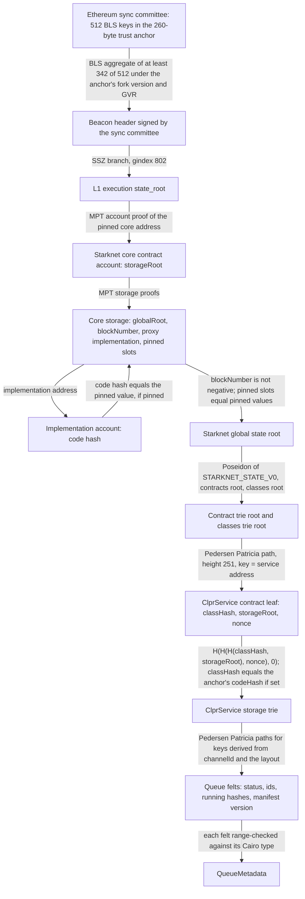
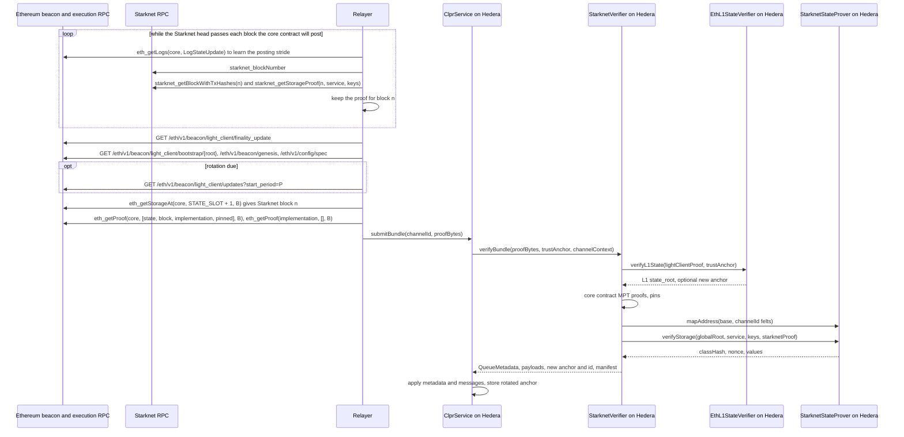

# Starknet verifier (Starknet → Hiero)

`StarknetVerifier` is an `IClprVerifier` that lets a Hiero CLPR Service accept bundles from a Cairo ClprService on
Starknet (`Starknet → Hiero`). It proves that the Channel's queue values are in a Starknet state that Ethereum has
accepted. Trust comes from Ethereum: the sync committee signs the header, the L1 state root in that header holds the
Starknet core contract's storage, and the core contract only stores a Starknet state root after the STARK verifier
accepted a proof of the state transition. From that global root, Pedersen Patricia proofs give the ClprService's
storage. The Starknet sequencer, the prover operator and the relayer are not trusted. Chain-specific values (core
contract, pins, Cairo storage layout) are constructor data.

The L1 half is the Ethereum beacon light client (`EthBeaconLightClient`, deployed through `EthL1StateVerifier`),
shared with the OP Stack verifiers. It is documented in the [Ethereum verifier README](../ethereum/README.md) and is
not repeated here.

## At a glance

| | |
|---|---|
| Chains covered | Starknet mainnet (`starknet:SN_MAIN`), Starknet Sepolia (`starknet:SN_SEPOLIA`). Per-chain page: [docs/chains/starknet.md](../../../../docs/chains/starknet.md) |
| Finality source | Starknet state root stored by the Starknet core contract on Ethereum (`StarknetState.globalRoot`, written by `updateState` only after the STARK verifier's fact registry accepts the proof), read through the Ethereum sync committee |
| Trust assumptions | Ethereum sync committee (2/3 of 512) + Starknet validity proofs + Starknet governance (no upgrade delay), optionally pinned |
| Typical bundle (live, ACK-only, 8 keys) | 7,145,849 gas (`eth_estimateGas`, incl. 21,000 + 421,396 calldata gas), 28,900 B calldata (Starknet Sepolia block 15909215, 2026-10-01) |
| Typical bundle (synthetic, ACK-only, 8 keys, dense tries) | 4,676,296 execution gas, 9,210 B proof |
| Rotation bundle (synthetic, ACK-only + sync-committee rotation) | 9,062,012 execution gas, 76,109 B proof. Live: not measured |
| Contract sizes | `StarknetVerifier` 15,308 B; `StarknetStateProver` 15,786 B; `StarkPedersenTableA` 21,132 B; `StarkPedersenTableB` 21,127 B; `EthL1StateVerifier` 11,593 B |
| Status | Live-verified on Starknet Sepolia over Ethereum Sepolia (fixture captured 2026-10-01T07:44:08Z). Starknet mainnet: core address, proxy layout and upgrade delay checked by hand, no committed fixture |

## How it works



1. **Sync committee to L1 state root.** `EthL1StateVerifier.sol:verifyL1State` hashes the beacon header, checks the
   BLS aggregate of at least 2/3 of the anchor's committee and proves the execution `state_root` by SSZ branch. It
   also verifies an optional next-committee rotation. See the [Ethereum README](../ethereum/README.md).
2. **L1 state root to the Starknet root.** `StarknetCoreProof.sol:verify` proves the core contract's account, then
   the storage slots `STATE_SLOT` (`globalRoot`), `STATE_SLOT + 1` (`blockNumber`, `int256`, must be ≥ 0), the
   StarkWare proxy implementation slot and every pinned slot. If the profile pins an implementation code hash, it
   proves the implementation's account and compares its code hash. Called from `StarknetVerifier.sol:_verifyCore`.
3. **Global root to the contract leaf.** `StarknetStateProver.sol:verifyStorage` checks
   `globalRoot = Poseidon('STARKNET_STATE_V0', contractsTreeRoot, classesTreeRoot)` (`_globalStateRoot`), hashes every
   proof node once with Pedersen (`StarknetPatricia.sol:hashNodes`) and walks the contract trie to the service's
   leaf (`StarknetPatricia.sol:get`). The leaf must equal `H(H(H(classHash, storageRoot), nonce), 0)`.
4. **Class-hash pin.** `StarknetVerifier.sol:_verifyServiceStorage` compares the proven class hash with the anchor's
   `codeHash` field (zero disables the pin).
5. **Keys from the Channel id.** `StarknetVerifier.sol:_keys` derives the storage addresses from `channelId` and the
   constructor layout through `StarknetStateProver.sol:mapAddress` (Pedersen chain, reduced into `[0, 2²⁵¹ − 256)`).
   The relayer does not choose keys.
6. **Storage values.** `verifyStorage` walks the storage trie for each key. A missing key is proven absent (value 0).
7. **Queue metadata.** `StarknetVerifier.sol:_buildStarknetQueueMetadata` range-checks each felt (u8, u64, u128
   halves) and builds `QueueMetadata`. With item 3 set, the last message's running hash is read from the
   `clpr_messages` map; with item 5 set, `_verifyStarknetManifest` checks the manifest preimage against the proven
   u256 commitment.

### Protocol constants and where they were checked

| Detail | Source | Live check |
|---|---|---|
| Core state slot `keccak256("STARKNET_1.0_INIT_STARKNET_STATE_STRUCT")`, struct `{globalRoot, int256 blockNumber, blockHash}`; `updateState*` writes it only after `IFactRegistry(verifier()).isValid(keccak256(programHash, fact))` | cairo-lang `starknet/solidity/Starknet.sol`, `StarknetState.sol` | `stateRoot()` and `stateBlockNumber()` equal the slots on Sepolia |
| Proxy implementation slot `keccak256("StarkWare2019.implemntation-slot")` (sic); upgrade-delay slot | starkex-contracts `upgrade/StorageSlots.sol` | Sepolia and mainnet: implementation found; upgrade delay 0 on both |
| Pedersen `[shift + a_low·P0 + a_high·P1 + b_low·P2 + b_high·P3].x`, P0..P3 = `CONSTANT_POINTS[2, 250, 254, 502]` | cairo-lang `crypto/signature/fast_pedersen_hash.py`, `pedersen_params.json` | H(1, 2) = `0x5bb9…026`; every node hash of real `starknet_getStorageProof` responses |
| Poseidon: Hades width 3, 4 + 83 + 4 rounds, x³, MDS `[[3,1,1],[1,−1,1],[1,1,−2]]`, round constants `sha256("Hades"‖i) mod p`; `hash_many` pads 1 then 0 | cairo-lang `cairo/common/poseidon_utils.py`, `poseidon_hash.py` | the global root of real blocks |
| Global root: 0 if both roots are 0, else `Poseidon('STARKNET_STATE_V0', contracts, classes)` (the code no longer special-cases an empty class trie, though a comment still says so) | sequencer `apollo_starknet_os_program/.../os/state/commitment.cairo`; Starknet docs "State" | equals `new_root` of blocks 15900183, 15900215, 15901215; equals the L1 `globalRoot` of block 15909215 in `capture.json` |
| Contract leaf `H(H(H(class, storageRoot), nonce), 0)`; binary `H(l, r)`; edge `H(child, path) + length`; height 251 | same, docs | real proofs (STRK token) |
| Cairo storage: `selector!` = keccak256 & (2²⁵⁰ − 1); `Map` entry = Pedersen chain over the key's `Hash` (u256 as low, high; tuples in order), reduced into `[0, 2²⁵¹ − 256)`; `Store` structs at base + offset; u256 = (low, high) felts | cairo corelib `starknet/storage.cairo`, `storage_access.cairo`, `storage/sub_pointers.cairo`, `hash.cairo`, `integer.cairo` | `ERC20_total_supply` of STRK read back |
| L1 cadence | `LogStateUpdate` events | Sepolia posts every 1,000 Starknet blocks |

## Bundle lifecycle

The relayer calls are the ones `test/e2e/relay/buildStarknetLiveProof.ts` and `test/e2e/relay/buildEthLiveProof.ts`
make.



`B` is the execution block of the beacon header that the sync committee signed. `n` is the Starknet block whose
`globalRoot` the core contract holds at `B`. Public Starknet RPCs serve `starknet_getStorageProof` only for recent
blocks, so the relayer fetches the proof when the Starknet head passes `n`, before L1 posts `n`, and keeps it. A
rotation travels inside the bundle (light-client items 4 and 5); there is no separate rotation transaction.
`verifyStarknetState(proof, anchor)` runs steps 1 and 2 only; a relayer can call it to learn `n`.

## Trust model

- **Trusted: Ethereum's sync committee.** 2/3 of 512 members sign the header, as for every Ethereum-anchored verifier
  here. See the [Ethereum README](../ethereum/README.md).
- **Trusted: the bootstrap checkpoint.** `verifyConfig` takes the initial committee, genesis validators root, fork
  version and class hash from the config proof (`EthL1StateVerifier.sol:genesisTrustAnchor`).
- **Trusted: Starknet's validity proofs.** `updateState` writes `globalRoot` only after
  `IFactRegistry(verifier()).isValid(keccak256(programHash, fact))`, so a stored root is the output of a proven
  Starknet OS run from the previous root. There is no challenge period.
- **Trusted: Starknet governance, unless pinned.** The core contract is a StarkWare proxy whose upgrade delay is 0 on
  Sepolia and mainnet. Governance can replace the implementation and change `programHash`, `aggregatorProgramHash`,
  `configHash` and the verifier address at once. A malicious change could post an arbitrary root. The profile can pin
  the implementation's code hash and any core slots; a pinned deployment then reverts after such a change instead of
  following it (safety over liveness). Pinning nothing trusts governance as Starknet's own bridge does.
- **Trusted: the Cairo ClprService class.** The anchor's `codeHash` field pins the service's class hash. A contract
  can change its class with `replace_class_syscall`; the pin catches that. Zero disables the pin.
- **Not trusted:** the Starknet sequencer, the SHARP prover operator, the relayer and the Starknet RPC. Storage keys
  are derived on chain; every node hash is recomputed.
- **To forge a bundle an attacker must** control 2/3 of an Ethereum sync committee, or get a false root accepted by
  the core contract (break the STARK verifier or, for an unpinned profile, control Starknet governance), or find a
  Pedersen, Poseidon or keccak256 collision.

## Proof format

**Trust anchor.** The 260-byte Ethereum anchor of `EthBeaconLightClient` (same as `EthMainnetVerifier` and the OP
Stack verifiers). Its `codeHash` field (offset 228) holds the Cairo ClprService's class hash, or zero.

**Bundle `proofBytes`.** An RLP list of 5 items, or 6 with an endpoint-manifest update:

| # | Field | Type | Meaning |
|---|---|---|---|
| 0 | `lightClientProof` | RLP string | The `EthL1StateVerifier.verifyL1State` proof (signed header, sync aggregate, execution state root and branch, optional next committee and branch, non-signer proofs) |
| 1 | `coreProof` | RLP list | `[coreAccountProof, coreStorageProof, implAccountProof]`. Storage entries for `STATE_SLOT`, `STATE_SLOT + 1`, the implementation slot, then each pinned slot, in that order. `implAccountProof` may be empty when no implementation is pinned |
| 2 | `starknetProof` | bytes | `abi.encode(contractsTreeRoot, classesTreeRoot, classHash, storageRoot, nonce, uint256[] contractNodes, uint256[] storageNodes)`. Nodes are 3 words each: binary `[left, right, 0]`, edge `[child, path, length]`. This is the `starknet_getStorageProof` node set, deduplicated |
| 3 | `lastMessageId` | uint or empty | Empty, or `nextMessageId − 1`; adds that message's two running-hash keys |
| 4 | `bundleContent` | bytes | Protobuf `ClprBundleContent` |
| 5 | `manifestPreimage` | bytes, optional | Endpoint-manifest protobuf; adds the two manifest-commitment keys |

Keys are derived in this order: 8 channel keys, then 2 message keys (item 3), then 2 manifest keys (item 5).

**Config proof.** `verifyConfig` takes `EthMainnetVerifier`'s config RLP
`[slot, syncCommittee, gvr, forkVersion, ledgerConfiguration, codeHash]`, with `codeHash` the class hash. The service
address must be 32 bytes and below 2²⁵¹. An optional manifest proof is `[lightClientProof, coreProof, starknetProof,
manifestPreimage]`.

**Deployment profile** (`StarknetVerifier` constructor):

| Parameter | Type | Meaning |
|---|---|---|
| `l1StateVerifier` | address | Deployed `EthL1StateVerifier` |
| `stateProver` | address | Deployed `StarknetStateProver(tableA, tableB)`; it checks the tables' code hashes |
| `profile.core` | address | Starknet core contract (StarkWare proxy) on Ethereum |
| `profile.coreImplCodeHash` | bytes32 | Pinned implementation code hash; zero = not pinned |
| `profile.pinnedSlots` / `pinnedValues` | bytes32[] | Core slots that must hold fixed values, e.g. `programHash`, `aggregatorProgramHash` |
| `layout` | `Layout` | Cairo storage addresses and member offsets of the ClprService (below) |

**Storage layout ("CLPR Starknet layout v0").** There is no Cairo ClprService yet, so the layout is constructor data.
This is the default a Cairo port should use:

```cairo
#[storage]
struct Storage {
    clpr_channels: Map<u256, ChannelQueue>,            // channelId
    clpr_messages: Map<(u256, u64), MessageValue>,     // (channelId, messageId)
    clpr_endpoint_manifest_commitment: u256,           // keccak256(ClprEndpointManifest protobuf)
}
#[derive(starknet::Store)]
struct ChannelQueue {                // offsets
    status: u8,                      // 0   ClprTypes.ChannelStatus
    next_message_id: u64,            // 1
    received_message_id: u64,        // 2
    sent_running_hash: u256,         // 3 (low), 4 (high)
    received_running_hash: u256,     // 5, 6
    endpoint_manifest_version: u64,  // 7
}
#[derive(starknet::Store)]
struct MessageValue { running_hash_after_processing: u256 } // 0, 1
```

Map bases are `sn_keccak` of the variable name (`keccak256 & (2²⁵⁰ − 1)`). A `Map` entry is the Pedersen chain over the
key's `Hash` felts (u256 as low, high; tuples in order). Running hashes are bytes32 read as `high << 128 | low`.

## Validator-set rotation

The trusted set is Ethereum's sync committee. It changes every period (8,192 slots, about 27 hours). A bundle whose
signed header is in period P can carry `next_sync_committee` (uncompressed keys) and its SSZ branch; the verifier
returns a new anchor with id `P + 1` and the ClprService stores it. Each rotation moves one period, so a Channel that
was idle for several periods catches up with one rotation bundle per missed period, using
`/eth/v1/beacon/light_client/updates`. Measured cost: the synthetic ACK-only bundle grows from 4,676,296 to
9,062,012 execution gas and from 9,210 to 76,109 proof bytes. Live rotation is not measured. Starknet itself has no
validator set in this path.

## Gas and calldata

Execution gas inside the EVM (Foundry, `forge test -vv`), unless marked `eth_estimateGas`. For a transaction add
21,000 and calldata gas. "Dense" synthetic tries have a binary node at each of the top 24 contract-trie levels
(Starknet Sepolia has about 23) and at each of the top 22 storage-trie levels for every key (a service with about 4M
storage slots).

| Case | Source | Gas | Proof / calldata |
|---|---|---|---|
| `verifyBundle`, ACK-only (8 keys), 512/512 | live, `capture.json` (Sepolia block 15909215) | 7,145,849 (`eth_estimateGas`; ~6,703,453 execution) | 28,900 B calldata |
| `verifyStarknetState` (L1 light client + core contract) | live, same capture | 2,016,358 (`eth_estimateGas`) | 20,612 B calldata |
| `StarknetStateProver.verifyStorage`, 11 keys, 23 contract + 59 storage nodes | live, same capture | 5,257,352 (`eth_estimateGas`) | 8,708 B calldata |
| `verifyStorage`, STRK token, 3 keys, 23 contract + 41 storage nodes | live Sepolia block 15900215, `test_live_sepoliaStorageProof` | 4,866,845 | 6,432 B proof |
| ACK-only bundle (8 keys), 512/512, dense | synthetic, `test_endToEnd_typicalBundle` | 4,676,296 | 9,210 B proof |
| Bundle with message and manifest keys (12 keys), dense | synthetic, `test_endToEnd_fullBundle` | 7,785,906 | 13,567 B proof |
| ACK-only + sync-committee rotation | synthetic, `test_endToEnd_rotation_typicalAndFullBundle` | 9,062,012 | 76,109 B proof |
| 12 keys + sync-committee rotation | synthetic, same test | 12,220,137 | 80,466 B proof |
| Pedersen H(a, b), one external call | `test_gas_pedersenAndPoseidon` | 67,717 | |
| `poseidon_hash_many` of 3, one external call | same test | 88,064 | |

All cases fit Hedera's 15M gas and 128 KB calldata. The live ACK-only bundle costs more than the synthetic one because
the live STRK storage trie is deeper than the synthetic dense trie (the live node set covers 11 keys). The largest
synthetic case (12 keys + rotation) leaves about 1.4M gas after 21,000 and calldata gas (80,466 B at up to 16 gas
per byte, at most 1.29M). A relayer can always send a rotation in its
own ACK-only bundle. Pedersen dominates: about 48k gas per trie node inside the prover (comb tables copied to memory
once per call), so cost grows with trie depth.

## Limits and known gaps

- **Storage-proof window.** Public Starknet RPCs (Cartridge, PublicNode) refuse `starknet_getStorageProof` for older
  blocks ("too far in the past"). The relayer must fetch the proof of each block the core contract will post while
  the Starknet head is near it, and keep it until L1 posts the block. On 2026-10-01 Sepolia posted every 1,000
  Starknet blocks, about every 29 minutes, about 10 minutes after the Starknet head passed the block; earlier the same
  day the core contract stayed on one block for more than 2 hours. Staged proofs that L1 passes unposted are useless.
- **Non-signer path not in the live capture.** The committed capture has 512/512 participation, so the live replay does
  not exercise non-signer proofs. The synthetic tests cover partial participation and the threshold.
- **Live rotation not measured.** Only the synthetic rotation numbers exist.
- **No upgrade delay on the core contract.** Starknet's core contract on Sepolia and mainnet has upgrade delay 0.
  Governance can change the implementation and program hashes in one transaction. Pinning makes the verifier stop
  instead of following such a change; every Starknet OS release then needs a new deployment.
- **No Cairo ClprService.** The layout is a proposal (v0). The live stand-in is the STRK token with its real class
  hash pinned: CLPR keys are proven absent and the ERC-20 total supply is proven present.
- **Archive access.** Without a node that serves old storage proofs, the relayer must run while the Starknet head
  passes each posted block. A Pathfinder or Juno node with storage proofs enabled removes this constraint.
- **Latency.** A Starknet block is deliverable only after the core contract posts it on L1.
- **Gas.** Pedersen costs about 48k gas per trie node. Options, by effort: batch-affine Pedersen with one shared
  inversion per step, larger comb tables, an optimized Poseidon, or a SNARK of the Patricia paths.
- **Not covered:** Starknet's pre-0.13 state commitment, StarkEx, and chains that settle on Starknet (L3s) without
  another proof hop.

## Upgrades and forks

This section maps the pinned values to the upgrade classes of `ADR/2026-10-01-fork-aware-verifiers.md` in the spec
fork (draft PR [LFDT-CLPR/clpr-spec#1](https://github.com/LFDT-CLPR/clpr-spec/pull/1)). The ADR is a draft; this
code does not implement it.

| Pinned value | Where | Changes when |
|---|---|---|
| Core address, implementation code hash, pinned slots | `StarknetVerifier` constructor | core upgrade, new program hash (every Starknet OS release) |
| `STATE_SLOT`, implementation slot, `int256 blockNumber` | `StarknetCoreProof` code constants | core storage layout change |
| Global root formula, Pedersen and Poseidon parameters, trie height 251, leaf formula | `StarknetStateProver` and libraries | Starknet state-commitment change |
| Cairo layout (bases, offsets) | `StarknetVerifier` constructor | ClprService storage change |
| Beacon gindices 802/87, depths 9/6, 8,192 slots per period | `EthL1StateVerifier` constructor | an Ethereum fork that moves those fields |
| Fork version, GVR, committee, class hash | 260-byte trust anchor | Ethereum fork version change; rotation; class change |

- **Class A (parameter).** A Starknet OS release changes `programHash`. Unpinned profiles keep working. Pinned
  profiles revert with `CorePinnedSlotMismatch` after the BLS and MPT checks pass, and need a new deployment. An
  Ethereum fork-version change needs the anchor updated before activation; the live spec checks that the real Fulu
  signature fails under the Electra version. A ClprService class upgrade needs a new class hash in the anchor.
- **Class B (layout).** A move of the core's state slot or of the ClprService's storage is constructor data for the
  layout, but `STATE_SLOT` is a code constant.
- **Class C (semantic).** A new state-commitment formula, hash or trie shape needs new prover code. A change in what
  `updateState` checks before writing `globalRoot` changes the trust model. Ethereum Gloas (EIP-7732) moves the
  execution payload and needs new L1 constants.
- **Typed reverts (ADR §3.9).** Not implemented. `CorePinnedSlotMismatch` and `CoreImplementationMismatch` behave as
  a safe stall: they change no state.

## Running it

Foundry tests (hashes, prover, verifier, end to end with a real BLS aggregate, compliance):

```sh
forge test --match-path 'test/verifiers/evm/starknet/*' -vv
forge test --match-contract StarknetComplianceTest
```

Live fixture replay on anvil (deploys `EthL1StateVerifier`, the two table contracts, `StarknetStateProver` and
`StarknetVerifier`, and prints the gas report; skipped if `capture.json` is missing):

```sh
forge build
npm run test:e2e:starknet-live
```

Fixture refresh and tools:

```sh
npm run starknet-live:stage         # keep a storage proof of every block the core contract will post (pending/)
npm run starknet-live:refresh       # wait for L1 to post a staged block, then write capture.json
npm run starknet:synthetic-fixture  # regenerate the Foundry synthetic fixture
npm run starknet:tables             # regenerate StarkTables.sol (Pedersen comb tables)
```

Run `starknet-live:stage` until it stages a block, then `starknet-live:refresh`; refresh must see the core contract
at a staged block during the roughly 29 minutes it stays there. Refresh prunes staged proofs at or below the captured
block.

## Files

| File | Purpose |
|---|---|
| [`src/verifiers/evm/starknet/StarknetVerifier.sol`](./StarknetVerifier.sol) | `IClprVerifier`: L1 light client → core contract → Starknet storage → queue metadata |
| [`src/verifiers/evm/starknet/StarknetStateProver.sol`](./StarknetStateProver.sol) | Deployed, stateless prover: global root, contract leaf, storage keys; Pedersen and Poseidon entry points |
| [`src/verifiers/evm/starknet/lib/IStarknetStateProver.sol`](./lib/IStarknetStateProver.sol) | Prover interface and proof encoding |
| [`src/libraries/proof/starknet/StarknetCoreProof.sol`](../../../libraries/proof/starknet/StarknetCoreProof.sol) | Core contract state, implementation and pinned slots from an L1 state root |
| [`src/libraries/proof/starknet/StarknetPatricia.sol`](../../../libraries/proof/starknet/StarknetPatricia.sol) | Pedersen Patricia node hashing and path walk (height 251) |
| [`src/libraries/proof/starknet/StarkPedersen.sol`](../../../libraries/proof/starknet/StarkPedersen.sol) | Starknet Pedersen hash, fixed-base comb |
| [`src/libraries/proof/starknet/StarkPoseidon.sol`](../../../libraries/proof/starknet/StarkPoseidon.sol) | Starknet Poseidon (Hades, width 3) and `hash_many` |
| [`src/libraries/proof/starknet/StarkTables.sol`](../../../libraries/proof/starknet/StarkTables.sol) | Generated Pedersen tables (two data contracts) and Poseidon round constants |
| [`script/starknet/genStarkTables.ts`](../../../../script/starknet/genStarkTables.ts) | Generator for `StarkTables.sol` |
| [`test/verifiers/evm/starknet/StarknetVerifier.t.sol`](../../../../test/verifiers/evm/starknet/StarknetVerifier.t.sol) | Reference vectors, live storage proof, prover and verifier unit tests, end-to-end tests with a real BLS aggregate, negative cases, gas |
| [`test/verifiers/evm/starknet/fixtures/`](../../../../test/verifiers/evm/starknet/fixtures/) | `synthetic.json` and the live Sepolia storage proof of block 15900215 |
| [`test/verifiers/compliance/StarknetComplianceTest.t.sol`](../../../../test/verifiers/compliance/StarknetComplianceTest.t.sol) | Shared compliance suite with proofs built in Solidity |
| [`test/helpers/StarknetSyntheticProofs.sol`](../../../../test/helpers/StarknetSyntheticProofs.sol) | Solidity proof builder for the compliance suite |
| [`test/e2e/relay/starknet.ts`](../../../../test/e2e/relay/starknet.ts) | Relay helpers: hashes, layout keys, node encoding, bundle encoders, off-chain verifier |
| [`test/e2e/relay/buildStarknetLiveProof.ts`](../../../../test/e2e/relay/buildStarknetLiveProof.ts) | Live staging, capture and offline builder |
| [`test/e2e/relay/buildStarknetSyntheticFixture.ts`](../../../../test/e2e/relay/buildStarknetSyntheticFixture.ts) | Synthetic fixture builder |
| [`test/e2e/fixtures/starknet-sepolia-live/`](../../../../test/e2e/fixtures/starknet-sepolia-live/) | `capture.json` (live capture, 2026-10-01) and `pending/` (staged storage proofs, emptied by refresh) |
| [`test/e2e/tests/verifiers/starknet-live-sepolia.spec.ts`](../../../../test/e2e/tests/verifiers/starknet-live-sepolia.spec.ts) | Vitest replay of the live capture on anvil, with gas report |

Shared dependencies (not part of this family): [`EthL1StateVerifier.sol`](../ethereum/EthL1StateVerifier.sol),
[`EthBeaconLightClient.sol`](../../../libraries/proof/beacon/EthBeaconLightClient.sol),
[`ClprEvmStateProof.sol`](../../../libraries/proof/evm/ClprEvmStateProof.sol),
[`ClprEvmBundleVerifier.sol`](../common/ClprEvmBundleVerifier.sol).

## References

- [starkware-libs/cairo-lang](https://github.com/starkware-libs/cairo-lang): `src/starkware/starknet/solidity/Starknet.sol`
  and `StarknetState.sol` (state struct, `updateState`), `crypto/signature/fast_pedersen_hash.py` and
  `pedersen_params.json`, `cairo/common/poseidon_utils.py` and `poseidon_hash.py`.
- [starkware-libs/starkex-contracts](https://github.com/starkware-libs/starkex-contracts): `upgrade/StorageSlots.sol`
  and `Proxy.sol` (implementation and upgrade-delay slots).
- [starkware-libs/sequencer](https://github.com/starkware-libs/sequencer):
  `apollo_starknet_os_program/.../os/state/commitment.cairo` (global root).
- [starkware-libs/cairo](https://github.com/starkware-libs/cairo) corelib: `starknet/storage.cairo`,
  `storage_access.cairo`, `storage/sub_pointers.cairo`, `hash.cairo`, `integer.cairo` (storage addresses, `Store`).
- [Starknet docs](https://docs.starknet.io): "State" (state commitment, tries) and "Important addresses" (core
  contracts); [Starknet JSON-RPC spec](https://github.com/starkware-libs/starknet-specs) `starknet_getStorageProof`.
- [Ethereum verifier README](../ethereum/README.md) for the beacon light client.
- `ADR/2026-10-01-fork-aware-verifiers.md`, [LFDT-CLPR/clpr-spec#1](https://github.com/LFDT-CLPR/clpr-spec/pull/1).
- Public endpoints used by the live tooling: `https://ethereum-sepolia-beacon-api.publicnode.com`,
  `https://0xrpc.io/sep`, `https://api.cartridge.gg/x/starknet/sepolia`,
  `https://starknet-sepolia-rpc.publicnode.com`.
