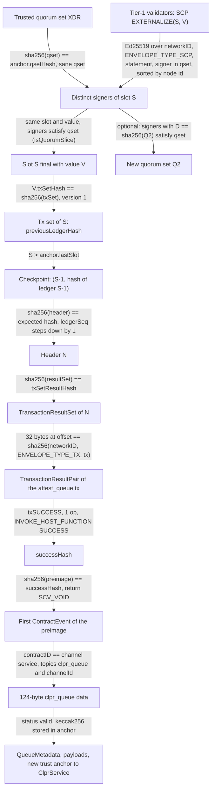
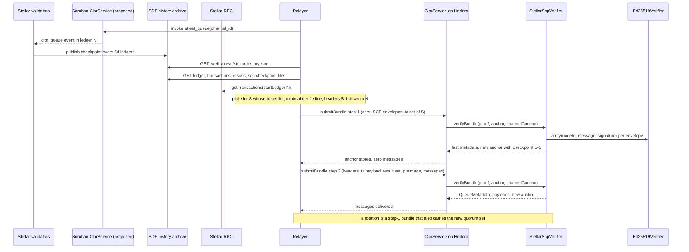

# Stellar verifier (`StellarScpVerifier`)

`StellarScpVerifier` is the Stellar → Hiero `IClprVerifier`. It is an SCP light client over a trusted
quorum set: on pubnet, the tier-1 organizations. It accepts a ledger when Ed25519-signed SCP
EXTERNALIZE statements from a slice of that set agree on the ledger's value. From there it reaches
older ledger headers by hash and proves the CLPR queue state as a Soroban contract event, through the
ledger's transaction-result hash. It does not use the bucket list, because the bucket list cannot be
opened for a single entry. The verifier follows changes of the trusted set (rotations) through
statements signed by the current set.

Every protocol rule below was checked against `stellar/stellar-core` master @ `cf8f96d` (29 Sep 2026),
`stellar/stellar-xdr` @ `ee040cd`, and live testnet and pubnet data captured on 1 Oct 2026 (pubnet
protocol 28, testnet protocol 29).

## At a glance

| Item | Value |
|---|---|
| Chains covered | Stellar pubnet (`stellar:pubnet`), Stellar testnet (`stellar:testnet`). Any stellar-core network with the network id, CAIP-2 id and initial quorum set configured. |
| Direction | Stellar → Hiero |
| Finality source | SCP EXTERNALIZE statements whose signers satisfy the trusted quorum set (stellar-core `LocalNode::isQuorumSlice`) |
| Trust assumption | A slice of the trusted set is honest: on pubnet, 7 of 10 tier-1 organizations with 2 of 3 validators each (14 Ed25519 signatures). Plus the initial quorum set, and the upgrade authority of the Soroban service contract. |
| Typical bundle, testnet | 2.21M gas, 32.2 KB, one transaction (harness, see [Gas and calldata](#gas-and-calldata)) |
| Typical bundle, pubnet | Two transactions: 13.38M gas / 83.7 KB (finality) + 1.92M gas / 68.4 KB (headers + event, harness) |
| Rotation | Pubnet tier-1 expansion 5 of 7 → 7 of 10 organizations: 10.58M gas, 113.2 KB |
| Contract sizes | `StellarScpVerifier` 17,489 B (EIP-170 headroom 7.1 KB); `Ed25519Verifier` 12,206 B |
| Status | Live-verified on testnet and pubnet (fixtures captured 2026-10-01). Finality, checkpoint and rotation run through `verifyBundle` in full. The event half runs on real Soroban events of other contracts, because no CLPR service exists on Stellar yet. |

**Family coverage.** Any stellar-core network (pubnet, testnet, futurenet, private networks): configure the network id,
CAIP-2 id and initial quorum set. Stellar-core forks such as Pi Network share the SCP envelope and header
formats. The finality half should apply to them unchanged (not verified here), and the event half needs
Soroban.

## How it works

### What a Stellar ledger commits to

| Question | Finding | Evidence |
|---|---|---|
| What does a validator sign? | One Ed25519 signature per SCP envelope over `networkID ‖ ENVELOPE_TYPE_SCP (1) ‖ XDR(SCPStatement)`, raw (not prehashed). An EXTERNALIZE statement carries the slot (= ledger sequence), the externalized `StellarValue`, and `D` = SHA-256 of the signer's own quorum set. | `HerderImpl::signEnvelope` / `verifyEnvelope`, `PubKeyUtils::verifySig`; `Stellar-SCP.x`. All 2 + 14 + 10 live signatures in the fixtures verify. |
| Is the ledger header signed? | **No.** SCP agrees on the *input* `StellarValue {txSetHash, closeTime, upgrades, ext}`. The header (the *output*) is not signed. | `Stellar-ledger.x`; `LedgerHeader.scpValue` |
| Then what authenticates a header? | The next ledger's tx set. `GeneralizedTransactionSet v1 = {previousLedgerHash, phases}`, and `txSetHash = SHA-256(XDR)`. A node votes for a tx set only if `previousLedgerHash` equals its last closed ledger. Ledger hash = SHA-256(XDR(LedgerHeader)). | `TxSetFrame.cpp` (`mHash(xdrSha256(xdrTxSet))`, checkValid `PREVIOUS_LEDGER_HASH_MISMATCH`), `LedgerManagerImpl` (`lcl.hash = xdrSha256(header)`); re-checked on 64-ledger archive ranges of both networks. |
| Can older headers be reached faster than one by one? | **No.** `skipList` holds old *bucket-list* hashes, not ledger hashes, despite the XDR comment. | `BucketManager::calculateSkipValues` (`skipList[0] = bucketListHash`) |
| What is `bucketListHash`? | `SHA-256(liveBucketList ‖ hotArchiveBucketList)` (since protocol 23). Each list is SHA-256 over 11 levels of `SHA-256(curr ‖ snap)`, and a bucket's hash is SHA-256 over the whole bucket file. There is no Merkle tree inside a bucket. | `BucketManager::snapshotLedger`, `BucketListBase::getHash`, `BucketLevel::getHash`, `BucketOutputIterator` |
| Can one `ContractData` entry be proven against it? | **Not in practice.** The proof needs the entire bucket that holds the newest version of the entry. On the archives at capture time: pubnet level 0 is 509 KB and level 1 is 1.4–1.6 MB; level 9 is 415 MB and level 10 is 2.4 GB (gzip). Testnet level 0 is 96 KB. Only an entry written in the last one or two ledgers sits in level 0. No public RPC returns entry proofs (`getLedgerEntries` returns values only). | `history.stellar.org` HAS and bucket files; Stellar RPC API |
| What else does the header commit to? | `txSetResultHash = SHA-256(XDR(TransactionResultSet))`, all of the ledger's results. A successful `InvokeHostFunction` result holds `sha256(InvokeHostFunctionSuccessPreImage {returnValue, events})`. Each event there carries a `contractID` that the host sets. | `LedgerManagerImpl` (`txSetResultHash = xdrSha256(txResultSet)`), `InvokeHostFunctionOpFrame::collectEvents` / `finalizeSuccess` |

So the verifier proves **a contract event in a closed ledger** through the transaction-result path.

### Proof chain



Walk-through:

1. `StellarScpVerifier.sol:_trustedQuorumSet` checks that the quorum-set XDR in the proof hashes to
   `anchor.qsetHash` and decodes it with `StellarXdr.sol:parseQuorumSet`.
2. `StellarScpVerifier.sol:_verifyScp` reads each envelope. `StellarXdr.sol:parseExternalize` accepts only
   EXTERNALIZE. Node ids must be strictly increasing, so each signer counts once.
   `StellarXdr.sol:isMember` requires each signer to be in the set. The verifier checks the signature
   over `StellarXdr.sol:scpSignedMessage` with `Ed25519Verifier.sol:verify`. All envelopes must carry the
   same slot and value.
3. `StellarXdr.sol:isSatisfied` evaluates the signers against the set like stellar-core's
   `LocalNode::isQuorumSlice`. At each level, at least `threshold` entries must be satisfied: a validator
   that signed, or an inner set that is itself satisfied. The threshold is per organization, not a flat
   k-of-n.
4. In the same function, `StellarXdr.sol:stellarValueEnd` parses the value. Only BASIC or SIGNED values
   are accepted, so `STELLAR_VALUE_EMPTY_TX_SET` (a skipped ledger) is rejected. The tx set must be a
   version-1 `GeneralizedTransactionSet` whose SHA-256 equals `V.txSetHash`. Its first field is the hash
   of ledger S-1.
5. `StellarScpVerifier.sol:verifyBundle` requires `S > anchor.lastSlot` (`StaleSlot`). It stores
   `(S-1, previousLedgerHash)` as the checkpoint and, if a rotation was proven, the new quorum-set hash.
6. `StellarScpVerifier.sol:_walkHeaders` walks back from the checkpoint. Each header is parsed by
   `StellarXdr.sol:parseHeader`, and its SHA-256 and `ledgerSeq` must match the expected values. The
   header's `previousLedgerHash` gives the next expected hash.
7. `StellarScpVerifier.sol:_provenEvent` checks `sha256(resultSet) == header.txSetResultHash`. The
   relayer supplies the transaction's signature payload. It must start with the network id and
   `ENVELOPE_TYPE_TX`, and its SHA-256 must sit at the given offset in the result set.
   `StellarXdr.sol:invokeSuccessHash` reads the success hash of the result that follows.
   `StellarXdr.sol:firstContractEvent` reads the emitter of the first event in the success preimage.
   The emitter must be the channel's service contract id.
8. `StellarScpVerifier.sol:_verifyQueueEvent` compares the event's topics and data header byte for byte
   with `[Symbol("clpr_queue"), Bytes(channelId)]` and `Bytes(124)`, and decodes the queue metadata.
9. `ClprEvmBundleVerifier.sol:_decodeBundleContent` returns the message payloads. `BundleLogic.sol:submitBundle`
   binds them to `sentRunningHash`. An optional endpoint manifest is checked by
   `StellarScpVerifier.sol:_bindManifest` against the event's manifest commitment.
10. `StellarScpVerifier.sol:_encodeTrustAnchor` and `_anchorId` return a new anchor only when a field
    changed.

Why the transaction hash is enough to find the right result: a transaction hash is a SHA-256 over a
preimage that begins with the network id. No other 32-byte value in a result set is a SHA-256 over a
network-id-prefixed preimage. A matching window is therefore the transaction's own
`TransactionResultPair`, or the `InnerTransactionResultPair` of a fee bump, whose
`InnerTransactionResult` has the same success layout. The verifier never parses the other results.

A bundle without an attestation (finality only) re-returns the last proven metadata.
`StellarScpVerifier.sol:_lastMetadata` checks it against `anchor.lastMetadataHash`. Before the first
attestation it returns the empty queue `{nextMessageId 1, …, PENDING}`. `ClprService` accepts this as a
trust-anchor-only update with zero new messages.

### CLPR on Stellar: the attestation event (Soroban side, not deployed)

No CLPR service exists on Stellar. The verifier fixes this interface for a Soroban `ClprService`. A
permissionless `attest_queue(channel_id)` reads the channel, emits exactly one event and returns
nothing:

```rust
// topics: (Symbol "clpr_queue", BytesN<32> channel_id); data: Bytes, 124 bytes big-endian
env.events().publish(
    (symbol_short!("clpr_queue"), channel_id),
    Bytes::from(next_message_id.to_be_bytes() ‖ sent_running_hash ‖ received_message_id.to_be_bytes()
        ‖ received_running_hash ‖ (status as u32).to_be_bytes() ‖ endpoint_manifest_version.to_be_bytes()
        ‖ manifest_commitment),
);
// attest_manifest(): topics (Symbol "clpr_manifest"), data Bytes(32) = keccak256(manifest protobuf)
```

The topics and the data are compared byte for byte with their XDR (`SCV_SYMBOL`, `SCV_BYTES`). Message
payloads come from the bundle content. The emitter must be the channel's peer service address, which for
Stellar is the 32-byte contract id.

## Bundle lifecycle

Pubnet tx sets rarely fit next to a result set in 128 KB, so a pubnet bundle is two transactions. Testnet
does both steps in one. The live fixtures are read from SDF's history archives and a public Stellar RPC
by `test/e2e/relay/buildStellarLiveProof.ts`. The Soroban `attest_queue` call is the proposed design and
is not deployed.



Replay protection: SCP slots must increase (`StaleSlot`). A bundle returns a new anchor only when the
anchor changed, so re-proving the same queue state from the same checkpoint returns no anchor, and the
service rejects it with `NoProgress`. Older queue states are rejected by the service's replay, ack and
state-machine checks (`ClprReplayDetected`). `IntegrationStellar.t.sol:test_twoStepBundles` covers both.

## Trust model

Trusted:

- **A slice of the trusted quorum set.** A forged finality proof needs the Ed25519 keys of a slice:
  on pubnet, at least 7 of the 10 tier-1 organizations, 2 validators in each, signing EXTERNALIZE for a
  value the network did not externalize. One honest, intact node's EXTERNALIZE already implies that the
  network externalized V (SCP safety). Demanding a full slice is what makes forging require a colluding
  tier-1 majority. This is the trust that every pubnet node places in tier-1. On testnet the set is SDF's
  3 validators, 2 of 3.
- **The initial quorum set (weak subjectivity).** It comes from the config proof. `verifyConfig` checks
  only that it is sane and that it externalized a real slot. Whoever completes the channel must check the
  set against the network, for example against stellarbeat.io or the `D` values in the archives.
- **A fixed view of a federated network.** SCP has no global validator set: each node chooses its own
  quorum slices. This verifier behaves like a watcher node configured with the tier-1 quorum set. Its
  view moves only through rotation proofs signed by the current set. Validators that left tier-1 keep
  their signing power until the next rotation is relayed.
- **The Soroban service contract's upgrade authority.** Only the contract id is pinned. Soroban contracts
  can replace their own Wasm (`update_current_contract_wasm`), and the code hash is in state, which cannot
  be proven here. The service must emit `clpr_queue` only with its true state. EVM verifiers in this repo
  pin a code hash; this one cannot.
- **The network id and CAIP-2 id** set at deployment.

Not trusted:

- The relayer. It chooses which envelopes, tx set, headers and transaction to send, but every piece is
  bound by a signature or a SHA-256 to the signed value.
- The history archive and the RPC. They are data sources only.
- Any other Soroban contract. The host sets an event's `contractID`, so another contract cannot emit an
  event that passes the emitter check.

To forge a bundle an attacker must control a slice of the trusted quorum set, or the Soroban service
contract (or its upgrade key).

## Proof format

### Trust anchor

`abi.encode(...)`, 160 bytes. `trust_anchor_id = abi.encodePacked(lastSlot, lastMetadataHash)`.

| Field | Type | Meaning |
|---|---|---|
| `qsetHash` | `bytes32` | SHA-256 of the trusted `SCPQuorumSet` XDR |
| `lastSlot` | `uint64` | Last slot proven final; the next SCP proof must be higher |
| `checkpointSeq` | `uint32` | Ledger sequence of the checkpoint (`lastSlot - 1`) |
| `checkpointHash` | `bytes32` | Hash of that ledger (SHA-256 of its header XDR) |
| `lastMetadataHash` | `bytes32` | keccak256 of `abi.encode(QueueMetadata)` last proven; 0 before the first attestation |

### Bundle `proof_bytes`

`RLP[qset, scp, headers, attestation, lastMetadata, bundleContent, manifest]`

| # | Field | Type | Meaning |
|---|---|---|---|
| 0 | `qset` | bytes | `SCPQuorumSet` XDR; SHA-256 must equal `anchor.qsetHash` |
| 1 | `scp` | list | `[]`, or `[[[statementXdr, sig64], ...], txSetXdr, newQsetXdr or ""]` |
| 2 | `headers` | list | `[headerXdr, ...]` from the checkpoint backwards; `[]` when there is no attestation |
| 3 | `attestation` | list | `[]`, or `[txPayload, resultSetXdr, pairOffset, successPreimage]` |
| 4 | `lastMetadata` | bytes | `abi.encode(QueueMetadata)` of the last attestation, used when field 3 is empty |
| 5 | `bundleContent` | bytes | `ClprBundleContent` protobuf (message payloads) |
| 6 | `manifest` | bytes | `ClprEndpointManifest` protobuf preimage, or empty; needs an attestation |

`txPayload` is `networkID ‖ ENVELOPE_TYPE_TX ‖ XDR(Transaction)`, the transaction's signature payload.
`pairOffset` is the byte offset of the transaction hash inside the result set.

### Config and manifest proofs

| Proof | Encoding |
|---|---|
| `verifyConfig` config proof | `RLP[qsetXdr, scp, ledgerConfigControlMessage]`; `scp` must be non-empty and must not rotate |
| `verifyConfig` endpoint-manifest proof | `RLP[headers, attestation, manifestPreimage]` walking back from the config checkpoint to a `clpr_manifest` event, or empty |

### Deployment profile

| Parameter | Where | Pubnet | Testnet |
|---|---|---|---|
| `ed25519` | constructor | address of a deployed `Ed25519Verifier` | same |
| `networkId` | constructor | SHA-256("Public Global Stellar Network ; September 2015") = `0x7ac33997…a979` | SHA-256("Test SDF Network ; September 2015") = `0xcee0302d…d472` |
| `chainId` | constructor; `verifyConfig` pins it | `stellar:pubnet` | `stellar:testnet` |
| Initial quorum set | config proof | tier-1: 7 of 10 organizations, 2 of 3 each, 30 validators (`0x040355b7…841d`) | 2 of 3 SDF validators (`0x59d361ae…d669`) |
| Service address | ledger configuration | 32-byte Soroban contract id of the CLPR service | same |

Per-chain values and their sources are in [`docs/chains/stellar.md`](../../../../docs/chains/stellar.md).

## Validator-set rotation

Stellar has no on-chain validator set. Each validator declares its own quorum set, and every SCP
statement carries `D`, the SHA-256 of that quorum set. The verifier's trusted set moves when tier-1 itself
moves.

- **Rule.** A step-1 bundle may carry a new quorum set Q2 (`newQsetXdr`). The verifier accepts it when the
  signers whose statements declare `D = SHA-256(Q2)` satisfy the *current* set, and all signers together
  also prove finality of the slot. The current tier-1 quorum therefore declares Q2 as its own quorum
  (`StellarScpVerifier.sol:_verifyScp`, `RotationNotEndorsed`).
- **Checks on Q2.** It must pass stellar-core's sanity checks with the "extra checks" (`parseQuorumSet`
  with `strict`): every level has a threshold of at least 51 %, nesting depth is at most 4, there are no
  duplicate validators, and there is at least one validator. Q2 may hold at most 64 validators.
- **Cost.** A rotation uses the same signatures as finality, so it adds no signature checks. It adds
  Q2's XDR to calldata (1,212 B for the current pubnet tier-1 set) and its parsing.
- **How often.** Tier-1 changes are rare and are not tied to an epoch. The live fixture holds one: the
  September 2026 pubnet tier-1 expansion from 7 to 10 organizations. Validators switched `D` between
  ledgers ~64,146,400 and ~64,160,000. Slot **64,150,367** is the first slot with a fitting tx set where
  10 old-set validators (2 in each of 5 organizations) declare the new set. `verifyBundle` rotates
  `958e72b8… → 040355b7…` for 10.58M gas and 113.2 KB, and the current finality proof runs under the
  rotated set.
- **Catch-up.** One bundle carries at most one new set. Several changes need one bundle each, in order.
  Each needs a slot where an old-set slice already declares the next set while its tx set still fits. In
  the September 2026 change that held for about 4,000 ledgers after the first validator switched. If
  tier-1 changes so fast that no old-set slice ever declares the new set, the channel needs a new config.

## Gas and calldata

Hedera limits: 15M gas and 128 KB calldata per transaction.

Live figures are `eth_estimateGas` on anvil (including 21k intrinsic gas and calldata) from
`test/e2e/tests/verifiers/stellar-live.spec.ts` over the fixtures captured on 2026-10-01. Synthetic
figures are forge gas from the Foundry tests. "Harness" means `StellarScpVerifierHarness.proveEvent`:
the production steps up to and including the emitter check, because the live event is not `clpr_queue`.

| Case | Source | Gas | Calldata | Fits |
|---|---|---|---|---|
| Testnet, one transaction: 2 sigs, 27 KB tx set, 2 headers, 15-tx result set | live, harness | 2.21M | 32.2 KB | yes |
| Testnet `verifyConfig` (2 sigs) | live | 2.15M | 28.2 KB | yes |
| **Pubnet step 1**: 14 of 30 envelopes, 77.6 KB tx set (complete `verifyBundle`) | live | **13.38M** | 83.7 KB | yes, 1.6M spare |
| **Pubnet step 2**: 3 headers, 184-tx result set (62 KB) | live, harness | **1.92M** | 68.4 KB | yes |
| Pubnet in one transaction (the same data) | live, harness | 14.35M | 150 KB | **no**: over 128 KB |
| **Pubnet rotation** 5 of 7 → 7 of 10: 10 endorsers, 107.5 KB tx set | live | **10.58M** | 113.2 KB | yes |
| `submitBundle` on `ClprService` (4 sigs, DATA + REPLY), `IntegrationStellar.t.sol:test_fullLifecycle` | synthetic | 4.05M | 3.5 KB | yes |
| Marginal Ed25519 signature (statement 244 B, signed message 280 B), `test_gas_perSignature` | synthetic | **834k** | ~0.3 KB | |
| Synthetic 4-signature rotation, `test_rotation_gas` | synthetic | not recorded in the repo (printed by the test with `-vv`) | | |

**Signature budget.** About 834k gas per signature. The signed message is 280 bytes and needs one more
SHA-512 block than a CometBFT vote. That allows 17 signatures in 15M with no calldata, and about 15 next
to an 80 KB tx set. Pubnet's 14 fit today. If tier-1 grows to 11 organizations (threshold 8, 16
signatures), step 1 no longer fits.

**Tx-set and result-set sizes on pubnet** (768 ledgers: 12 checkpoints over the 5 days to 1 Oct 2026):

| | min | p5 | median | p95 | ≤ 115 KB |
|---|---|---|---|---|---|
| tx set | 99.5 KB | 135 KB | 306 KB | 413 KB | **1.4 %** |
| result set | 37 KB | 54 KB | 78 KB | 117 KB | 94 % |

Testnet tx sets were 5–44 KB in the same period.

## Limits and known gaps

- **No CLPR service on Stellar.** The event format above is this verifier's proposal. A Soroban
  `ClprService` port, and the Hiero → Stellar direction, are separate work. Live tests therefore stop at
  `WrongAttestationEvent` after every earlier check has passed.
- **Pubnet latency.** Archive checkpoints are published every 64 ledgers (~6 min). A relayer also waits
  for a ledger whose tx set fits (~1 in 70 ledgers, ~6 min on average; longer when the network is
  busy). A relayer can take EXTERNALIZE envelopes from the overlay as a watcher node instead, which
  avoids the archive delay. Calling `attest_queue` once per ledger while waiting keeps the header walk to
  one or two headers.
- **Tier-1 growth.** A 16-signature tier-1 does not fit one transaction. The options are a signature
  accumulator across transactions, a SNARK of the slice, or an Ed25519 precompile on Hedera.
- **Event shape.** The attestation must be the invocation's first event, with a void return value and one
  operation. A CONFIRM-only quorum is not accepted; archives sometimes keep a node's last CONFIRM, and the
  relayer skips those envelopes.
- **Ed25519 strictness.** The vendored Ed25519 library is not libsodium's strict verifier (small-order
  and non-canonical checks). Only distinct signers count, so malleability cannot inflate the count.
- **No contract-data proofs.** `ContractData` entries cannot be proven against `bucketListHash` at a
  practical size, so state is attested by event.
- **Not fork-aware yet.** The anchor has no `fork_id`, and there is no `verifyForkProfile` (see below).
- **Fixture dependencies.** The relay scripts import `@noble/curves`, a dependency of `viem` that is not
  declared in `package.json`.

## Upgrades and forks

Stellar upgrades its protocol by SCP vote: validators nominate a `LedgerUpgrade` (for example
`LEDGER_UPGRADE_VERSION`) inside `StellarValue.upgrades`, and it takes effect in the ledger that
externalizes it. `LedgerHeader.ledgerVersion` then carries the new protocol number. The verifier
parses `upgrades` only as opaque items (at most 6 items of at most 128 bytes,
`StellarXdr.sol:stellarValueEnd`). It decodes `ledgerVersion` in `StellarXdr.sol:parseHeader` but does
not check it. It pins these instead:

| Pinned by the code | Where | Effect of a change |
|---|---|---|
| Network id (SHA-256 of the passphrase) | constructor `NETWORK_ID`; SCP and transaction preimages | New network. Needs a new deployment and a new channel. |
| SCP signed message `networkID ‖ ENVELOPE_TYPE_SCP (1) ‖ statement`, Ed25519 keys only | `StellarXdr.sol:scpSignedMessage`, `nodeId` | Signature scheme change. |
| `SCPStatement` EXTERNALIZE layout | `StellarXdr.sol:parseExternalize` | Statement layout change. |
| `StellarValue` ext arms BASIC, SIGNED, EMPTY_TX_SET | `StellarXdr.sol:stellarValueEnd` | A new arm (for example the `MS_CLOSE_TIME` arms still behind an `#ifdef`) reverts `XdrUnsupportedArm`. |
| `GeneralizedTransactionSet` version 1 with `previousLedgerHash` first | `StellarScpVerifier.sol:_verifyScp` | A version 2 tx set reverts `TxSetMismatch`. |
| `LedgerHeader` layout, ext arms v0 and v1 (inner v0) | `StellarXdr.sol:parseHeader` | A new extension reverts `XdrUnsupportedArm`. |
| Result layout: txSUCCESS, 1 op, `opINNER`, `INVOKE_HOST_FUNCTION` (24), SUCCESS, success hash | `StellarXdr.sol:invokeSuccessHash` | A change reverts `XdrUnsupportedArm` or fails the hash. |
| `InvokeHostFunctionSuccessPreImage` and `ContractEvent` (ext v0, contract id present, type CONTRACT, body v0), `SCVal` arms VOID, BYTES, SYMBOL | `StellarXdr.sol:firstContractEvent`, `_verifyQueueEvent` | A change reverts `XdrUnsupportedArm` or `WrongAttestationEvent`. |

Classes in the terms of the fork-aware verifier ADR (`ADR/2026-10-01-fork-aware-verifiers.md` in the
spec fork, draft PR [LFDT-CLPR/clpr-spec#1](https://github.com/LFDT-CLPR/clpr-spec/pull/1)):

- **Class A (parameter).** A protocol bump that leaves the pinned XDR unchanged. The verifier does not
  check `ledgerVersion`, so it keeps working with no action. The fixtures show this today: testnet
  headers are protocol 29 and pubnet headers protocol 28, and the same code verifies both. Soroban
  network-setting upgrades change limits and fees, not layouts, and are also
  Class A; larger limits can make tx sets bigger and slow down pubnet relaying. Tier-1 quorum-set
  changes are Class A as well and are handled by rotation.
- **Class B (layout).** A new header extension, a new `StellarValue` arm, a new `ContractEvent`
  extension, or a moved field. These are the most likely Stellar changes. The verifier has no layout
  descriptor format, so today each of them needs new code and is handled as Class C. A descriptor with
  the header extension length and the event prefix layout would make the common cases Class B.
- **Class C (semantic).** A change of the SCP signed message or signature scheme, a tx set that no
  longer commits to `previousLedgerHash`, a change in how `txSetResultHash` or the success hash is
  computed, Soroban events leaving the success preimage, or a new network passphrase. These need a new
  verifier and Channel succession (ADR §3.7).

Fork identity and evidence, if this verifier becomes fork-aware: `fork_id` would be the 4-byte protocol
version. The evidence would be `ledgerVersion` of a header reached by hash from a signed value, or a
`LEDGER_UPGRADE_VERSION` item in the signed `StellarValue.upgrades`. Both are authenticated by SCP, so
the relayer would not state the fork.

Deadlines (ADR §3.6): Stellar signers do not expire by time. The same tier-1 keys keep signing after an
upgrade, so a profile or successor can still be set up after activation, as long as tier-1 does not
change in the meantime. If tier-1 rotates while the verifier cannot parse post-upgrade data, the
rotation cannot be proven, and the channel recovers only by succession.

Gaps against the ADR: the verifier fails closed with its own errors (`XdrUnsupportedArm`,
`UnsupportedStellarValue`, `TxSetMismatch`), not with `ClprForkUnsupported` / `ClprForkBoundary` /
`ClprForkLayoutUnsupported`. Some of these come before the consensus proof has verified:
`parseExternalize` runs before the signature check, and `parseHeader` runs before the header hash is
compared. The anchor id does not include a fork id, and `verifyForkProfile` is not implemented.

## Running it

```bash
# Unit tests (synthetic chain, real Ed25519 signatures and XDR): 49 tests
forge test --match-path test/verifiers/evm/stellar/StellarScpVerifier.t.sol

# Shared IClprVerifier compliance suite: 21 tests
forge test --match-contract StellarComplianceTest

# Unmodified ClprService: config, bundle, replay, two-step form: 5 tests
forge test --match-path test/integration/IntegrationStellar.t.sol

# Gas logs (per-signature, 4-signature bundle and rotation, submitBundle)
forge test --match-path test/verifiers/evm/stellar/StellarScpVerifier.t.sol --match-test gas -vv
forge test --match-path test/integration/IntegrationStellar.t.sol --match-test test_fullLifecycle -vv

# Live fixture replay on anvil (testnet + pubnet): 23 tests
forge build && npm run test:e2e:stellar-live

# Re-capture the live fixtures from SDF archives and public Stellar RPC
npm run stellar-live:refresh

# Print a summary of one network's live proof
npx tsx test/e2e/relay/buildStellarLiveProof.ts --network pubnet

# Regenerate the synthetic fixture (forge cannot sign Ed25519)
npm run stellar-synthetic:refresh
```

The live spec reads `CLPR_ANVIL_PORT_A` (default 8598).

### What the tests cover

- `StellarScpVerifier.t.sol` negative cases: bad signature, tampered statement, wrong network id, below
  threshold (one organization; one signer per organization), unknown signer, duplicate signer, wrong
  validator set, mixed slots, conflicting value, wrong tx set, stale slot, replayed bundle, rotation not
  endorsed, rotation to an undeclared or insane set, broken or tampered header chain, no checkpoint,
  tampered result set, wrong pair offset, another transaction's payload, other network, tampered
  preimage, wrong emitter, wrong channel, other event, invalid status, wrong last metadata, nothing
  proven, malformed anchor, and truncations that never panic.
- `StellarComplianceTest.t.sol`: every manifest the suite commits to is pre-published as a signed
  `clpr_manifest` event in the synthetic chain.
- `stellar-live.spec.ts`: the live events stand in for `clpr_queue` (a `new_block_event` on testnet, a
  RedStone `REDSTONE` price update on pubnet). Step 1 and the rotation pass `verifyBundle` completely.
  Negative cases on real data: corrupted signature, one signature short, other tx set, other quorum set,
  stale slot, tampered result set, other service contract.

## Files

| File | Role |
|---|---|
| `src/verifiers/evm/stellar/StellarScpVerifier.sol` | `IClprVerifier`: trust anchor, SCP finality, checkpoints, header walk, event proof, quorum-set rotation |
| `src/verifiers/evm/stellar/StellarXdr.sol` | Strict XDR decoders: `LedgerHeader`, `StellarValue`, `SCPStatement` EXTERNALIZE, `SCPQuorumSet` with sanity rules and slice evaluation, Soroban result and success preimage |
| `src/verifiers/evm/sei/Ed25519Verifier.sol` | Pure-Solidity Ed25519, reused as an external contract (Hedera has no Ed25519 precompile) |
| `test/verifiers/evm/stellar/StellarScpVerifier.t.sol` | Unit tests, including the negative cases |
| `test/verifiers/evm/stellar/StellarTestBuilder.sol` | Builds bundles, anchors and contexts from the synthetic fixture |
| `test/verifiers/evm/stellar/StellarScpVerifierHarness.sol` | `proveEvent`: production steps up to the emitter, for live events that are not `clpr_queue` |
| `test/verifiers/evm/stellar/fixtures/synthetic.json` | Synthetic chain: ledgers 100–122, quorum sets Q1 and Q2, real signatures |
| `test/verifiers/compliance/StellarComplianceTest.t.sol` | Shared compliance suite over the synthetic chain |
| `test/integration/IntegrationStellar.t.sol` | End-to-end on an unmodified `ClprService` |
| `test/e2e/fixtures/stellar-live/testnet.json` | Live testnet capture: slot 4,961,087, event in ledger 4,961,085 |
| `test/e2e/fixtures/stellar-live/pubnet.json` | Live pubnet capture: slot 64,708,579, event in ledger 64,708,576, rotation at slot 64,150,367 |
| `test/e2e/relay/stellar.ts` | XDR, archive and SCP helpers for the relay scripts |
| `test/e2e/relay/buildStellarLiveProof.ts` | Captures and assembles the live proofs |
| `test/e2e/relay/buildStellarSyntheticFixture.ts` | Generates the synthetic fixture |
| `test/e2e/tests/verifiers/stellar-live.spec.ts` | Vitest replay of the live fixtures on anvil |

## References

- stellar-core, master @ `cf8f96d`: <https://github.com/stellar/stellar-core> (`HerderImpl`,
  `LocalNode`, `QuorumSetUtils`, `TxSetFrame`, `LedgerManagerImpl`, `BucketManager`, `BucketListBase`,
  `InvokeHostFunctionOpFrame`)
- stellar-xdr @ `ee040cd`: <https://github.com/stellar/stellar-xdr> (`Stellar-SCP.x`,
  `Stellar-ledger.x`, `Stellar-ledger-entries.x`, `Stellar-transaction.x`, `Stellar-contract.x`)
- SDF history archives: <https://history.stellar.org/prd/core-live/core_live_001>,
  <https://history.stellar.org/prd/core-testnet/core_testnet_001>
- Public Stellar RPC (`getTransactions`): <https://mainnet.sorobanrpc.com>,
  <https://soroban-testnet.stellar.org>
- Tier-1 membership: <https://stellarbeat.io>
- Fork-aware verifiers ADR: `ADR/2026-10-01-fork-aware-verifiers.md`,
  [LFDT-CLPR/clpr-spec#1](https://github.com/LFDT-CLPR/clpr-spec/pull/1)
