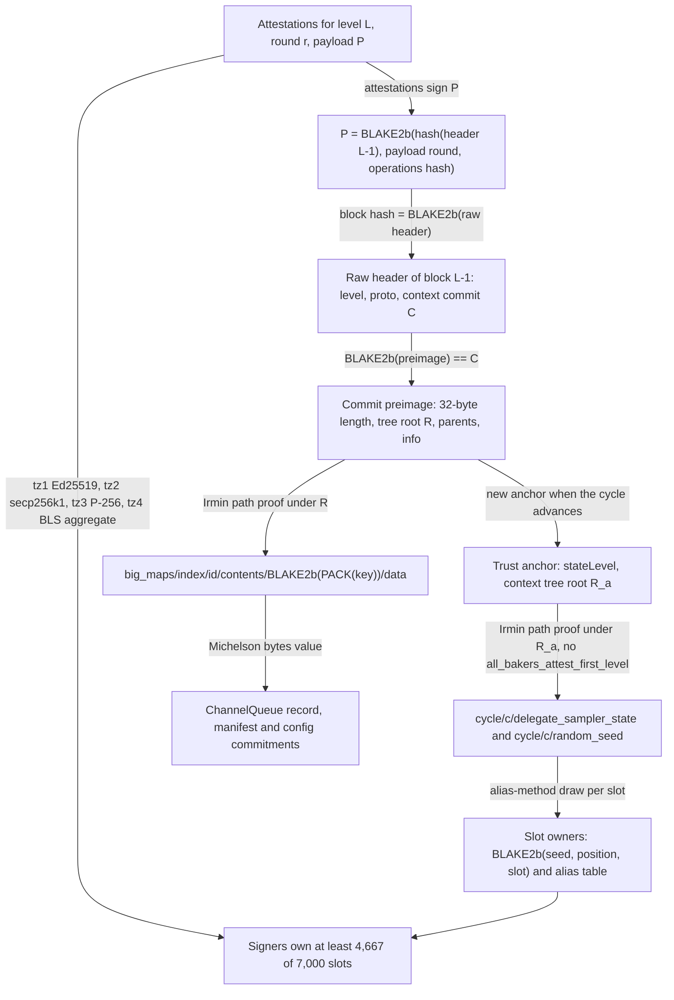
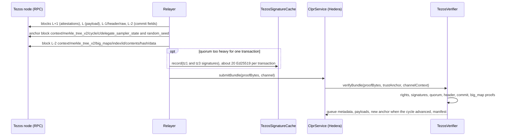

# Tezos verifiers (Tezos L1, Etherlink L1 half)

> **Source**: [TezosVerifier.sol](./TezosVerifier.sol) · light client [TezosLightClient.sol](./TezosLightClient.sol) ·
> signature cache [TezosSignatureCache.sol](./TezosSignatureCache.sol) · context proofs
> [TezosContextVerifier.sol](./TezosContextVerifier.sol) · Etherlink L1 half
> [EtherlinkCementedState.sol](./EtherlinkCementedState.sol) · libraries
> [TezosContextProof](../../../libraries/proof/tezos/TezosContextProof.sol),
> [TezosSampler](../../../libraries/proof/tezos/TezosSampler.sol),
> [TezosBlake2b](../../../libraries/proof/tezos/TezosBlake2b.sol), [TezosBls](../../../libraries/proof/tezos/TezosBls.sol),
> [TezosKeys](../../../libraries/proof/tezos/TezosKeys.sol)
> **Interface**: [IClprVerifier.sol](../../../interfaces/IClprVerifier.sol)
> **Chain pages**: [Tezos](../../../../docs/chains/tezos.md) · [Etherlink](../../../../docs/chains/etherlink.md)

`TezosVerifier` is a `Tezos → Hiero` CLPR verifier that runs on Hedera's EVM. It is a light client
for Tezos's Tenderbake consensus: from a trusted Tezos state it reads the attestation rights of the
attested cycle, checks that the signers of a block's attestations own more than 2/3 of the
consensus committee's slots, follows the attested payload to the predecessor block header and its
context commit, and then proves the Tezos CLPR Service's big_map entries with Merkle proofs into
the Tezos context (an Irmin tree). All four Tezos signature schemes are verified: tz1 Ed25519,
tz2 secp256k1, tz3 P-256 and tz4 BLS12-381 (one aggregate). `EtherlinkCementedState` uses the same
light client to prove the last cemented commitment of the Etherlink smart rollup and return its
PVM state hash; the step from that hash to an Etherlink EVM storage slot is not built (see
[Limits](#limits-and-known-gaps)).

Checked against octez master `29b6b0fc` (2026-10-01): `src/proto_025_PsUshuai/lib_protocol`
(protocol 025 PsUshuai, active on mainnet), `src/lib_crypto`, `src/lib_context/encoding`,
`irmin/lib_irmin_pack/inode.ml`, and live on Tezos mainnet on 2026-10-01.

## At a glance

| Item | Value |
|---|---|
| Chains covered | Tezos mainnet `tezos:NetXdQprcVkpaWU` (chain id bytes `0x7a06a770`); Etherlink mainnet `eip155:42793` (L1 half only: cemented PVM state hash) |
| Direction | Tezos → Hiero (Etherlink → Hiero: L1 half) |
| Finality source | Tenderbake: an attestation quorum (> 2/3 of the 7,000 committee slots, threshold 4,667) on the payload of level L makes block L−1 final |
| Trust assumptions | Less than 1/3 of the attested cycle's committee slots are Byzantine; a deploy-time checkpoint (level + context root); the pinned CLPR contract and big_map id |
| Typical bundle (live, one transaction) | 11,402,659 gas, 79,492 B calldata (tz4 aggregate + 4 tz2 + 15 tz3 signatures inline) |
| Typical bundle (live, cached signatures) | 7,002,485 gas, 98,372 B calldata, after 4 cache transactions (8.89M, 8.88M, 3.12M, 6.87M gas) |
| Rotation (live, previous-cycle anchor) | 11,398,689 gas, 79,364 B inline; 6,998,470 gas, 98,244 B cached |
| Contract sizes | `TezosVerifier` 21,906 B, `EtherlinkCementedState` 14,648 B, `TezosSignatureCache` 4,303 B, `TezosContextVerifier` 3,132 B, plus the shared `Ed25519Verifier` 12,206 B |
| Status | Tezos: live-verified on mainnet (finality + context proofs; fixture captured 2026-10-01 09:02 UTC, level 15,181,989). No Tezos CLPR Service exists, so `verifyBundle` / `verifyConfig` are covered by the synthetic suite. Etherlink: L1 half live-verified; storage proofs blocked |

## How it works



1. **Rights.** `TezosLightClient.sol:_verifyFinality` computes L's cycle from the deployment
   profile and proves the cycle's delegate sampler and random seed under the anchor root with
   `TezosContextVerifier.verify` (`TezosContextProof.sol:verify`). The same proof shows that the
   anchor's `data/` directory has no `all_bakers_attest_first_level` entry.
2. **Payload.** `_parseHeader` reads the raw header of block L−1 (level, protocol level, context
   hash) and the payload hash is recomputed as octez `Block_payload.hash` does.
3. **Signatures.** `_checkAttestations` rebuilds each tz1/tz2/tz3 attestation's signed bytes
   (watermark `0x13` ‖ chain id ‖ branch ‖ tag 21 or 23 ‖ slot ‖ level ‖ round ‖ P ‖ DAL bitset)
   and checks `BLAKE2b-256` of them with the signer's context key: Ed25519 through
   `Ed25519Verifier` or `TezosSignatureCache`, secp256k1 with `ecrecover`
   (`TezosKeys.sol:verifySecp256k1`), P-256 in Solidity (`TezosKeys.sol:verifyP256`, called through
   `TezosSignatureCache.checkP256` or the cache). `_checkAggregate` checks the tz4
   `attestations_aggregate`: one G1 multi-scalar multiplication of the members' keys and their
   DAL-weighted companion keys, hash-to-curve of the BLS-mode attestation, one pairing
   (`TezosBls.sol:verifyAggregate`).
4. **Quorum.** `TezosSampler.sol:countSignedSlots` re-draws slot owners from slot 0 upward and
   counts slots owned by a signer until the threshold is reached.
5. **Context.** The commit preimage is hashed to the predecessor header's context hash; its tree root
   is the state after block L−2. `TezosVerifier.sol:verifyBundle` proves the CLPR queue record (and
   the manifest commitment when present) under that root with `_bigMapBytes`.

## Bundle lifecycle



## Trust model

- **Trusted:** fewer than 1/3 of the attested cycle's committee slots are held by Byzantine bakers
  (Tenderbake's assumption). Two attestation quorums on different payloads at one level then need
  overlapping honest signers, which Tenderbake's locking rules forbid.
- **Trusted:** the deploy-time checkpoint (state level and context tree root) and the deployment
  profile (chain id, protocol level, cycle era, committee size and threshold). A wrong profile only
  makes valid bundles fail.
- **Trusted:** the pinned CLPR contract and big_map id. `verifyConfig` proves that the contract's
  whole storage is `Int <big_map id>`, so the big_map belongs to it.
- **Not trusted:** the relayer. Every key comes from the Tezos context under the trusted root,
  every signed message is rebuilt from the attested level, round and payload, slots are re-drawn
  on chain, and each slot is counted once. Relayer-supplied secp256k1/P-256 `y` coordinates must be
  on the curve with the parity the compressed key names. Each relayer-supplied BLS point must have
  the x coordinate of the 48-byte key in the context; the pairing check fails unless the supplied
  points form the key that signed.
- **Not checked:** whether a signer is a forbidden delegate (denounced for double signing). Tezos
  ignores such attestations; the verifier counts them, which stays safe under the 1/3 assumption.
- **To forge a bundle** an attacker must control at least 1/3 of a cycle's committee slots and get
  honest bakers to attest a conflicting payload, or break BLAKE2b, Ed25519, ECDSA or BLS12-381.

## Proof format

`proofBytes` = `abi.encode(TezosVerifier.BundleProof)`; `trustAnchor` = `abi.encode(uint32 stateLevel, bytes32 contextRoot)`.

| Field | Type | Meaning |
|---|---|---|
| `finality.level` / `round` | uint32 | Attested level L and attestation round |
| `finality.payloadRound`, `operationsHash` | uint32, bytes32 | The other inputs of the payload hash |
| `finality.predecessorHeader` | bytes | Raw header of block L−1 (`/header/raw`) |
| `finality.contextRoot`, `commitTail` | bytes32, bytes | Tree root and the rest of the commit preimage (parents, date, author, message) |
| `finality.samplerProof`, `seedProof` | bytes | Context path proofs under the anchor root |
| `finality.attestations[]` | (uint16 signer, uint16 slot, bytes32 branch, bool withDal, bytes dal, bytes signature, bytes32 y) | One per tz1/tz2/tz3 attestation; `signer` is the sampler support index; empty `signature` = read from the cache |
| `finality.aggregates[]` | (bytes32 branch, uint16[] signers, bytes[] keys, bytes[] dal, bytes[] companionKeys, bytes signature) | At most one tz4 aggregate; keys/companion keys 128-byte EIP-2537 G1, signature 256-byte G2, `dal` empty or `0x01 ‖ Z.to_bits(bitset)` |
| `queueProof` | bytes | Context proof of the `"q" ‖ channelId` big_map entry |
| `bundleContent` | bytes | `ClprBundleContent` (payloads; checked by ClprService against the proven running hash) |
| `manifestProof`, `manifestPreimage` | bytes | Optional `"m"` entry proof and the manifest bytes it commits to |

Context path proof (one level per hashed object, top-down): `kind(1) ‖ len(u16) ‖ preimage ‖
[pointer(1) for inode trees]`, then `valueLen(u32) ‖ value`. Kinds: 0 stable directory (searched by
name), 1 inode tree, 2 inode values (searched by name). `verifyConfig` takes
`abi.encode(ConfigProof{finality, storageProof, configProof, controlMessage})` from the checkpoint.

**Tezos CLPR Service storage profile** (a Michelson contract whose storage is one `big_map bytes bytes`):

| Key (Michelson `bytes`) | Value (Michelson `bytes`) |
|---|---|
| `"q" ‖ channelId` | 89-byte ChannelQueue record: status u8, next_message_id u64, received_message_id u64, sent_running_hash, received_running_hash, endpoint_manifest_version u64 (big-endian) |
| `"m"` | keccak256 of the endpoint manifest (`ClprProtobuf.encodeEndpointManifest`) |
| `"c"` | keccak256 of the ControlMessage carrying the LedgerConfiguration |

**Deployment profile** (`TezosLightClient.Profile` plus constructor arguments):

| Parameter | Mainnet value (tests) | Source |
|---|---|---|
| `chainId` | `0x7a06a770` (`NetXdQprcVkpaWU`) | block `chain_id` |
| `protocolLevel` | 25 | header `proto` |
| `eraFirstLevel`, `eraFirstCycle`, `blocksPerCycle` | 15,168,289, 1369, 14,400 | block `metadata.level_info`, constants |
| `committeeSize`, `threshold` | 7,000, 4,667 | `consensus_committee_size`, `consensus_threshold_size` |
| `serviceAddress`, `bigMapId` | the CLPR contract (22-byte id), its big_map | origination |
| checkpoint | a state level and its context tree root | `merkle_tree_v2` root of a trusted block |

## Validator-set / committee rotation

Tezos draws attestation rights per cycle (14,400 blocks, about 24 h at 6 s per block) from the stake
snapshot fixed `consensus_rights_delay` = 2 cycles ahead. A state in cycle a holds the samplers of
cycles a, a+1 and a+2, so an anchor in cycle a can verify levels up to cycle a+2.
`verifyBundle` keeps the anchor while the finalized state stays in the anchor's cycle and returns a
new anchor when it reaches a later cycle; a rotation is therefore an ordinary bundle and costs the
same (live: 11,398,689 gas inline from a cycle-1368 anchor to a cycle-1369 quorum). A channel idle
for more than about two cycles needs one bundle per two cycles to catch up, from a node that still
serves the anchor block's context.

## Gas and calldata

Measured on anvil (`eth_estimateGas`: intrinsic + calldata + execution) from
`test/e2e/fixtures/tezos-live/mainnet.json`, Tezos mainnet level 15,181,989 (cycle 1369), captured
2026-10-01, against Hedera's 15M gas and 128 KB:

| Transaction | Gas | Calldata | Notes |
|---|---|---|---|
| Bundle, inline signatures | 11,402,659 | 79,492 B | tz4 aggregate (65 members, 2,410 slots) + 4 tz2 + 15 tz3; 4,688 slots signed |
| Rotation, inline (anchor in cycle 1368) | 11,398,689 | 79,364 B | |
| `TezosSignatureCache.record` | 8,889,488 / 8,878,842 / 3,122,405 | ≤ 9,668 B | 47 tz1 signatures in batches of 20 |
| `TezosSignatureCache.record` | 6,871,858 | 9,665 B | 25 tz3 signatures |
| Bundle, cached tz1/tz3 | 7,002,485 | 98,372 B | all 76 individual attesters + aggregate |
| Etherlink cemented state, inline | 11,536,116 | 78,276 B | same quorum + 2 context proofs |

The quorum at that level: 47 tz1 (2,169 slots), 4 tz2 (75), 25 tz3 (2,288) and the tz4 aggregate
(2,410), 6,942 of 7,000 slots. Re-drawing slot owners (one BLAKE2F call per slot) until the
signers own 4,667 slots costs 2,777,438 gas at that level (`TezosLive.t.sol:test_live_slotDrawCost`). Ed25519 costs about 440k gas per signature in the cache
and P-256 about 275k (batch totals above). Whether one transaction suffices depends on the level's
mix of key types; the cached path always fits.

## Limits and known gaps

- **No Tezos CLPR Service yet.** The Michelson contract (one `big_map bytes bytes` with the keys
  above) is a design; live tests prove a tzBTC ledger entry (`big_maps/index/31`) and the tzBTC
  contract's storage instead.
- **Public RPC.** Only `rpc.tzbeta.net` served `context/merkle_tree_v2` (rpc.tzkt.io returns 403,
  mainnet.smartpy.io an empty body). A relayer needs a node keeping the anchor block's context (up
  to two cycles back for catch-up); tzbeta served one-cycle-old proofs at capture.
- **State lag.** The proven state is the one after block L−2 (two blocks, about 12 s, behind the
  attested level).
- **Gas depends on the key mix.** P-256 has no precompile on Hedera and is verified in Solidity
  (about 275k gas each); Ed25519 about 440k. When tz4 power is low the inline path may exceed 15M;
  the cache path (several transactions) is the fallback.
- **Protocol-specific.** The verifier assumes alias-sampled slots: it refuses anchors that schedule
  "all bakers attest" (activation when half of the bakers use tz4 keys, 83 of 196 at capture), and a
  switch to SWRR lotteries (`swrr_new_baker_lottery_enable`, currently false) would stop new
  samplers from being stored, so proofs would fail. Both need a new verifier.
- **Forbidden delegates** are not excluded (see Trust model).
- **Etherlink storage proofs are blocked.** `EtherlinkCementedState` returns the cemented PVM
  state hash; proving an EVM slot under it needs a binary-Irmin proof of the durable storage from an
  Etherlink rollup node, which no public endpoint serves, and cementation takes 14 days.

## Upgrades and forks

A Tezos protocol amendment can change the header or operation encodings, the sampler, the
attestation threshold or the context layout. The verifier pins the predecessor header's protocol
level (`ProtocolMismatch`), the era (`blocks_per_cycle` changes start a new era) and the committee
constants, so after an upgrade bundles fail closed until a verifier for the new protocol is
registered. This follows the fork-aware verifier ADR (`ADR/2026-10-01-fork-aware-verifiers.md` in
the spec fork, draft PR LFDT-CLPR/clpr-spec#1): one verifier per protocol, selected by the protocol
level of the attested block. Tezos announces amendments about two weeks before activation
(adoption period), which is the window to deploy the next verifier.

## Running it

```sh
forge test --match-contract 'TezosVerifierTest|TezosLiveTest|TezosComplianceTest'   # unit, live, compliance
forge build && npm run test:e2e:tezos-live                                          # live replay on anvil
npm run tezos-live:refresh                                                          # re-capture from mainnet (TEZOS_RPC to override)
npx tsx test/e2e/relay/tezos/buildTezosSynthetic.ts                                 # regenerate the synthetic chain
```

## Files

| File | Purpose |
|---|---|
| `src/verifiers/evm/tezos/TezosVerifier.sol` | IClprVerifier: CLPR big_map proofs over the light client |
| `src/verifiers/evm/tezos/TezosLightClient.sol` | Tenderbake finality from a context root |
| `src/verifiers/evm/tezos/TezosSignatureCache.sol` | Permissionless Ed25519 / P-256 signature cache |
| `src/verifiers/evm/tezos/TezosContextVerifier.sol` | Stateless context-proof contract |
| `src/verifiers/evm/tezos/EtherlinkCementedState.sol` | Etherlink last cemented commitment (L1 half) |
| `src/libraries/proof/tezos/*.sol` | BLAKE2b, Irmin path proofs, sampler, secp256k1/P-256, BLS aggregate |
| `test/verifiers/evm/tezos/TezosVerifier.t.sol` | Synthetic chain: bundle, config, cache, negative cases |
| `test/verifiers/evm/tezos/TezosLive.t.sol` | Live mainnet fixture in Foundry |
| `test/verifiers/compliance/TezosComplianceTest.t.sol` | Shared compliance suite |
| `test/verifiers/evm/tezos/fixtures/synthetic.json` | Synthetic chain (generated) |
| `test/e2e/fixtures/tezos-live/` | `capture.json` (RPC data) and `mainnet.json` (derived proofs) |
| `test/e2e/relay/buildTezosLiveFixture.ts` | Capture and proof building (relayer reference) |
| `test/e2e/relay/tezos/*.ts` | Codec, Irmin proofs, sampler, synthetic chain generator |
| `test/e2e/tests/verifiers/tezos-live.spec.ts` | Anvil replay with gas and calldata checks |

## References

- octez `src/proto_025_PsUshuai/lib_protocol/`: `delegate_sampler.ml`, `sampler.ml`, `validate.ml`,
  `operation_repr.ml`, `block_payload_repr.ml`, `block_header_repr.ml`, `dal_attestations_repr.ml`,
  `all_bakers_attest_activation_storage.ml`, `storage.ml`, `apply.ml` (commit message),
  `raw_context.ml` — https://gitlab.com/tezos/tezos
- octez `src/lib_crypto/` (`bls.ml`, `p256.ml`, `secp256k1.ml`, `ed25519.ml`, `blake2B.ml`) and
  `src/lib_bls12_381_signature/bls12_381_signature.ml`
- octez `src/lib_context/encoding/context.ml`, `src/lib_context/merkle_proof_encoding/`,
  `src/lib_context/disk/context.ml`, `irmin/lib_irmin_pack/inode.ml`, `irmin/lib_irmin/commit.ml`
- Tezos RPC `GET /chains/main/blocks/<id>/context/merkle_tree_v2/<path>` and
  `/chains/main/blocks/<id>/context/constants` on https://rpc.tzbeta.net
- EIP-152 (BLAKE2F), EIP-2537 (BLS12-381), RFC 9380 (hash to curve), RFC 7693 (BLAKE2)
- Hedera node native-library check listing `besu blake2bf`:
  https://github.com/hiero-ledger/hiero-consensus-node (`NativeLibVerifier.java`)
