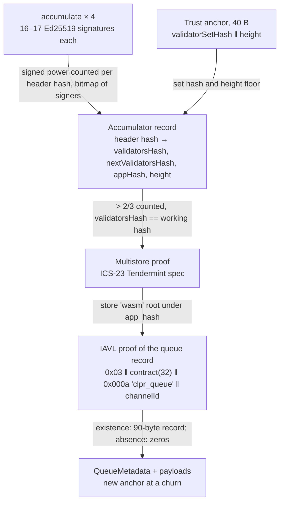
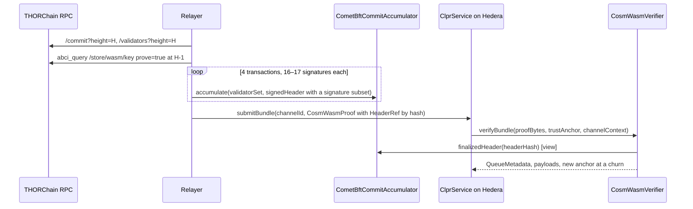

# THORChain verifier (CosmWasm App Layer on CometBFT)

A "THORChain → Hiero" verifier. It proves CometBFT finality of a `thorchain-1` header (validators
holding more than 2/3 of the voting power signed it) and an ICS-23 proof of the peer CLPR Service's
queue record in THORChain's CosmWasm `wasm` store under that header's `app_hash`. There is no
THORChain-specific contract. THORChain is a deploy-time profile of
[`CosmWasmVerifier`](../provenance/README.md) and `CometBftCommitAccumulator`. Every THORChain
validator has the same power, so a commit needs 67 Ed25519 signatures. That is about 44M gas, so the
commit is spread over four `accumulate` transactions before the bundle.

## 1. At a glance

| | |
|---|---|
| Direction | `THORChain → Hiero` |
| Chain | THORChain mainnet `cosmos:thorchain-1` (thornode 3.20.3, CometBFT 0.38.19) |
| Finality source | CometBFT commit, > 2/3 of voting power: 67 of 99 validators (64 of 95 at the last churn), all power 100 |
| Trust (one line) | Honest 2/3 of each THORChain set the anchor reaches, a bootstrap checkpoint, an anchor kept current across churns, the CLPR Service contract's admin |
| Typical bundle | 5 transactions: 4 × `accumulate` (11.14M–11.91M gas, 5.9–6.0 KB each) + `verifyBundle` by header hash 583,234 gas, 3.0 KB (live) |
| Rotation (churn) | Same 5 transactions at the churn header: 4 × 11.10M–11.26M + 583,609 gas (live) |
| Contract sizes | `CosmWasmVerifier` 15,306 B; `CometBftCommitAccumulator` 13,104 B; `Ed25519Verifier` 12,206 B |
| Status | Live-verified on `thorchain-1` data recorded 2026-10-01 (a real churn and a current header, real App Layer contract storage). No CLPR Service can be deployed today: the App Layer is halted and uploads are whitelisted (§8) |

## 2. How it works

The proof chain is `CosmWasmVerifier`'s ([Provenance README §2](../provenance/README.md)). The only
difference is that the bundle always references its header (and any hop) **by hash**, because the
commit was accumulated earlier.



1. `CometBftCommitAccumulator.sol:accumulate(validatorSet, signedHeader)` verifies the signatures
   not yet counted in the batch, adds their power and sets their bits. Each batch must carry the same
   round and part-set header (`CommitMismatch`); a batch that adds nobody reverts
   (`NoNewSignatures`).
2. `CosmWasmVerifier.sol:verifyBundle` resolves `HeaderRef{3 header_hash}` through
   `CometBftCommitAccumulator.sol:finalizedHeader`, which reverts `NotFinalized` until more than 2/3
   is counted (`CometBftStoreProofBase.sol:_resolveHeader`).
3. Multistore proof of store `wasm` against `app_hash`, then the IAVL proof of the queue record and
   optional service item, exactly as for Provenance (`_verifiedStoreRoot`, `_queueKey`,
   `_proveEntry`, `_decodeQueueRecord`).
4. A churn header returns the new anchor (`_nextAnchor`).

## 3. Bundle lifecycle



## 4. Trust model

Trusted:
- **Honest supermajority** of every THORChain validator set the anchor reaches.
- **Bootstrap checkpoint** for `verifyConfig`: a set hash at a recent churn.
- **Churn freshness.** A churned-out node can withdraw its bond, so an old set may have nothing at
  stake. The light client is sequential with no trusting period, so a relay must bundle at every
  churn header and catch up promptly if it misses one.
- **The CLPR Service contract's admin**, as for any CosmWasm contract
  ([Provenance README §4](../provenance/README.md)).

Not trusted: the relayer and whoever calls `accumulate`. A record binds one header hash to one set
hash, and the verifier accepts it only for the set its anchor names.

To forge a bundle an attacker must control more than 2/3 of a THORChain set the anchor reaches, or
an old set the anchor still names after its bonds were withdrawn.

## 5. Proof format

The proof is `CosmWasmProof` ([Provenance README §5](../provenance/README.md)); THORChain bundles use
`HeaderRef{3 header_hash}`. Store layout (thornode v3.20.3 → wasmd v0.54.0):

| What | Key in store `wasm` | Live proof in the fixture |
|---|---|---|
| Contract storage | `0x03 ‖ canonical address (32 B, BuildContractAddressClassic) ‖ key` | all three keys below |
| cw2 `Item("contract_info")` | `… ‖ "contract_info"` | `{"contract":"rujira-thorchain-swap","version":"1.3.0"}` |
| cw-storage-plus `Map("vaults")["avax-avax"]` | `… ‖ 0x0006 "vaults" ‖ "avax-avax"` | `"thor13etu2zrd…"` |
| CLPR queue record | `… ‖ 0x000a "clpr_queue" ‖ channelId` | absent (non-existence) |

Deployment profile:

```
CometBftCommitAccumulator("thorchain-1", KeyScheme.ED25519, Ed25519Verifier)
CosmWasmVerifier.Profile{accumulator, storeKey: "wasm",
                         bootstrapValidatorsHash: <set hash at a recent churn>, bootstrapHeight}
```

## 6. Validator-set rotation (churn)

All validators have power 100, so `validators_hash` changes only at churns: every
`CHURNINTERVAL = 43200` blocks (about 3 days) plus ad-hoc churn-outs. There are no
delegation-driven rotations. Each churn costs one bundle at the churn header R, which is the same
five transactions as a typical bundle (§7). A relay that missed a churn accumulates both commits
and sends one catch-up bundle that references both by hash: 599,882 gas.

## 7. Gas and calldata

Live `thorchain-1` data recorded 2026-10-01 (`test/e2e/fixtures/thorchain-live/thorchain.json`):
the last churn `R = 27,914,371` (95 validators, signed by the old set) and a current header
`B = 28,052,921` (99 validators, signed by the new set), plus ABCI proofs from Rujira's swap router
`thor1n5a08r0z…cccnat2ska5t4g` (code 198, cw2 `rujira-thorchain-swap` 1.3.0). Gas is anvil
`eth_estimateGas` of the whole transaction (`accumulate`: `gasUsed`), replayed on this branch on
2026-10-01. Hedera limits: 15,000,000 gas, 131,072 B.

| Transaction | Sigs | Gas | Calldata | ≤ 15M |
|---|---|---|---|---|
| Bundle at B with the commit inline (one tx) | 67 | 44,401,841 | 12.9 KB | **no** |
| `accumulate` R, batches 1 / 2 / 3 / 4 | 16 each | 11,260,593 / 11,101,964 / 11,114,059 / 11,111,586 | 5.7 KB | yes |
| **Bundle at R by header hash** (churn: returns the new anchor) | 0 | **583,609** | 3.0 KB | yes |
| `accumulate` B, batches 1 / 2 / 3 / 4 | 17 / 17 / 17 / 16 | 11,914,216 / 11,771,789 / 11,783,859 / 11,141,574 | 6.0 / 6.0 / 6.0 / 5.9 KB | yes |
| **Bundle at B by header hash** (typical) | 0 | **583,234** | 3.0 KB | yes |
| Catch-up bundle at B, hop R, both by hash | 0 | 599,882 | 3.0 KB | yes |
| `verifyContractEntry` cw2 `contract_info` (existence) | 0 | 297,296 | 1.8 KB | yes |
| `verifyContractEntry` Map `vaults["avax-avax"]` (existence) | 0 | 304,337 | 1.8 KB | yes |

A typical bundle therefore costs about 46.6M gas over five transactions. The bundle proves the
absence of the CLPR queue record (two IAVL neighbours); an existing record needs one path and is
cheaper.

## 8. Limits and known gaps

- **No Ed25519 precompile on Hedera**: four extra transactions per bundle. A SNARK of the commit
  (Groth16 over BN254, about 0.3–0.4M gas, estimate) would collapse this to one transaction; it is
  documented in the [CometBFT README §8](../cometbft/README.md), not built.
- **App Layer halted (2026-10-01).** Mimir `HALTWASMGLOBAL = 1`. `WasmMgr.checkGlobalHalt` blocks
  `StoreCode`, `Instantiate(2)`, `Execute`, `Migrate`, `Sudo` and admin changes. Contract state is
  still in the `wasm` store and provable (this fixture), but no CLPR Service could be deployed or run
  until node operators lift the halt.
- **Upload whitelist.** `MsgStoreCode` and `MsgInstantiateContract` are allowed only from addresses
  compiled into thornode (`common/wasmpermissions/wasm_permissions_mainnet.go` at v3.20.3: 3 may
  store code, all Rujira; 11 may instantiate) unless mimir `MimirKeyWasmPermissionless` is set (it is
  not). A contract can instantiate further contracts without permission, but code upload still
  needs a whitelisted sender.
- **History.** The public node `gateway.liquify.com` serves ABCI proofs at the June 2026 churn. Other
  public endpoints (ninerealms, publicnode) did not answer on 2026-10-01.
- **No CLPR Service exists**; the service sketched in the [Provenance README §12](../provenance/README.md)
  applies unchanged.

Where a CLPR Service could live:

| Option | Store | Who can deploy | Verdict |
|---|---|---|---|
| CosmWasm App Layer | `wasm`, standard wasmd layout | whitelisted addresses (above), or a whitelisted deployer such as Rujira uploading the code | Chosen: `CosmWasmVerifier` works unchanged |
| Native thornode module | a new IAVL store or a key range in `thorchain` | a thornode release and node-operator upgrade | Same governance cost plus Go code in consensus; no benefit for the verifier |

## 9. Upgrades and forks

THORChain does not use `x/gov`. Node operators approve upgrades (`MsgProposeUpgrade`,
`MsgApproveUpgrade`), and an upgrade is scheduled when at least 2/3 of active nodes approve. Under
the fork-aware verifier ADR (`ADR/2026-10-01-fork-aware-verifiers.md` in the spec fork, draft PR
LFDT-CLPR/clpr-spec#1, CometBFT row of Appendix B.1):

- Class A (header version, sets): hashed as signed, not pinned; sets follow churns (§6).
- Class B (layout): a wasmd upgrade that changed `ContractStorePrefix` or the store name would
  break every proof and need a new deployment.
- Class C (semantic): a change to keys, votes or the header hash fails closed in the accumulator.
- Mimir halts are not forks: they stop the CLPR Service, not verification.

`fork_id` and profile arming from the ADR are not implemented in this family yet.

## 10. Running it

```bash
forge test --match-path 'test/verifiers/evm/provenance/*'                         # CosmWasmVerifier suite (29 tests)
forge test --match-path 'test/verifiers/compliance/CosmWasmComplianceTest.t.sol'  # shared suite (21 tests)
forge build && npm run test:e2e:thorchain-live    # 7 tests on the live fixture (CLPR_ANVIL_PORT_A, default 8601)
npm run thorchain-live:refresh                     # re-record (last churn + current header)
```

## 11. Files

| File | What |
|---|---|
| `src/verifiers/evm/provenance/CosmWasmVerifier.sol` | The verifier (no THORChain-specific code) |
| `src/verifiers/evm/cometbft/CometBftCommitAccumulator.sol` | Multi-transaction commit accumulation |
| `src/verifiers/evm/cometbft/CometBftStoreProofBase.sol` | Header references and store proofs |
| `test/e2e/fixtures/thorchain-live/thorchain.json` | Live capture: churn R, header B, contract proofs, wasm mimir values |
| `test/e2e/fixtures/cometbft-live/thorchain.json` | Earlier live commit used by the CometBFT and Provenance specs |
| `test/e2e/relay/buildThorchainLiveFixture.ts` | Fixture refresh script |
| `test/e2e/relay/cosmwasm.ts` | Builds `CosmWasmProof` from RPC JSON |
| `test/e2e/tests/verifiers/thorchain-live.spec.ts` | Live replay, 7 tests with negatives (replayed batch, flipped signature, not finalized, wrong set, stale anchor, another channel, tampered IAVL proof) |
| `docs/chains/thorchain.md` | Chain page |

## 12. References

- thornode v3.20.3 (the live version): `go.mod` (wasmd v0.54.0, cosmos-sdk v0.53.0, cometbft
  v0.38.21, iavl v1.2.8), `x/thorchain/manager_wasm_current.go` (`checkGlobalHalt`,
  `checkCanStore`, `checkInstantiateAuthorization`), `common/wasmpermissions/`, `app/app.go`.
- thornode `keeper/v1/keeper_upgrade.go` (`UpgradeApprovedByMajority`), as cited in the x/clpr
  README on branch `feat/dydx-xclpr`.
- CosmWasm/wasmd v0.54.0 `x/wasm/types/keys.go` (`ContractStorePrefix = 0x03`),
  `x/wasm/keeper/addresses.go` (`BuildContractAddressClassic`, 32 B).
- Fork-aware verifiers ADR, `ADR/2026-10-01-fork-aware-verifiers.md` (spec fork, draft PR
  LFDT-CLPR/clpr-spec#1).
- Live: `https://gateway.liquify.com/chain/thorchain_rpc` (status, commit, validators, blockchain,
  `abci_query /store/wasm/key?prove=true`) and `…/thorchain_api` (mimir, asgard vaults, wasm codes,
  contracts and state).
