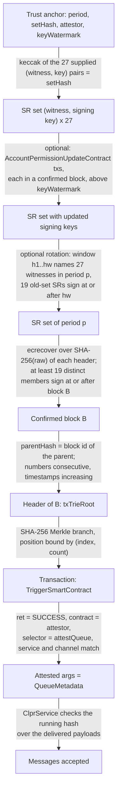
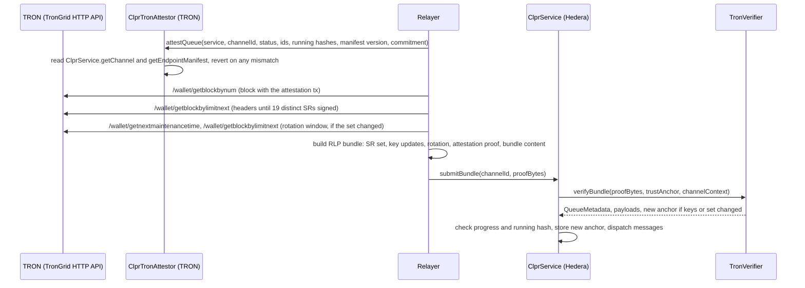

# TronVerifier: TRON → Hiero

`TronVerifier` is an `IClprVerifier` that runs on Hedera's EVM and verifies CLPR bundles from TRON (direction
`TRON → Hiero`). It is a DPoS light client for TRON's 27 Super Representatives (SRs). TRON blocks commit to
transactions but not to contract storage, so the verifier does not prove storage. It proves that a call to an
attestation contract, `ClprTronAttestor.attestQueue`, succeeded in a block that 19 of the 27 trusted SRs confirmed.
That function reverts unless its arguments equal the live ClprService channel state, so the call's arguments are the
queue state.

## At a glance

| Item | Value |
|---|---|
| Chains covered | TRON mainnet (`tron:0x2b6653dc`), Nile testnet (`tron:0xcd8690dc`); Shasta and private java-tron chains by configuration. Per-chain page: [`docs/chains/tron.md`](../../../../docs/chains/tron.md) |
| Finality source | java-tron solidification: a block is final once 19 distinct active SRs have produced blocks at or above it |
| Trust (one line) | No 19 keys of the anchored SR set sign a conflicting chain; the attestor contract is correct; bootstrap SR set trusted |
| Typical bundle | Mainnet, live: 959,816 gas (`eth_estimateGas`), 5,508 B calldata (19 headers, 324-transaction block) |
| Rotation + bundle | Mainnet, live: 2,750,499 gas, 13,796 B calldata (47 rotation headers + 19) |
| Contract size | `TronVerifier` runtime 18,220 B (6,356 B under EIP-170); `ClprTronAttestor` (TRON side) 3,682 B |
| Status | Live-verified on TRON mainnet and Nile, fixtures captured 2026-10-01. No ClprService on TRON yet: a real `TriggerSmartContract` stands in for `attestQueue` |

## How it works

### What a TRON block commits to

Every rule below was checked against java-tron `develop` at `b33eed8` (Sep 2026) and against live Nile and mainnet
data (Oct 2026).

| Question | Finding | Evidence |
|---|---|---|
| Is the header's state-root field populated? | No. `BlockHeader.raw.accountStateRoot` (field 11) is empty on mainnet, Nile and Shasta; `getAllowAccountStateRoot` (proposal 25) is unset on all three | `/wallet/getchainparameters`; the JSON-RPC `stateRoot` is empty |
| If it were enabled, would it cover storage? | No. The trie gets only `AccountStore` entries (`AccountStateCallBack`). Contract storage lives in `StorageRowStore` and is never committed | `framework/.../AccountStateCallBack.java` |
| Is there a receipts or log root? | No. `TransactionInfo` is stored but not committed; JSON-RPC returns `receiptsRoot = 0x00…` | `jsonrpc/types/BlockResult.java` |
| Is there an account or storage proof RPC? | No. `eth_getProof` returns "method not found" on TronGrid; `eth_getStorageAt` is unauthenticated | live RPC; `TronJsonRpc.java` |
| What is committed? | `txTrieRoot`: a SHA-256 binary tree over SHA-256 of each full `Transaction` (raw_data, signatures and `ret`). An odd node is promoted as is; an empty block's root is all zeros | `BlockCapsule.calcMerkleRoot`, `MerkleTree.java` |
| Is `ret.contractRet` consensus data? | Yes, for VM transactions. Each validating node re-executes the call and rejects the block on a mismatch (`TransactionTrace.check`: "different resultCode") | `TransactionTrace.java`, `Manager.processTransaction`, `RuntimeImpl.execute` |

A function that reverts unless its arguments equal current storage turns "storage held X at block B" into "a
successful call with argument X is in block B". The second statement needs only headers and `txTrieRoot`.

### Proof chain



1. `TronVerifier.sol:_decodeTrustAnchor` reads the 128-byte anchor. `TronVerifier.sol:_decodeSrSet` reads the 27
   supplied pairs and `verifyBundle` requires their hash (`_hashSrSet`) to equal `setHash`.
2. `TronVerifier.sol:_applyKeyUpdates` applies proven `AccountPermissionUpdateContract` transactions in strictly
   increasing block order above `keyWatermark`; each is confirmed with `_confirmTx`.
3. `TronVerifier.sol:_rotate` (optional) checks the maintenance window and builds the next set; keys are accepted
   only through `_keyAuthenticated`.
4. `TronVerifier.sol:_verifyQueueAttestation` calls `_confirmTx`: `_parseHeaders` checks the parent links and
   recovers signers with `TronLib`, `_requireConfirmed` counts distinct endorsers with `_countEndorsers`, and the
   Merkle branch is checked against `txTrieRoot`.
5. `TronVerifier.sol:_attestationArgs` decodes the `Transaction` and `TriggerSmartContract` protobufs with `TronLib`,
   requires `SUCCESS`, the attestor address and the `attestQueue` selector, and returns the arguments.
   `_verifyQueueAttestation` checks `service`, `channelId` and `status ≤ CLOSED`, and builds `QueueMetadata`.
6. `verifyBundle` decodes the payloads with `_decodeBundleContent`. `_bindManifest` checks an optional manifest
   preimage against the attested `manifestCommitment`. A new anchor is returned if keys or the set changed.

## Bundle lifecycle



Every bundle needs one `attestQueue` transaction on TRON, paid in energy by the relayer. Latency is TRON inclusion
plus about 19 blocks (about 1 minute at 3 s blocks).

## Trust model

Trusted:
- **Fewer than 9 of the 27 anchored SR keys are dishonest** (no 19 sign a conflicting chain). This includes SRs voted
  out since the last rotation, until the next rotation drops them. It is the same assumption as TRON's own
  solidification.
- **The bootstrap SR set and attestor address** given to `verifyConfig` (weak subjectivity). The verifier checks only
  that 19 of the supplied keys signed a real header chain. It cannot prove the attestor's bytecode, because TRON
  does not commit to code; it pins the address, and the attestor's `SERVICE` is immutable.
- **The attestor contract is correct**: it reverts unless every argument equals storage.

Not trusted:
- The relayer and the sender of `attestQueue`. A false argument makes the TRON call revert, and a reverted call is
  rejected (`AttestationFailed`).
- Any single SR, including the producer of the attested block.

To forge a bundle an attacker must control 19 of the anchored SR signing keys, or supply a false SR set or attestor
address at configuration time.

## Proof format

Trust anchor: `abi.encode(uint64 period, bytes32 setHash, address attestor, uint64 keyWatermark)`, 128 bytes.

| Field | Type | Meaning |
|---|---|---|
| `period` | `uint64` | Maintenance period of the anchored set; also the trust anchor id |
| `setHash` | `bytes32` | keccak256 of `witness_0 ‖ key_0 ‖ … ‖ witness_26 ‖ key_26`, sorted by witness |
| `attestor` | `address` | `ClprTronAttestor` address (20-byte form) |
| `keyWatermark` | `uint64` | Block number of the last applied key update; updates must be above it |

Bundle `proof_bytes`, RLP:

| # | Field | Type | Meaning |
|---|---|---|---|
| 0 | `srSet` | `[[witness20, key20] x 27]` | Sorted by witness; key 0 when unknown or FN-DSA |
| 1 | `keyUpdates` | list of `TxProof` | `AccountPermissionUpdateContract` transactions |
| 2 | `rotation` | `[]` or `[headers, windowEnd]` | Rotation into a later maintenance period |
| 3 | `attestation` | `TxProof` | The `attestQueue` transaction |
| 4 | `bundleContent` | bytes | Protobuf `ClprBundleContent` |
| 5 | `manifestPreimage` | bytes or empty | Endpoint manifest, bound to the attested commitment |

`TxProof = [headers, txBytes, index, count, siblings[bytes32]]`, `headers = [[raw, sig65 | ""], …]`.

Configuration (`verifyConfig`): `[srSet, attestor20, headers, ledgerConfigControlMessage]`, plus an optional
manifest proof `[attestManifest TxProof, manifestPreimage]`. The CAIP-2 id is pinned at construction because TRON
headers carry no chain id.

Constructor (per deployment): `srCount`, `threshold` (must be more than 2/3 of `srCount`), `maintenanceIntervalMs`,
`maintenanceOffsetMs`, `chainId` (CAIP-2).

### Header and signature rules

- Header hash = `SHA-256(raw)`. Block id = 8-byte big-endian number followed by `hash[8..32]`. `child.parentHash`
  must equal the parent's id; numbers are consecutive and timestamps strictly increase.
- Signatures are 65 bytes, `r ‖ s ‖ v` with `v ∈ {0,1}`, over the header hash, recovered with `ecrecover`.
- The signing key is the witness-permission address, not necessarily the witness address (`AllowMultiSign = 1` on
  mainnet and Nile; `BlockCapsule.validateSignature`). In live data 6 of the 27 mainnet SRs sign with a key other
  than their witness address, so the anchor stores (witness, key) pairs.
- FN-DSA-512 (TIP-899) headers are links only. Their signature (`pq_auth_sig`) is outside `raw`, so the hash chain is
  unchanged, but they carry no ECDSA signature and are never counted. One Nile SR signs this way.
- The Merkle leaf position is bound by `(index, count)`, and a 64-byte leaf is rejected.

## Validator-set / committee rotation

- The active set changes only at maintenance, on the grid `OFFSET + k x INTERVAL`
  (`DynamicPropertiesStore.updateNextMaintenanceTime`). The first block at or after `nextMaintenanceTime` runs
  maintenance; the next block follows after 2 skipped slots, a 9 s gap visible in both fixtures.

| Network | INTERVAL | OFFSET |
|---|---|---|
| Mainnet | 21,600,000 ms (6 h) | 0 |
| Nile | 1,800,000 ms (30 min) | 600,000 |
| Shasta | 600,000 ms (10 min) | 480,000 |

- A rotation into period `p` is a parent-linked chain `h0, h1 … hw … hm`. `h0` and `hw` lie in period `p`;
  `h1..hw` name exactly 27 distinct witnesses; at least 19 distinct members of the old set sign at or after `hw`;
  `p ≥ anchor.period`, so a rollback is impossible. Window keys are accepted only if they are the witness address,
  the old key, or a key proven in the same bundle by an `AccountPermissionUpdateContract`; any other key reverts with
  `UnauthenticatedSignerKey`.
- Key updates: java-tron requires a witness permission with exactly one key. Updates are proven in confirmed blocks,
  in strictly increasing block order above `keyWatermark`, so an older update cannot be replayed over a newer one.
- Cadence: a rotation is needed only when the set or a key changes; the relayer should rotate in every such period.
  If 9 or more SRs were replaced in one maintenance, which has never happened on mainnet, the channel needs a new
  configuration.
- Cost: on live mainnet a rotation adds 1,790,683 gas and 8,288 B (2,750,499 − 959,816 gas; 13,796 − 5,508 B).
  Both live rotations crossed a real maintenance boundary with no change in membership (+0/−0 SRs).

## Gas and calldata

Hedera limits: 15M gas, 128 KB calldata. `eth_estimateGas` and calldata are from anvil (`tron-live.spec.ts`) and
include the 21k base and calldata cost; the synthetic figures are Foundry execution gas. Live fixtures were captured
on 2026-10-01.

| Case | Gas | Calldata |
|---|---|---|
| Steady bundle, live mainnet (19 headers, 324-tx block, Merkle depth 9) | 959,816 | 5,508 B |
| Steady bundle, live Nile (19 headers, 7-tx block, depth 3) | 944,214 | 5,668 B |
| Rotation + bundle, live mainnet (47 + 19 headers) | 2,750,499 | 13,796 B |
| Rotation + bundle, live Nile (48 + 19 headers) | 2,737,953 | 13,988 B |
| `verifyConfig`, live mainnet (27 headers) | 1,113,639 | 6,021 B config proof |
| `verifyConfig`, live Nile (27 headers) | 1,106,024 | 5,955 B config proof |
| Steady bundle, synthetic, 19 headers (verifier only) | 980,913 | 5,186 B |
| Steady bundle, synthetic, 27 headers (verifier only) | 1,208,235 | 6,594 B |
| Rotation + bundle, synthetic (verifier only) | 2,467,224 | 13,464 B |
| `submitBundle` on an unmodified ClprService (DATA + REPLY, synthetic) | 1,453,739 | 5,270 B |

The live figures come from a harness that runs the production code up to the `attestQueue` selector check (see
Limits). The 27 SR pairs ride in every bundle (about 1.1 KB), which keeps the stored anchor at 128 bytes.

## Limits and known gaps

- **No ClprService or attestor on TRON yet.** The live fixtures use a real successful `TriggerSmartContract` with 19
  confirmations in place of `attestQueue`; `verifyBundle` passes every step and stops at `WrongAttestationCall`.
  `ClprTronAttestor` is tested against a real ClprService on the EVM (`IntegrationTron.t.sol`) but is not deployed.
- **One TRON transaction per bundle**, paying energy for about one `getChannel` plus one manifest encode.
- **Maintenance grid is a constructor parameter.** A governance change of the interval shifts the grid. Safety is
  unaffected, but the rotation window check could reject or mix periods; redeploy and reconfigure.
- **Fail-closed headers.** An unknown or duplicated `BlockHeader.raw` field reverts, so a new header field halts
  verification until it is reviewed.
- **Post-quantum migration (TIP-899).** FN-DSA-512 blocks are not counted. If 9 or more mainnet SRs move to FN-DSA,
  finality is lost until Hedera can verify Falcon. Hedera has no precompile for it.
- **Key-update gaps.** A relayer may apply an older key update and omit a newer one. The key is still one the SR
  designated, and the newer update can be applied later because the watermark only moves forward.
- Nile's PBFT SR-list commits would make rotation proofs smaller, but they travel only over P2P and PBFT is off on
  mainnet, so they are not used.

## Upgrades and forks

- TRON upgrades by on-chain proposals voted by SRs. A proposal that adds a header field, changes the signature
  scheme, enables `accountStateRoot` or changes the maintenance interval affects this verifier.
- Under the fork-aware verifier ADR
  ([`ADR/2026-10-01-fork-aware-verifiers.md`](https://github.com/shayansal/clpr-spec/blob/adr/fork-handling/ADR/2026-10-01-fork-aware-verifiers.md),
  draft PR [LFDT-CLPR/clpr-spec#1](https://github.com/LFDT-CLPR/clpr-spec/pull/1)): SR set and key changes are
  Class A (proven by the source consensus); a new header field or a maintenance-grid change is Class B; a move to
  FN-DSA signatures is Class C (a new verifier and channel succession).
- The verifier is not fork-aware yet. Today a new header field reverts (fail closed), which matches the ADR's safe
  stall, but without the typed fork reverts.

## Running it

```sh
# Unit, compliance and ClprService integration tests (Foundry)
forge test --match-path 'test/**/*Tron*' -vv

# Live fixture replay on anvil (Nile and mainnet)
npm run test:e2e:tron-live

# Refresh the live fixtures from TronGrid (Nile, then mainnet)
npm run tron-live:refresh
```

Test counts on this branch: 32 unit, 21 compliance and 4 integration tests (Foundry), 18 anvil tests.

## Files

| File | Purpose |
|---|---|
| `src/verifiers/evm/tron/TronVerifier.sol` | `IClprVerifier`: SR-set anchor, finality, rotation, key updates, attestation decoding |
| `src/verifiers/evm/tron/TronLib.sol` | `BlockHeader.raw` parsing, block ids, signer recovery, transaction Merkle tree, `Transaction`, `TriggerSmartContract` and `AccountPermissionUpdateContract` protobufs |
| `src/verifiers/evm/tron/ClprTronAttestor.sol` | TRON-side reference attestor: `attestQueue` and `attestManifest` succeed only on live ClprService state. Not deployed |
| `test/verifiers/evm/tron/TronVerifier.t.sol` | Unit tests, including negative cases |
| `test/verifiers/evm/tron/TronTestBuilder.sol` | Synthetic TRON headers, transactions and SR sets |
| `test/verifiers/evm/tron/TronVerifierHarness.sol` | Exposes internals for tests |
| `test/verifiers/compliance/TronComplianceTest.t.sol` | `IClprVerifier` compliance suite |
| `test/integration/IntegrationTron.t.sol` | Full lifecycle on an unmodified ClprService; attestor against a real ClprService |
| `test/e2e/fixtures/tron-live/{nile,mainnet}.json` | Live captures: a maintenance boundary and a confirmed transaction |
| `test/e2e/relay/buildTronLiveProof.ts` | Capture (`--refresh`) and bundle builder |
| `test/e2e/tests/verifiers/tron-live.spec.ts` | Anvil replay of the live fixtures |

## References

- java-tron source (`develop` at `b33eed8`): https://github.com/tronprotocol/java-tron
  (`DposService.updateSolidBlock`, `MaintenanceManager`, `DynamicPropertiesStore`, `BlockCapsule`, `MerkleTree`,
  `TransactionTrace`, `AccountPermissionUpdateActuator`, `AccountStateCallBack`, `TronJsonRpc`)
- TRON protocol protobufs: https://github.com/tronprotocol/protocol
- TIP-899 (FN-DSA-512): https://github.com/tronprotocol/tips
- TronGrid HTTP API (`/wallet/getblockbynum`, `/wallet/getblockbylimitnext`, `/wallet/getchainparameters`,
  `/wallet/getnextmaintenancetime`): https://developers.tron.network/reference
- Fork-aware verifier ADR: https://github.com/shayansal/clpr-spec/blob/adr/fork-handling/ADR/2026-10-01-fork-aware-verifiers.md
