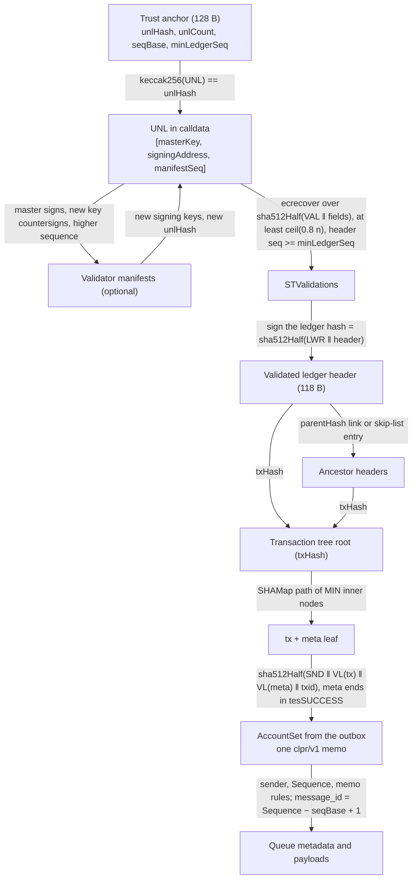
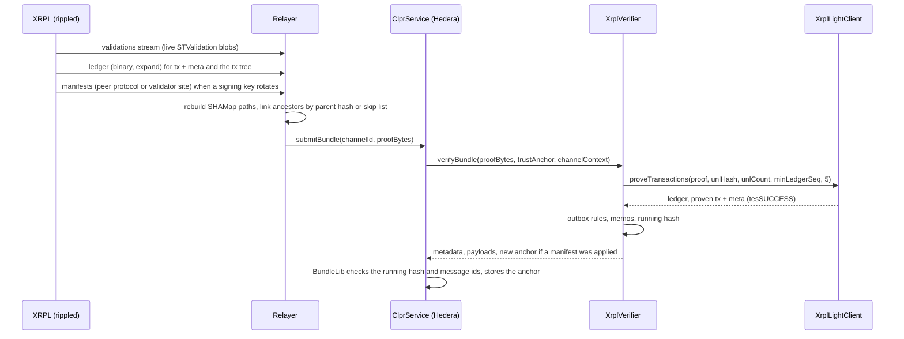

# XRP Ledger verifier (`XrplVerifier`)

`XrplVerifier` is an **XRP Ledger → Hiero** `IClprVerifier`. It is a light client for XRPL consensus
plus a set of outbox rules. `XrplLightClient` checks that at least 80% of a committed UNL signed
validations for a ledger, links older ledgers to it through parent hashes or the skip list, and
proves each CLPR transaction, with its metadata and a `tesSUCCESS` result, in the ledger's
transaction tree. XRPL has no contracts, so the CLPR endpoint is an **outbox account**: a k-of-n
multisig whose CLPR messages are AccountSet transactions carrying one `clpr/v1` memo each.
`XrplVerifier` enforces that shape and turns the memos into CLPR messages and queue metadata, with
`message_id = Sequence − seq_base + 1`.

Every rule below was checked against rippled `develop` @ `ddbc5f1` (2026-09-30) and against live
mainnet and testnet data captured on 2026-10-01.

## 2. At a glance

| | |
|---|---|
| Chains | XRP Ledger mainnet (network id 0, CAIP-2 `xrpl:0`), XRPL testnet (network id 1, `xrpl:1`) |
| Direction | XRP Ledger → Hiero |
| Finality source | UNL validations (secp256k1, `vfFullValidation`) from at least `ceil(0.8 × UNL)` validators on the ledger hash |
| Trust (one line) | 80% of the configured UNL is honest; the UNL and `seq_base` are correct at channel setup; the outbox's signer list decides message content |
| Typical bundle | **6,890,892 gas**, **15,204 B** (testnet, 1 outbox message reached through the skip list, 6 of 6 validations) |
| Bundle + rotation | **7,665,815 gas**, **13,700 B** (mainnet, 28 of 35 validations, one real validator manifest applied) |
| Contract sizes | `XrplVerifier` 12,735 B, `XrplLightClient` 11,608 B, `XrplUnlKeys` 9,192 B, `ClprSha512Hasher` 2,960 B (runtime) |
| Status | Live-verified on XRPL mainnet (ledger 107,352,581) and testnet (ledgers up to 21,187,460, 5 outbox messages), 2026-10-01 |

## 3. How it works



1. Decode the anchor and the channel context (`XrplVerifier.sol:verifyBundle`, `_decodeAnchor`).
2. The UNL in field [0] must hash to `unlHash` and have `unlCount` entries
   (`XrplLightClient.sol:_decodeUnl`).
3. Apply validator manifests, if any: each is signed by the validator's master key (ed25519 or
   secp256k1) and countersigned by the new secp256k1 signing key, with a higher sequence
   (`XrplUnlKeys.sol:applyManifests`).
4. Hash the 118-byte ledger header with SHA-512Half (`XrplLib.sol:parseHeader`). Its sequence must be
   at least `minLedgerSeq` (`XrplLightClient.sol:_ledger`).
5. Check the validations: strictly increasing UNL indexes, each a full validation for this ledger
   hash and sequence, signed by that validator's secp256k1 key (`ecrecover`), until
   `ceil(0.8 × unlCount)` (`XrplLightClient.sol:_requireQuorum`, `XrplLib.sol:validationDigest`).
6. Collect the transaction-tree roots of the validated ledger and of each ancestor, linked by parent
   hash or by the validated ledger's skip list (`XrplLightClient.sol:_txRoots`).
7. Prove each transaction with its metadata in its ledger's tree, and require `tesSUCCESS`
   (`XrplLightClient.sol:_proveTx`, `XrplLib.sol:verifyPath`, `metaSucceeded`).
8. Apply the outbox rules to each transaction and decode its memo (`XrplVerifier.sol:_clprMessage`,
   `_decodeMemo`), check consecutive Sequences and `next_message_id`, and chain the running hash.

Protocol facts used:

| Item | Rule | Source (rippled `ddbc5f1`) |
|---|---|---|
| Ledger hash | `sha512Half("LWR\0" ‖ seq ‖ drops ‖ parentHash ‖ txHash ‖ accountHash ‖ parentCloseTime ‖ closeTime ‖ resolution ‖ flags)`; the header is 118 bytes | `LedgerHeader.cpp` `calculateLedgerHash` |
| Validation | STValidation signed over `sha512Half("VAL\0" ‖ fields without sfSignature)`; must carry `vfFullValidation` | `STValidation.cpp`, `STObject::getSigningHash` |
| Validation keys | secp256k1 only ("We can only use secp256k1 keys for signing validations") | `STValidation.h` |
| ed25519 | Only for validator master keys, which sign manifests over the raw `"MAN\0" ‖ fields` bytes | `PublicKey.cpp` `verify`, `Manifest.cpp` |
| Quorum | `max(ceil(0.8 × effectiveUNL), ceil(0.6 × UNL))`. The verifier requires `ceil(0.8 × UNL)` and ignores the negative UNL, which is stricter | `ValidatorList::calculateQuorum` |
| SHAMap | inner = `sha512Half("MIN\0" ‖ 16 child hashes)`; branch d = key nibble d; tx+meta leaf = `sha512Half("SND\0" ‖ VL(tx) ‖ VL(meta) ‖ txid)`, txid = `sha512Half("TXN\0" ‖ tx)`; state leaf = `sha512Half("MLN\0" ‖ data ‖ key)` | `SHAMapInnerNode.cpp`, `SHAMapTxPlusMetaLeafNode.h`, `Ledger::rawTxInsert` |
| tesSUCCESS | sfTransactionResult (UINT8 3) has the highest field code in the metadata template and fields are sorted, so serialized metadata always ends `03 10 <result>` | `TxMeta.cpp`, `STObject::add` |
| Skip list | `keylet::skip()` = `sha512Half(0x0073)` holds the hashes of the previous 256 ledgers | `Ledger::updateSkipList` |
| Memos | the serialized sfMemos array is at most 1024 bytes | `STTx.cpp` `isMemoOkay` |

### Outbox rules

- The sender is the channel's outbox account: the top-level sfAccount (never a Signer's) must equal
  `ChannelContext.remoteServiceAddress` (20 bytes).
- Each message is an **AccountSet with Flags 0** and no other fields. The allowed top-level fields
  are TransactionType, Flags, Sequence (non-zero), NetworkID, LastLedgerSequence, Fee,
  SigningPubKey, TxnSignature, Account, Signers and Memos. Anything else is rejected, including
  TicketSequence (Tickets), tfInnerBatchTxn (Batch), Delegate, SetFlag and Domain.
- **Exactly one memo**, with MemoType `clpr/v1`, no MemoFormat, and serialized Memos of at most 1024
  bytes. MemoData is protobuf `ClprXrplMemo {bytes channel_id = 1; ChannelSyncData sync_data = 2;
  ClprMessagePayload payload = 3}`, decoded strictly: field 3 is required and no field may repeat.
- **message_id = Sequence − seq_base + 1.** Sequences in a bundle must be consecutive, and each
  memo's `sync_data.next_message_id` must equal `message_id + 1`. `channel_id` must equal the
  channel's id. The payload is returned unchanged as the message bytes.
- The returned metadata: `nextMessageId` = last message id + 1, `receivedMessageId` and `state`
  from the last memo's `sync_data`, `sentRunningHash` = the chain `sha256(prev ‖ sha256(payload))`
  starting at field [6]. XRPL publishes no `receivedRunningHash` or endpoint-manifest version, so
  both are zero and bundles never carry a manifest.

Field [6] needs no authentication. The proof fixes every payload and its id, and BundleLib
recomputes the chain from the channel's own `receivedRunningHash` over the new payloads and reverts
unless the result equals `sentRunningHash`, so a wrong starting hash only makes the bundle fail.
Gaps cannot be hidden: within a bundle the Sequences are consecutive, and across bundles BundleLib
rejects a bundle whose messages do not start at `receivedMessageId + 1`.

## 4. Bundle lifecycle



## 5. Trust model

Trusted:
- **XRPL consensus:** at least 80% of the configured UNL is honest. This matches what a rippled node
  with the same UNL accepts.
- **Channel setup inputs:** the UNL (masters, signing keys, manifest sequences), `seq_base`, the
  LedgerConfiguration and the manifest commitment are correct when the channel is opened.
- **The outbox's signer list** (k-of-n) decides message content. XRPL has no contracts, so nothing on
  the ledger checks that a memo matches a real CLPR queue. The ledger proves only that the signer
  list sent it, in order, exactly once. This part is **operator trust** ("trusts the outbox
  signers").

Not trusted: the relayer, the RPC and peer nodes that served the data, and field [6].

To forge a bundle an attacker must either control `ceil(0.8 × n)` UNL signing keys, or control the
outbox's signer list (which can then send any memo, but only through validated ledgers, in
Sequence order).

## 6. Proof format

`verifyBundle` proof, RLP list:

| Field | Type | Meaning |
|---|---|---|
| [0] UNL | `[[masterKey(33), signingAddress(20), manifestSeq], ...]` | Must hash to `unlHash`; UNL order |
| [1] manifests | `[manifest, ...]` | Signing-key rotations, applied first (may be empty) |
| [2] header | bytes (118) | The validated ledger |
| [3] validations | `[[unlIndex, STValidation], ...]` | Strictly increasing indexes, at least `ceil(0.8 n)` |
| [4] ancestors | `[[header] \| [header, [inner...], skipList] \| [header, ""], ...]` | Parent-linked or skip-list-linked older ledgers |
| [5] messages | `[[ledgerRef, tx, meta, [inner(512)...]], ...]` | In Sequence order; `ledgerRef` 0 = validated ledger, k = ancestor k |
| [6] runningHash | bytes32 | The running hash before message [5][0] (untrusted) |

Trust anchor: `abi.encode(bytes32 unlHash, uint256 unlCount, uint256 seqBase, uint256 minLedgerSeq)`,
128 bytes, with `unlHash = keccak256(‖ masterKey(33) ‖ signingAddress(20) ‖ manifestSeq(4))` in UNL
order.

`verifyConfig` proof, RLP: `[UNL with compressed signing keys, header, validations, [inner...],
AccountRoot, seqBase, controlMessage, manifestCommitment]`. It proves the outbox's AccountRoot in a
UNL-validated ledger and requires `lsfDisableMaster` and no sfRegularKey, so only the signer list can
send (`XrplVerifier.sol:verifyConfig`, `_checkOutbox`). XRPL publishes none of `seq_base`, the
LedgerConfiguration or the endpoint manifest, so the party opening the channel supplies them and the
manifest proof is the preimage of that commitment.

Deployment parameters: the CAIP-2 string (`xrpl:0` or `xrpl:1`) and the `XrplLightClient` address
(`XrplVerifier` constructor); the light client takes the `ClprSha512Hasher` and `XrplUnlKeys`
addresses.

## 7. Validator-set rotation

- **Signing keys** rotate through manifests. A bundle that applies manifests returns a new anchor
  with the re-committed UNL and `minLedgerSeq` = this ledger, so ledgers validated by superseded keys
  can no longer be submitted. Replaying a manifest fails on its sequence. Measured on mainnet: one
  real ed25519-master manifest adds about 1.8M gas (7.67M vs 5.88M).
- **UNL membership** is not proven on-chain. The publisher's signed list (vl.ripple.com) is a base64
  JSON blob, which is impractical to verify on-chain. A membership change needs a channel
  re-configuration. This is the same trust a rippled operator places in its configured publisher
  key. Mainnet UNL changes are rare (the captured list is sequence 85, 35 validators).

## 8. Gas and calldata

Measured with `eth_estimateGas` on anvil (including the 21k base and calldata) by
`test/e2e/tests/verifiers/xrpl-live.spec.ts`, fixtures captured 2026-10-01. Ledger data is real;
nothing is re-signed.

| Case | Gas | Calldata |
|---|---|---|
| mainnet ledger 107,352,581: memo Payment tx + meta, 28 of 35 validations | 5,883,034 | 11,812 B |
| mainnet: sender AccountRoot state proof (depth 7) | 6,333,939 | 12,740 B |
| mainnet: + one real validator manifest rotation (ed25519 master) | 7,665,815 | 13,700 B |
| testnet `verifyConfig`: outbox AccountRoot, 6 of 6 validations | 3,371,215 | 6,436 B |
| testnet `verifyBundle`: the 5 clpr/v1 outbox messages, linked via the skip list | 11,217,083 | 21,444 B |
| testnet `verifyBundle`: 1 message via the skip list | 6,890,892 | 15,204 B |

All fit Hedera's limits (15M gas, 128 KB calldata). Costs are dominated by SHA-512, about 47k gas
per 128-byte block: a validation is about 2 blocks plus `ecrecover`, so a mainnet quorum of 28 is
about 3.5M; a 1 KB memo transaction is about 20 blocks; the skip list is an 8.2 KB leaf, about 4.5M
with its path. A bundle with the message in the validated ledger itself skips the skip list.

## 9. Limits and known gaps

- **Relays must record validations live.** Validations are only broadcast on the `validations`
  stream. Older ledgers can only be reached from a current validated ledger, through parent links
  (about 100k gas per ledger) or the skip list (the last 256 ledgers, about 15 minutes). Flag-ledger
  skip lists (`keylet::skip(seq)`) would reach further; they are not implemented.
- **Proof data.** No public RPC returns SHAMap inner nodes. Transaction paths are rebuilt from the
  full ledger (`ledger` with `binary`, `expand`). State paths (AccountRoot, skip list) come from the
  peer protocol (`TMGetLedger` / `liAS_NODE`) with `test/e2e/relay/xrplPeer.ts`, which does the
  rippled handshake with a throwaway node key; checked against `r.ripple.com` and
  `s.altnet.rippletest.net`.
- **UNL membership** changes need a re-configuration (section 7).
- **One outbox account per channel**, because Sequence numbers are per account.
- **Message size:** serialized Memos are capped at 1024 bytes, which leaves 883 bytes of message
  data with 20-byte addresses (measured by the emitter on testnet, `messages.json`
  `max_message_data_bytes_20B_addrs`); advertise at most 800.
- **SHA-512 cost.** `ClprSha512Hasher` is built with the legacy pipeline and no optimizer (via-IR
  spills its working variables; the legacy optimizer runs out of stack on the unrolled rounds). An
  optimized build would roughly halve the cost, but foundry cannot set that per file.
- **Emitter fixture notes.** The testnet messages were recorded by the outbox emitter on branch
  `feat/xrpl-design`. It encodes `ChannelSyncData.status` with ACTIVE = 0, while the CLPR service spec
  has PENDING = 0 and ACTIVE = 1; the verifier follows the spec, so those messages read as PENDING.
  Its recorded running hashes use `sha256(prev ‖ payload)`; the verifier derives the protocol's
  chain itself, so verification is unaffected.

## 10. Upgrades and forks

XRPL changes through amendments. What would break the verifier:
- a new ledger-header layout or hash prefix (`LWR`), a change to STValidation signing or to the
  quorum rule (`ValidatorList::calculateQuorum`);
- a SHAMap leaf or inner-node format change;
- new transaction fields on AccountSet are rejected by the strict field list, which fails closed.
  An amendment that makes a new field mandatory would halt the channel until the verifier allows it.

Under the fork-aware verifier ADR (`ADR/2026-10-01-fork-aware-verifiers.md` in the spec fork, draft
PR LFDT-CLPR/clpr-spec#1) such an amendment is handled by deploying a new verifier version and
moving the channel at an amendment-activation ledger. Nothing in the anchor is amendment-specific.

## 11. Running it

```bash
# unit, compliance and hash-library tests
forge test --match-path 'test/verifiers/evm/xrpl/*'
forge test --match-path 'test/verifiers/compliance/XrplComplianceTest.t.sol'
forge test --match-path 'test/libraries/crypto/*'

# live fixture replay on anvil (CLPR_ANVIL_PORT_A selects the port)
forge build && npm run test:e2e:xrpl-live

# refresh the fixtures (mainnet capture, testnet outbox capture, skip-list link)
npm run xrpl-live:refresh
```

`linkXrplMessages.ts` must run within 256 ledgers (about 15 minutes) of the message ledgers, or the
messages must be re-emitted.

## 12. Files

| File | Role |
|---|---|
| `src/verifiers/evm/xrpl/XrplVerifier.sol` | `IClprVerifier`: outbox rules, memos, queue metadata, anchor, config |
| `src/verifiers/evm/xrpl/XrplLightClient.sol` | UNL quorum, headers, ancestor links, tx + meta inclusion, ledger entries, config AccountRoot |
| `src/verifiers/evm/xrpl/XrplUnlKeys.sol` | Validator manifests, config-time UNL key conversion, state-tree proofs, skip list (split out for EIP-170) |
| `src/verifiers/evm/xrpl/XrplLib.sol` | rippled binary formats: STObject walker, header hashing, validation digests, DER, SHAMap paths, leaves, manifests |
| `src/libraries/crypto/ClprSha512Hasher.sol` | SHA-512 as a contract (raw calldata in, 64-byte digest out) |
| `test/verifiers/evm/xrpl/XrplVerifier.t.sol`, `XrplTestBuilder.sol` | Unit tests over synthetic signed ledgers |
| `test/verifiers/compliance/XrplComplianceTest.t.sol` | Shared `IClprVerifier` compliance suite |
| `test/verifiers/evm/xrpl/XrplLiveHarness.sol` | Test harness for the live replay |
| `test/e2e/fixtures/xrpl-live/mainnet.json`, `testnet.json`, `messages.json` | Live captures (2026-10-01) |
| `test/e2e/relay/captureXrplLive.ts`, `linkXrplMessages.ts`, `buildXrplLiveProof.ts`, `xrplCodec.ts`, `xrplPeer.ts` | Capture, linking, proof building, binary codec, peer-protocol client |
| `test/e2e/tests/verifiers/xrpl-live.spec.ts` | Anvil replay of the live fixtures |

## 13. References

- rippled `develop` @ `ddbc5f1` (https://github.com/XRPLF/rippled): `src/libxrpl/protocol/STTx.cpp`,
  `STValidation.cpp`, `PublicKey.cpp`, `TxMeta.cpp`, `LedgerHeader.cpp`;
  `include/xrpl/protocol/STValidation.h`; `src/libxrpl/server/Manifest.cpp`;
  `src/xrpld/app/misc/detail/ValidatorList.cpp`; `src/libxrpl/ledger/Ledger.cpp`;
  `src/libxrpl/shamap/SHAMapInnerNode.cpp`; `include/xrpl/shamap/SHAMapTxPlusMetaLeafNode.h`
- XRPL docs: ledger header, transaction and ledger-object formats, Memos field, multisigning,
  `validations` stream — https://xrpl.org/docs
- Validator list: https://vl.ripple.com (mainnet), https://vl.altnet.rippletest.net (testnet)
- Public endpoints used: `xrplcluster.com`, `s.altnet.rippletest.net`, peer ports of `r.ripple.com`
  and `s.altnet.rippletest.net` (51235)
- CAIP-2 XRPL namespace: https://namespaces.chainagnostic.org/xrpl/caip2
