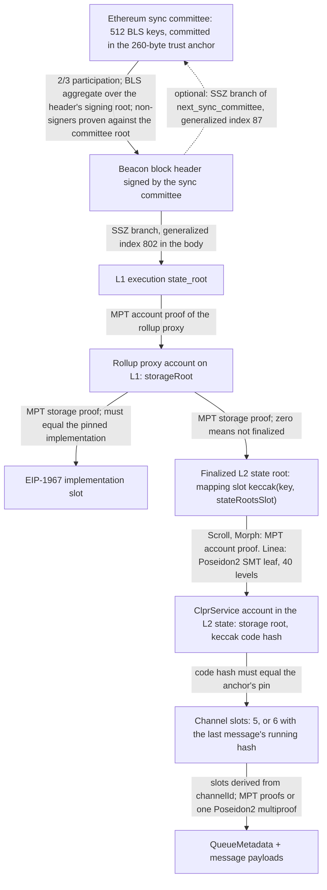
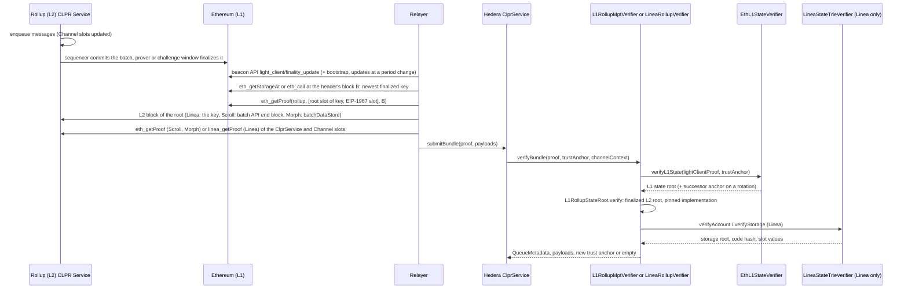

# L1-settled rollup verifiers (Linea, Scroll, Morph)

`L1RollupMptVerifier` and `LineaRollupVerifier` let a Hiero CLPR Service accept bundles from a CLPR Service on a rollup
that keeps its finalized L2 state roots in an Ethereum contract (`<rollup> → Hiero`). Trust comes from Ethereum: the
sync committee signs the header, the header fixes the L1 execution state root, and in that state the rollup's L1
contract stores the finalized L2 state root of a block or batch. A Merkle proof against that L2 root gives the
ClprService's Channel slots. One shared base (`L1RollupVerifierBase`) does the L1 part for every rollup; the per-rollup
facts (L1 contract, mapping slot, pinned implementation) are constructor data, and the L2 trie is the only thing that
differs: Ethereum's Merkle-Patricia trie on Scroll and Morph, a Poseidon2 sparse Merkle tree on Linea.

The family also covers two Bitcoin-side chains from the same ranking, which it cannot verify: Citrea (blocked, design
notes below) and Merlin (no trustless settlement; weak tier only). See "Limits and known gaps".

The L1 half is the Ethereum beacon light client (`EthBeaconLightClient`, deployed through `EthL1StateVerifier`),
documented in the [Ethereum verifier README](../ethereum/README.md); it is not repeated here.

## At a glance

| | |
|---|---|
| Chains covered | Linea (`eip155:59144`), Scroll (`eip155:534352`), Morph (`eip155:2818`), all on Ethereum mainnet. Not covered: Citrea, Merlin. Per-chain pages: [docs/chains](../../../../docs/chains/README.md) |
| Finality source | The rollup's L1 contract: Linea `LineaRollup.stateRootHashes[block]`, Scroll `ScrollChain.finalizedStateRoots[batch]`, Morph `Rollup.finalizedStateRoots[batch]`, read through the Ethereum sync committee |
| Trust assumptions | Ethereum sync committee (2/3 of 512) + the rollup's finalization rule and upgrade keys: validity proofs on Linea and Scroll; on Morph, the sequencer unless a whitelisted challenger challenges within 2 days |
| Typical bundle (live, stand-in account, ACK-only) | Linea 8,174,997 gas / 18,660 B calldata; Scroll 2,098,879 gas / 18,948 B; Morph 1,922,495 gas / 16,804 B (anvil `eth_estimateGas`, mainnet fixtures of 2026-10-01) |
| Linea bundle with a real ClprService (derived) | 7.85M to 9.88M gas (live L1 + account parts plus synthetic storage multiproofs, see "Gas and calldata") |
| Rotation | In-bundle. The L1 light client with a real committee rotation costs 5,222,914 gas / 68,964 B calldata against 445,188 gas / 2,884 B without; a rotation bundle is about 4.78M gas and 66 KB larger than a plain one (derived) |
| Contract sizes | `L1RollupMptVerifier` 13,506 B; `LineaRollupVerifier` 14,025 B; `LineaStateTrieVerifier` 4,209 B; LineaPoseidon2 hasher 12,727 B; `EthL1StateVerifier` 11,593 B |
| Status | Live-verified on Ethereum mainnet for Linea, Scroll and Morph (fixtures captured 2026-10-01). Citrea: blocked. Merlin: blocked for trustless verification |

## How it works



1. `EthL1StateVerifier.sol:verifyL1State` checks the sync-committee signature over the header (2/3 of 512, non-signers
   subtracted from the committed aggregate), proves the execution `state_root` into the header's body, and, when the
   proof carries one, the next sync committee (the successor trust anchor).
2. `L1RollupStateRoot.sol:verify` proves the rollup proxy's account against that state root, then two storage slots of
   it: `keccak256(key ‖ stateRootsSlot)`, which must be non-zero (the finalized L2 state root of `key`), and the EIP-1967
   implementation slot, which must equal the profile's pinned implementation. `key` must be at least `minKey`.
3. `L1RollupVerifierBase.sol:verifyBundle` hands the L2 root to the trie hook `_l2ServiceStorageRoot`:
   - `L1RollupMptVerifier.sol` (Scroll, Morph): an `eth_getProof` account proof (`ClprEvmBundleVerifier._verifyServiceStorageRoot`).
   - `LineaRollupVerifier.sol` → `LineaStateTrieVerifier.sol:verifyAccount`: the account leaf, its key hash
     (Poseidon2 of the address) and value hash (nonce, balance, storage root, Poseidon2 code hash, keccak code hash,
     code size), folded up the 40-level tree to the root.
   The keccak code hash must equal the anchor's `codeHash` (unless the anchor pins zero).
4. `L1RollupVerifierBase.sol:_verifyChannelSlots` asks the hook `_l2ProveSlots` to prove every slot the storage proof
   carries, then picks the five Channel slots it derives from `channelId` (and, with 6 proofs, the last message's
   running-hash slot from the proven `nextMessageId`). On Linea, `LineaStateTrieVerifier.sol:verifyStorage` checks all
   claims in one multiproof: present slots by key and value hash, absent slots by two adjacent leaves whose key hashes
   bracket the slot's.
5. `ClprEvmBundleVerifier.sol:_buildQueueMetadata` decodes the slots; `_decodeBundleContent` returns the payloads. An
   endpoint-manifest update (items 5 and 6) is checked the same way at slot 18.

### Linea's state trie

Linea's finalized root is the root of its own state trie, not the Merkle-Patricia root in Linea block headers. The trie
is a sparse Merkle tree of depth 40 whose leaves are appended at `nextFreeNode` and linked in key-hash order, with head
and tail sentinels. Leaf hash = H(prev ‖ next ‖ hKey ‖ hValue), node = H(left ‖ right), empty leaf = 0, empty subtree
Z(h+1) = H(Z(h) ‖ Z(h)), and root = H(nextFreeNode ‖ subtree root). H is Poseidon2 over the KoalaBear field
(p = 2^31 − 2^24 + 1, width 16, x^3, 6 full and 21 partial rounds) in Merkle-Damgard mode over 32-byte words, each word
holding 8 field elements. Keys and 32-byte values are first split into 16 two-byte limbs. All of this was checked
against `linea_getProof` output for finalized Linea mainnet blocks (`test/e2e/relay/linea.ts` reproduces the roots).

Poseidon2 is not an EVM precompile. `LineaPoseidon2` is a separate contract generated from Yul
(`script/zkrollup/generatePoseidon2.ts` → `tools/zkrollup/LineaPoseidon2.yul` → `LineaPoseidon2Code.sol`): fully
unrolled, state at fixed memory words, lazy modular reduction, compiled without the optimizer. It costs about 24,700
gas per 32-byte block (2,473,756 gas for 100 blocks, `test_linea_poseidon2Vectors`). A node costs two blocks, so one 40-level path is 80 blocks; leaves of one tree are
verified as a multiproof so shared upper levels are hashed once.

The hash reduces limbs mod p, so a word whose limb is shifted by p hashes like the original. Wherever the verifier
compares relayer-supplied key hashes by order (absent-slot brackets) it requires every limb to be below p; pointer and
key equality checks compare against values the verifier computes itself.

## Bundle lifecycle



## Trust model

Trusted:
- The Ethereum sync committee: at least 2/3 of the 512 members sign the header. The trust anchor fixes the committee
  (aggregate key and Merkle root of the keys), the genesis validators root, the fork version, the channel id and the
  ClprService code hash.
- The bootstrap committee given to `verifyConfig` (the config proof is the `EthMainnetVerifier` format).
- The rollup's finalization rule, as written in its L1 contract at the pinned implementation:
  - Linea: `finalizeBlocks` (OPERATOR_ROLE) writes `stateRootHashes[endBlock]` only after the PLONK verifier set for
    the proof type accepts the aggregated proof. If no finalization happens for six months, a liveness-recovery
    operator gets OPERATOR_ROLE.
  - Scroll: `finalizeBundlePostEuclidV2` (whitelisted provers) writes `finalizedStateRoots[batch]` after the rollup
    verifier accepts the ZK proof; in enforced batch mode (after 7 days without finalization or with stuck L1
    messages) anyone can `commitAndFinalizeBatch` with a proof.
  - Morph: `finalizeBatch` writes `finalizedStateRoots[batch]` when the 2-day challenge window (172,800 s) has passed
    without a successful challenge; only whitelisted challengers can challenge, and a challenge must be answered with a
    ZK proof within the 3-day proof window. **On Morph this verifier trusts the sequencer unless a whitelisted
    challenger challenges in time.** `commitBatchWithProof` (permissionless after 7 days of sequencer delay) finalizes
    immediately with a ZK proof.
- The rollup's upgrade keys. Read on 2026-10-01: Linea's and Morph's ProxyAdmins are owned by timelocks whose
  `getMinDelay()` is 0; Scroll's ProxyAdmin is owned by its `ScrollOwner` access-control contract. Whoever controls
  these can change the implementation; the verifier pins the implementation address, so an upgrade stops it (fail
  closed) until a new profile is deployed. Admin roles inside an implementation (verifier addresses, provers,
  challengers) are not pinned.

Not trusted: the relayer, the RPC providers, the Scroll batch API (its answer is checked by state-root equality), and
the sequencer on Linea and Scroll.

To forge a bundle an attacker must control 2/3 of the sync committee, or get a false root finalized by the rollup
(break its proof system, control its upgrade keys or admin roles, or on Morph make every whitelisted challenger stay
silent for 2 days), or break keccak256 or Poseidon2.

## Proof format

`proofBytes` (RLP list):

| # | Field | Type | Meaning |
|---|---|---|---|
| 0 | `lightClientProof` | bytes (RLP inside) | `EthL1StateVerifier.verifyL1State` proof: header, sync aggregate, execution state root and branch, optional next committee and branch, non-signer proofs |
| 1 | `rollupProof` | list | `[key, l1AccountProof (MPT nodes), l1StorageProof ([[slot, nodes], …]: root slot, EIP-1967 slot)]` |
| 2 | `l2AccountProof` | MPT: list of nodes; Linea: bytes | Linea: `abi.encode(Account, MultiProof)` with one leaf |
| 3 | `l2StorageProof` | MPT: `[[slot, nodes], …]`; Linea: bytes | 5 entries, or 6 with the last message's running hash. Linea: `abi.encode(MultiProof, SlotClaim[])` |
| 4 | `bundleContent` | bytes | protobuf `ClprBundleContent` (payloads only; metadata comes from the proof) |
| 5 | `manifestStorageProof` | as item 3 | optional, slot 18 (endpoint-manifest commitment) |
| 6 | `manifestPreimage` | bytes | optional, protobuf manifest whose keccak256 is the commitment |

Linea ABI types (`ILineaStateTrieVerifier`): `Leaf(index, prev[2], next[2], hKey, hValue)`,
`MultiProof(nextFreeNode[2], Leaf[] leaves (strictly increasing index), uint256[] siblings (fold order))`,
`Account(nonce, balance, storageRoot, snarkCodeHash, keccakCodeHash, codeSize)`,
`SlotClaim(slot, value, absent, leaf, right)`. Sibling hashes are supplied directly, not as node preimages.

Trust anchor: the 260-byte `EthBeaconLightClient` anchor `gvr ‖ forkVersion ‖ channelId ‖ aggregate ‖ committeeRoot ‖
codeHash`, `codeHash` being the L2 ClprService's keccak256 code hash. Anchor id: the 8-byte sync-committee period.

`verifyConfig` takes the `EthMainnetVerifier` config RLP `[slot, syncCommittee, gvr, forkVersion, ledgerConfiguration,
codeHash]`; the optional manifest proof is `[lightClientProof, rollupProof, l2AccountProof, manifestStorageProof,
manifestPreimage]`, verified under the genesis anchor.

Deployment profile (`L1RollupStateRoot.Profile`, constructor data; mainnet values in `profiles/ZkRollupProfiles.sol`):

| Field | Linea | Scroll | Morph |
|---|---|---|---|
| `rollup` | `0xd19d4B5d358258f05D7B411E21A1460D11B0876F` | `0xa13BAF47339d63B743e7Da8741db5456DAc1E556` | `0x759894Ced0e6af42c26668076Ffa84d02E3CeF60` |
| `stateRootsSlot` | 282 (`stateRootHashes`) | 158 (`finalizedStateRoots`) | 160 (`finalizedStateRoots`) |
| `implementation` | `0x052b73d934E9412045Bf731574463Fd026D74645` | `0x0a20703878E68E587c59204cc0EA86098B8c3bA7` | `0x213CE22b487B71Ac68a1B5b12d2b93D1AF30Ea1d` |
| `minKey` | 0 | 0 | 0 |
| key | L2 block number | batch index | batch index |
| L2 trie | Poseidon2 SMT (`LineaRollupVerifier`) | MPT (`L1RollupMptVerifier`) | MPT (`L1RollupMptVerifier`) |

`EthL1StateVerifier` constructor for Electra/Fulu: `(802, 9, 87, 6, 8192)`. `LineaRollupVerifier` also takes the
`LineaStateTrieVerifier` address, which takes the LineaPoseidon2 hasher address.

## Validator-set / committee rotation

The trusted set is the Ethereum sync committee; it changes every period (8,192 slots, about 27 hours). A bundle whose
light-client proof carries `next_sync_committee` (uncompressed keys) and its SSZ branch returns the successor anchor
and the next period as `newTrustAnchorId`; `ClprService` stores it. The successor keeps the channel id and code-hash
pin. A bundle must be signed by the committee in the anchor, so a relayer that misses a period catches up with one
rotation bundle per missed period, each needing an L1 state proof at a header of that period (archive access for old
headers). Measured on mainnet data: the light client with a rotation costs 5,222,914 gas and 68,964 B of calldata.

## Gas and calldata

Measured with anvil `eth_estimateGas` (`npm run test:e2e:zkrollup-live`) on the mainnet fixtures captured 2026-10-01
(L1 blocks 26,096,309 to 26,096,313, 508 of 512 signers). Hedera limits: 15,000,000 gas, 128 KB calldata.

| Call | Linea | Scroll | Morph |
|---|---|---|---|
| `verifyBundle`, 5 absent Channel slots on the stand-in | 8,174,997 gas, 18,660 B | 2,098,879 gas, 18,948 B | 1,922,495 gas, 16,804 B |
| `verifyL2StateRoot` (L1 half only) | 1,329,234 gas, 12,356 B | 1,327,321 gas, 12,228 B | 1,234,818 gas, 11,364 B |

| L1 light client (`EthL1StateVerifier.verifyL1State`) | gas | calldata |
|---|---|---|
| without rotation | 445,188 | 2,884 B |
| with a real rotation (period 1,872) | 5,222,914 | 68,964 B |

A rotation bundle is a normal bundle plus the rotation difference (+4,777,726 gas, +66,080 B). Derived, not measured as
one transaction: Linea 12,952,723 gas / 84,740 B, Scroll 6,876,605 gas / 85,028 B, Morph 6,700,221 gas / 82,884 B.

Linea's cost is the Poseidon2 hashing (Foundry execution gas, `forge test --match-path 'test/verifiers/evm/zkrollup/*' -vv`):

| Linea part | Execution gas | Data |
|---|---|---|
| `verifyAccount` (live, 1 leaf, 40 siblings) | 2,571,808 | live |
| `verifyStorage`, 5 absent slots, 8 leaves, 43 siblings (live stand-in, 21-leaf trie) | 4,135,673 | live |
| `verifyStorage`, 6 present slots inserted together, small trie ("fresh") | 3,806,984 | synthetic |
| `verifyStorage`, 5 present + last message far away in a 1M-leaf trie ("busy") | 4,768,388 | synthetic |
| `verifyStorage`, 3 present + 2 absent in a 1M-leaf trie ("partial") | 5,836,725 | synthetic |

Derived Linea bundle for a real ClprService (live bundle − live storage + synthetic storage): fresh 7,846,308, busy
8,807,712, partial 9,876,049 gas; with a rotation in the same bundle 12,624,034, 13,585,438 and 14,653,775 gas. The
last is within 2.5% of the 15M limit: a rotation bundle on Linea should carry as few absent slots as possible.

## Limits and known gaps

- **Stand-in accounts.** No ClprService runs on Linea, Scroll or Morph, so the live bundles prove long-lived contracts
  (Linea L2 TimeLock `0xc808…56ca`, Scroll `0x5300…0000`, Morph `0x5300…0001`) and their Channel slots are exclusion
  proofs. The present-slot cases on Linea are synthetic.
- **Linea gas.** A Linea bundle costs 7.8M to 9.9M gas (derived) and up to about 14.7M with a rotation. Each absent
  Channel slot adds two leaf paths. Bundles with many absent slots plus a rotation can exceed 15M; then the relayer has
  to rotate in a bundle whose slots are present or wait for them to be set.
- **Archive depth.** The L2 proof must be taken at the finalized root's block. At capture time the finalized root was
  about 3.7 hours old on Linea, 2.1 hours on Scroll and 48 hours on Morph. `rpc.linea.build`, `rpc.scroll.io` and
  `rpc.morphl2.io` served those proofs on 2026-10-01; other public endpoints did not (Morph's QuickNode endpoint limits
  `eth_getProof` to 10,000 blocks; one Scroll endpoint still served zkTrie proofs). Production relayers should run
  their own L2 nodes with enough state history.
- **Latency.** A message is deliverable only after its block's root is finalized on L1: hours on Linea and Scroll, at
  least 2 days on Morph.
- **Rotation catch-up** needs L1 state proofs at old headers (archive L1 node).
- **Citrea is blocked.** Citrea's batch proofs are written to Bitcoin as taproot-witness inscriptions, brotli-compressed
  and split across chunk transactions (`crates/bitcoin-da` and `crates/primitives/src/compression.rs` in
  chainwayxyz/citrea). The repository's Bitcoin verifier proves transactions by txid Merkle branch, which does not
  commit to witness data; it would also need the coinbase witness commitment, chunk reassembly, on-chain brotli
  decompression, and verification of Citrea's RISC Zero or SP1 receipt. On-chain brotli decompression of a proof is not
  practical within 15M gas. Not built.
- **Merlin is blocked for trustless verification.** Merlin runs a Polygon CDK node (chain 4200;
  `zkevm_verifiedBatchNumber` and `zkevm_getBatchByNumber` answer on `rpc.merlinchain.io`), but the settlement
  transactions its node reports (`sendSequencesTxHash`, `verifyBatchTxHash`) were found neither on Ethereum mainnet nor
  on Bitcoin (both byte orders) on 2026-10-01. With no public chain holding its verified state roots, the only option is
  a weak tier that trusts Merlin's sequencer or a t-of-n set of attestors signing its state roots. Not built.
- **No Hiero → rollup direction** in this branch.

## Upgrades and forks

In the terms of the fork-aware verifier ADR (`ADR/2026-10-01-fork-aware-verifiers.md`, draft
[LFDT-CLPR/clpr-spec#1](https://github.com/LFDT-CLPR/clpr-spec/pull/1)):

- **Ethereum forks** (fork version, beacon layout) behave as for the Ethereum verifier: the fork version is in the
  anchor (class A), generalized indices are `EthL1StateVerifier` constructor data (class B). A fork that changes the
  light-client structures (for example Gloas) needs new code (class C).
- **Rollup contract upgrades.** The profile pins the implementation, so any upgrade makes every bundle revert with
  `ImplementationMismatch` (a safe stall). If the mapping slot and the finalization rule are unchanged, a new profile
  with the new implementation is a class B change; if the rule changes, it is class C.
- **L2 state format changes** (class C). Scroll moved from zkTrie to the MPT in its Euclid upgrade, Morph's L2 now
  serves MPT proofs, and Linea's state trie hashes with Poseidon2 (Linea's repository still carries the MiMC code of
  the earlier trie). A root of an older format cannot be opened with the current
  proofs (that would need a hash preimage), so bundles fail closed; `minKey` can additionally exclude old keys.
- **Linea hash parameters.** The Poseidon2 constants are in generated bytecode; a change needs a new hasher (class C).

## Running it

```sh
forge build
forge test --match-path 'test/verifiers/evm/zkrollup/*' -vv     # Foundry: live replays + Linea synthetic tries
npm run test:e2e:zkrollup-live                                   # anvil replay of the three mainnet fixtures
npm run zkrollup-live:refresh:linea                              # re-capture (also :scroll, :morph); rewrites the Foundry fixture
npm run zkrollup-live:forge                                      # rebuild the Foundry fixtures from the captures
npx tsx test/e2e/relay/buildLineaSyntheticFixture.ts             # rebuild the synthetic Linea tries
npm run zkrollup:poseidon2                                       # regenerate LineaPoseidon2 (needs solc 0.8.30; set SOLC if not found)
```

Deployment order: `EthL1StateVerifier(802, 9, 87, 6, 8192)`; for Linea `LineaPoseidon2Code.deploy()`, then
`LineaStateTrieVerifier(hasher)`, then `LineaRollupVerifier(l1, ZkRollupProfiles.linea(), trie)`; for Scroll and Morph
`L1RollupMptVerifier(l1, ZkRollupProfiles.scroll() | morph())`. Re-check each profile against the rollup's current
implementation first.

## Files

| File | Purpose |
|---|---|
| `src/verifiers/evm/zkrollup/L1RollupVerifierBase.sol` | Shared verifier: wire format, L1 half, Channel slots, config, manifest |
| `src/verifiers/evm/zkrollup/L1RollupMptVerifier.sol` | MPT L2 trie (Scroll, Morph) |
| `src/verifiers/evm/zkrollup/LineaRollupVerifier.sol` | Linea L2 trie through `ILineaStateTrieVerifier` |
| `src/verifiers/evm/zkrollup/LineaStateTrieVerifier.sol` | Linea SMT account proof and storage multiproof |
| `src/verifiers/evm/zkrollup/lib/ILineaStateTrieVerifier.sol` | Linea proof types |
| `src/verifiers/evm/zkrollup/profiles/ZkRollupProfiles.sol` | Mainnet profiles |
| `src/libraries/proof/zkrollup/L1RollupStateRoot.sol` | Finalized root from the rollup's L1 storage |
| `src/libraries/proof/linea/LineaPoseidon2Code.sol` | Generated creation code of the Poseidon2 hasher |
| `tools/zkrollup/LineaPoseidon2.yul` | Generated Yul source of the hasher |
| `script/zkrollup/generatePoseidon2.ts` | Generator for the two files above |
| `src/verifiers/evm/ethereum/EthL1StateVerifier.sol` | Ethereum light client (shared with the OP Stack family) |
| `test/verifiers/evm/zkrollup/ZkRollupLive.t.sol` | Foundry replay of the mainnet fixtures and negative cases |
| `test/verifiers/evm/zkrollup/LineaStateTrieSynthetic.t.sol` | Linea present-slot multiproofs (synthetic) |
| `test/verifiers/evm/zkrollup/fixtures/*.json` | Foundry inputs (generated) |
| `test/e2e/fixtures/{linea,scroll,morph}-live/capture.json` | Raw mainnet captures |
| `test/e2e/relay/buildZkRollupLiveProof.ts` | Capture and offline builder, with every link cross-checked |
| `test/e2e/relay/zkrollup.ts` | Profiles and encoders |
| `test/e2e/relay/linea.ts` | Poseidon2 and Linea SMT reference, multiproof builder |
| `test/e2e/relay/buildLineaSyntheticFixture.ts` | Synthetic Linea tries |
| `test/e2e/tests/verifiers/zkrollup-live.spec.ts` | anvil replay with gas and calldata checks |

## References

- Linea: `LineaRollup` implementation `0x052b…4645` verified source (Blockscout, `src/rollup/LineaRollupBase.sol`,
  `ZkEvmV2.sol`, `LivenessRecovery.sol`); Consensys/linea-monorepo `contracts/src/libraries/Poseidon2.sol` and
  `SparseMerkleProof.sol` (commit 0eb8fd96); `linea_getProof` on `https://rpc.linea.build`.
- Scroll: `ScrollChain` implementation `0x0a20…3bA7` verified source (Blockscout, `src/L1/rollup/ScrollChain.sol`);
  `SystemConfig.enforcedBatchParameters`; batch API `https://mainnet-api-re.scroll.io/api/batch?index=`.
- Morph: `Rollup` implementation `0x213C…Ea1d` verified source (Blockscout, `contracts/l1/rollup/Rollup.sol`,
  `IRollup.sol`, `BatchHeaderCodecV1.sol`).
- Citrea: chainwayxyz/citrea `crates/bitcoin-da/src/helpers/parsers.rs`, `crates/bitcoin-da/src/verifier.rs`,
  `crates/primitives/src/compression.rs` (commit f11527f9).
- Merlin: `rpc.merlinchain.io` (`eth_chainId`, `zkevm_*` methods); mempool.space transaction lookups.
- Ethereum light client: [Ethereum verifier README](../ethereum/README.md), consensus-specs Altair light client.
- Fork-aware verifiers ADR: `ADR/2026-10-01-fork-aware-verifiers.md`, [LFDT-CLPR/clpr-spec#1](https://github.com/LFDT-CLPR/clpr-spec/pull/1).
