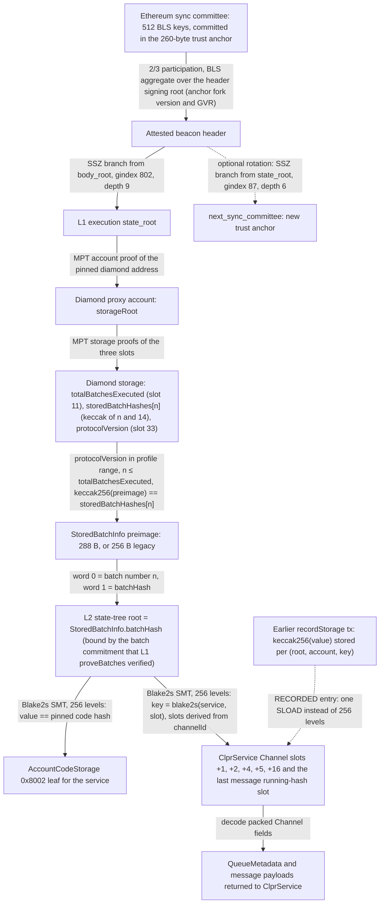
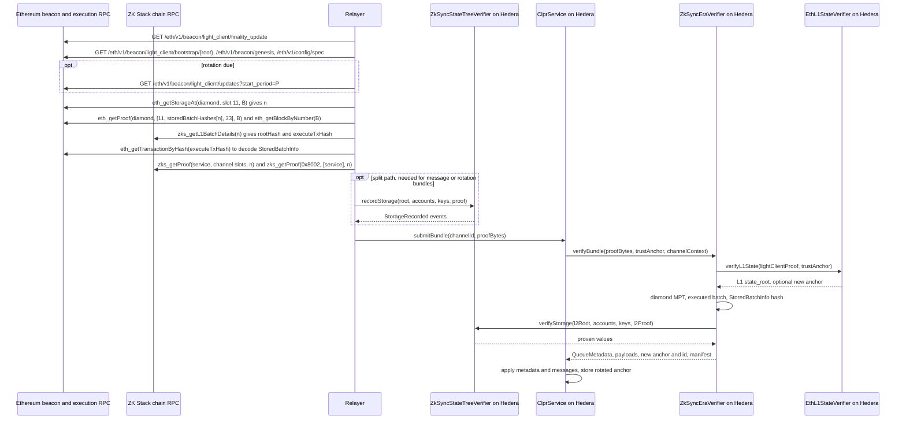

# ZKsync Era verifier (EraVM ZK Stack chains)

`ZkSyncEraVerifier` lets a Hiero CLPR Service accept bundles from a CLPR Service on a ZK Stack chain that runs EraVM
and settles on Ethereum (`<chain> → Hiero`). It proves that the Channel's queue values are in the L2 state of a batch
that Ethereum has executed. Trust comes from Ethereum: the sync committee signs the L1 state, and in that state the
chain's diamond proxy records which batches are executed. The executed batch's stored hash fixes the L2 state-tree
root, and a Blake2s sparse Merkle proof against that root gives the ClprService's storage slots. The relayer,
sequencer and prover operator are not trusted. One bytecode serves ZKsync Era, Abstract and other EraVM ZK Stack
chains; the chain-specific values are constructor data.

The L1 half is the Ethereum beacon light client (`EthBeaconLightClient`, deployed through `EthL1StateVerifier`). It is
documented in the [Ethereum verifier README](../ethereum/README.md) and is not repeated here.

## At a glance

| | |
|---|---|
| Chains covered | ZKsync Era (`eip155:324`), ZKsync Sepolia (`eip155:300`), Abstract (`eip155:2741`), Abstract Sepolia (`eip155:11124`), and other EraVM ZK Stack chains that settle on Ethereum (Sophon `eip155:50104`, Lens `eip155:232`, Cronos zkEVM `eip155:388`, …). Per-chain pages: [docs/chains](../../../../docs/chains/README.md) |
| Finality source | Batch executed on Ethereum L1 (`n ≤ totalBatchesExecuted` in the chain's diamond proxy), read through the Ethereum sync committee |
| Trust assumptions | Ethereum sync committee (2/3 of 512) + ZK Stack validity proofs and the chain's upgrade governance |
| Typical bundle, one tx (live, ACK-only, 6 tree entries) | 14,529,485 gas, 27,492 B calldata (ZKsync Sepolia, 2026-10-01) |
| Typical bundle, split (live) | tx 1 `recordStorage` 12,632,320 gas / 5,892 B; tx 2 `verifyBundle` 1,946,164 gas / 22,468 B |
| Rotation | In-bundle (no separate tx). Synthetic: 7 RECORDED entries + rotation 5.12M execution gas, 69,675 proof bytes. Live: not measured |
| Contract sizes | `ZkSyncEraVerifier` 14,983 B; `ZkSyncStateTreeVerifier` 15,583 B; `EthL1StateVerifier` 11,593 B (from the [OP Stack README](../opstack/README.md)) |
| Status | Live-verified on ZKsync Sepolia over Ethereum Sepolia (fixture captured 2026-10-01). Era mainnet: storage layout, `StoredBatchInfo` hash and `zks_getProof` checked by hand on 2026-10-01, no committed fixture |

### Chain coverage

Coverage depends on the settlement contracts and the VM, not on the brand. A chain is covered when its L1 diamond uses
`ZKChainStorage` (slots 11, 14, 33), it settles on Ethereum, and it runs EraVM with the Blake2s tree. Probed on
Ethereum mainnet and Sepolia on 2026-10-01 (`Bridgehub.getAllZKChainChainIDs`, then each diamond's
`getSemverProtocolVersion`, `getSettlementLayer`, storage slot 11, and the chain's own RPC). Every probed diamond had
`storage[11] == getTotalBatchesExecuted()`. This probe is not a committed script; re-check the profile for each chain at
deployment.

| Chain | Id | Protocol | Covered | Notes |
|---|---|---|---|---|
| ZKsync Sepolia | 300 | 0.29.1 | yes, live-verified | diamond `0x9A6D…1Ef9` |
| ZKsync Era | 324 | 0.30.1 | yes | diamond `0x3240…0324`; `StoredBatchInfo` hash and `zks_getProof` checked by hand |
| Abstract | 2741 | 0.30.1 | yes, needs own node | rollup |
| Abstract Sepolia | 11124 | 0.29.1 | yes, needs own node | |
| Sophon | 50104 | 0.30.1 | yes, needs own node | validium |
| Lens | 232 | 0.30.1 | yes, needs own node | validium |
| Cronos zkEVM | 388 | 0.30.1 | yes, needs own node | validium |
| GRVT 325, ZERO 543210, ZKcandy 320, Treasure 61166, zkXPLA 375, Memento 51888, other EraVM chains | | 0.26–0.30 | by L1 profile | their L2 RPCs were not reachable, so the tree API is unconfirmed |
| Sophon testnet, Wonder testnets | | 0.28–0.29 | no | settle on ZKsync Gateway (needs a two-hop path) |
| ZKsync OS chains (e.g. 30715, 30716, 2787, GenLayer testnet 4221) | | | no | different state tree |

## How it works



Every solid edge is checked on-chain in one `verifyBundle` call. If any check fails, the call reverts.

1. **Sync-committee signature.** `EthL1StateVerifier.sol:verifyL1State` decodes the attested header and calls
   `EthBeaconLightClient.sol:verifySyncCommitteeSignature`: at least 342 of 512 bits set, non-signer keys
   authenticated against the anchor's committee root, BLS aggregate checked under the anchor's fork version and
   genesis validators root. See the [Ethereum README](../ethereum/README.md).
2. **Execution state root.** `EthBeaconLightClient.sol:verifyExecutionStateRoot` proves `execution_payload.state_root`
   into the header's `body_root` (gindex and depth are `EthL1StateVerifier` constructor data; Electra/Fulu: 802, 9).
3. **Diamond storage.** `ZkSyncEraVerifier.sol:_verifyExecutedBatch` proves the diamond account with
   `ClprEvmStateProof.sol:verifyAccount` and the three slots with `ClprEvmStateProof.sol:verifyProvenSlots`. The slot
   of `storedBatchHashes[n]` is `keccak256(abi.encode(n, 14))`, where `n` is word 0 of the preimage.
4. **Executed batch.** In the same function: `protocolVersion` must lie in `[MIN_PROTOCOL_VERSION,
   MAX_PROTOCOL_VERSION]` (`UnsupportedProtocolVersion`), `n ≤ totalBatchesExecuted` (`BatchNotExecuted`), and
   `keccak256(preimage) == storedBatchHashes[n]` (`StoredBatchHashMismatch`).
5. **L2 state root.** Word 1 of the preimage is `batchHash`, which era-contracts sets to the batch's new state root.
   The same root is part of the batch `commitment` that `proveBatches` checked against the validity proof. The
   verifier does not recompute the commitment; it relies on the batch being executed.
6. **Code hash.** `ZkSyncEraVerifier.sol:_verifyChannelSlots` calls `ZkSyncStateTreeVerifier.sol:verifyStorage` for
   the leaf `AccountCodeStorage (0x8002)[service]` and compares it to the anchor's `codeHash` (`CodeHashMismatch`).
   This entry is omitted when the anchor's `codeHash` is zero.
7. **Channel slots.** The keys come from `ClprEvmBundleVerifier.sol:_channelMetadataSlots` (Channel struct +1, +2, +4,
   +5, +16) and, for bundles with messages, `ClprEvmBundleVerifier.sol:_lastMessageRunningHashSlot` at the
   `nextMessageId − 1` that entry +1 claims. `verifyStorage` folds each entry to the root, so the claimed
   `nextMessageId` is authenticated in the same call.
8. **Queue values.** `ClprEvmBundleVerifier.sol:_buildQueueMetadata` decodes the five values;
   `ClprEvmBundleVerifier.sol:_decodeBundleContent` decodes the message payloads.
9. **Rotation (optional).** `EthBeaconLightClient.sol:verifyRotation` proves `next_sync_committee` against the
   attested `state_root` and returns the successor anchor.
10. **Endpoint manifest (optional).** `ZkSyncEraVerifier.sol:_verifyZkEndpointManifest` proves slot 18 (the manifest
    commitment) and checks `keccak256(preimage)` against it.

The entry points are `ZkSyncEraVerifier.sol:verifyBundle` (steps 1–10) and `ZkSyncEraVerifier.sol:verifyL2StateRoot`
(steps 1–5, for relayers and monitoring).

### L1: the diamond proxy

Checked against [era-contracts](https://github.com/matter-labs/era-contracts) `main` (be9a1fe, 2026-09-21) and live
storage of ZKsync Sepolia (protocol 0.29.1) and ZKsync Era mainnet (0.30.1) on 2026-10-01.

`ZKChainStorage` sits at slot 0 of the diamond proxy. The verifier reads three slots; their numbers are profile data:

| Field | Slot | Value |
|---|---|---|
| `totalBatchesExecuted` | 11 | highest executed batch |
| `storedBatchHashes[n]` | `keccak256(abi.encode(n, 14))` | `keccak256(abi.encode(StoredBatchInfo))` |
| `protocolVersion` | 33 | packed semver `minor << 32 ‖ patch` (0.29.1 = `0x1d00000001`) |

`Executor._commitOneBatch` stores `batchHash = newStateRoot`, the root of the L2 state tree after batch `n`. The
preimage is `abi.encode` of 9 words: `batchNumber, batchHash, indexRepeatedStorageChanges, numberOfLayer1Txs,
priorityOperationsHash, dependencyRootsRollingHash, l2LogsTreeRoot, timestamp, commitment`. Batches committed before
v27 hash an 8-word form without `dependencyRootsRollingHash`. The verifier accepts both lengths, because word 0 is the
batch number and word 1 the state root in each. The live builder decodes the preimage from the batch's L1
`executeBatchesSharedBridge` calldata and checks its hash against storage (Sepolia batch 22329 in the fixture;
mainnet batch 518012 checked by hand).

Acceptance rule: an executed batch has a verified validity proof, and `Executor.revertBatches` cannot go below
`totalBatchesExecuted`, so its root is final. Committed or proven but unexecuted batches are rejected. Older executed
batches are accepted: their state is final too, and the CLPR Service rejects metadata that does not advance.

### L2: the state tree

Checked against [zksync-era](https://github.com/matter-labs/zksync-era) `main` (ff5f519, 2026-08-25),
`core/lib/merkle_tree` and `core/lib/types/src/storage`, and against live `zks_getProof` on ZKsync Sepolia and mainnet.

| Item | Definition | Source |
|---|---|---|
| Tree | Binary sparse Merkle tree of depth 256 | `TREE_DEPTH = KEY_SIZE * 8` |
| Key | `blake2s(address left-padded to 32 bytes ‖ slot)` read as a little-endian U256 | `StorageKey::raw_hashed_key`, `hashed_key_u256` |
| Path | Bit `d` of the key chooses the side at depth `d` (depth 0 = leaf level); bit set → `hash(sibling ‖ node)` | `HashTree::fold_merkle_path` |
| Leaf | `blake2s(leafIndex as 8 bytes big-endian ‖ value)` | `Blake2Hasher::hash_leaf` |
| Absent key | Empty leaf `blake2s(0^40)`; a proof with index 0 must have value 0 | `TreeEntry::empty`, `TreeEntryWithProof::verify` |
| Branch | `blake2s(left ‖ right)`; empty subtree `e_{d+1} = blake2s(e_d ‖ e_d)` | `hash_branch`, `compute_empty_tree_hashes` |
| API path | `zks_getProof` returns siblings root-to-leaf and drops the leaf-side run of empty subtrees | `metadata_calculator/src/api_server/mod.rs` |

The Solidity tree verifier reproduces the reference root of zksync-era's `compute_tree_hash_works_correctly` test
(`0x7f00a6b2…81e0`), and live proofs fold to the batch `rootHash`. There is no per-account storage root: the
ClprService's slots are leaves keyed by `(address, slot)`. Its code hash is the leaf `AccountCodeStorage
(0x8002)[address]`, a versioned bytecode hash (`0x01…` for EraVM, `0x02…` for EVM-emulated code). The trust anchor
pins that value.

### Blake2s on Hedera

The BLAKE2F precompile (EIP-152) is the Blake2**b** compression function: 64-bit words, 12 rounds, rotations
32/24/16/63. ZKsync's tree uses Blake2**s**: 32-bit words, 10 rounds, rotations 16/12/8/7. F cannot compute it, so
Blake2s runs in EVM code.

Every hash in a proof is one final 64-byte block (40 bytes for leaves). The 4×4 state lives in four 256-bit row words,
each 32-bit word in the low half of a 64-bit lane, so one G step updates four columns (then four diagonals) at once. A
rotation is `and(shr(n, mul(x, 0x100000001)), M)`. Message words sit zero-padded in their own memory slots, so
`mload(base + 32k + 8i)` delivers word `k` in lane `i`. `script/zksync/generateBlake2s.ts` generates the rounds and
the 256-entry empty-subtree table. The contract compiles with the legacy pipeline (`foundry.toml`
`compilation_restrictions`).

A proof costs the same for inclusion and exclusion and for any path length: the levels the API omits are still hashed,
with the table's empty subtrees as siblings.

## Bundle lifecycle

The relayer calls below are the ones `test/e2e/relay/buildZkSyncLiveProof.ts` and
`test/e2e/relay/buildEthLiveProof.ts` make.



`B` is the attested execution block. `n` is the newest batch executed at `B` in the live builder; any executed batch
is accepted. A rotation travels inside the bundle (light-client items 4 and 5); there is no separate rotation
transaction.

## Trust model

- **Trusted: Ethereum's sync committee.** 2/3 of 512 members sign the attested header. This is the same light client as
  the other Ethereum-anchored verifiers. See the
  [Ethereum README](../ethereum/README.md).
- **Trusted: the bootstrap checkpoint.** `verifyConfig` takes the initial committee, genesis validators root, fork
  version and code hash from the config proof (`EthL1StateVerifier.sol:genesisTrustAnchor`).
- **Trusted: ZK Stack validity proofs.** An executed batch was proven by the chain's `Verifier`, set by ZKsync
  governance through the ChainTypeManager.
- **Trusted: the chain's upgrade governance.** Governance can upgrade the diamond facets, the proof verifier and the
  system contracts. The verifier pins the diamond address and a protocol-version range, not facet code.
- **Not trusted:** the sequencer, the batch committer, prover and executor, and the relayer. A committed but
  unexecuted batch is rejected.
- **Not trusted: `recordStorage` callers.** Anyone can record. A record is a fact about a root; the bundle still
  authenticates that root as an executed batch on L1.
- **To forge a bundle an attacker must** control 2/3 of an Ethereum sync committee, or get a false state root
  executed on L1 (break the validity proof system or control the chain's governance), or break keccak256 or Blake2s.

## Proof format

**Trust anchor.** The 260-byte Ethereum anchor of `EthBeaconLightClient`, the same as `EthMainnetVerifier` and the OP
Stack verifiers. Its `codeHash` field (offset 228) pins the L2 ClprService's versioned bytecode hash, or is zero to
skip that check. Layout: [Ethereum README](../ethereum/README.md), section "Configuration & trust anchor".

**Config.** `verifyConfig(configProofBytes, channelId, endpointManifestProofBytes)` takes `EthMainnetVerifier`'s
config RLP `[slot, syncCommittee, gvr, forkVersion, ledgerConfiguration, codeHash]`. An optional manifest proof
`[lightClientProof, diamondProof, storedBatchInfo, l2ManifestProof, manifestPreimage]` is verified end to end under
the genesis anchor; `l2ManifestProof` holds the code-hash entry (if pinned) and the slot-18 entry.

**Bundle `proof_bytes`:** a top-level RLP list of 5 items, or 7 with a manifest update.

| # | Field | Type | Meaning |
|---|---|---|---|
| 0 | `lightClientProof` | RLP string | wraps the `EthL1StateVerifier.verifyL1State` proof (7 items, see the Ethereum README) |
| 1 | `diamondProof` | RLP list | `[accountProof, [[slot, nodes] × 3]]` for the diamond at the attested L1 block |
| 2 | `storedBatchInfo` | bytes | `abi.encode(StoredBatchInfo)`, 288 B (v27+) or 256 B (legacy) |
| 3 | `l2StorageProof` | bytes | packed tree entries: [code hash if pinned], Channel +1, +2, +4, +5, +16, [last message's running hash] |
| 4 | `bundleContent` | bytes | protobuf `ClprBundleContent` |
| 5 | `manifestProof` | bytes | optional: one packed entry for slot 18 |
| 6 | `manifestPreimage` | bytes | optional: the endpoint manifest protobuf |

**Packed tree entry** (`IZkSyncStateTreeVerifier`), back to back in request order:

| Field | Size | Meaning |
|---|---|---|
| `value` | 32 B | slot value (zero for an absent slot) |
| `leafIndex` | 8 B | big-endian enumeration index (0 for an absent slot) |
| `pathLen` | 2 B | number of siblings (≤ 256), or `0xffff` = RECORDED (no siblings follow) |
| `path` | 32 B × `pathLen` | siblings root-to-leaf, each in W-form (every 4-byte group byte-reversed) |

The relayer converts siblings to W-form. This changes no security property: the hash fixes the meaning of every byte.
All keys are derived on-chain from `channelId` and the service address.

**Deployment profile** (`ZkSyncEraVerifier.Profile`, plus the two helper addresses):

| Parameter | Meaning |
|---|---|
| `l1StateVerifier` | deployed `EthL1StateVerifier` (constructor `(802, 9, 87, 6, 8192)` for Electra/Fulu) |
| `stateTreeVerifier` | deployed `ZkSyncStateTreeVerifier` (no constructor arguments; shared by all chains) |
| `diamondProxy` | the chain's diamond proxy on L1 (`Bridgehub.getZKChain(chainId)`) |
| `totalBatchesExecutedSlot` | 11 |
| `storedBatchHashesSlot` | 14 |
| `protocolVersionSlot` | 33 |
| `minProtocolVersion`, `maxProtocolVersion` | inclusive packed-semver range whose layout was checked; the live profile uses `29 << 32` to `30 << 32 ‖ 0xffffffff` (0.29.0–0.30.x) |

## Validator-set rotation

The trusted set is the Ethereum sync committee. It changes every 8,192 slots (256 epochs, about 27 hours). A bundle
whose attested header is in the anchor's period can carry the next committee and its SSZ branch; the verifier returns
the successor anchor and the period as `newTrustAnchorId`. The channel and code-hash fields carry over.

- **Cost.** Synthetic, Foundry execution gas: a rotation adds about 4.4M to an inline bundle (7 inline entries: 15.14M
  without, 19.50M with) and makes the bundle about 69 KB (71,275 proof bytes with 7 inline entries; 69,675 with 7
  RECORDED entries). A rotation bundle with inline tree entries does not fit 15M gas; with RECORDED entries it costs
  5.12M. The [Ethereum README](../ethereum/README.md) measures the rotation alone at ~4.84M gas.
- **Cadence.** One rotation per period. The relayer gets the next committee from
  `/eth/v1/beacon/light_client/updates`.
- **Catch-up.** One period per bundle, in order. A bundle that rotates needs a diamond `eth_getProof` at its attested
  L1 block, so catching up on old periods needs an archive L1 RPC. Catch-up was not tested for this family.

## Gas and calldata

Hedera limits: 15M gas and 128 KB calldata per transaction.

**Live**: ZKsync Sepolia over Ethereum Sepolia, fixture `test/e2e/fixtures/zksync-sepolia-live/capture.json`
(captured 2026-10-01), batch 22329, protocol 0.29.1, 487/512 participation. `eth_estimateGas` on anvil, so the
figures include the 21,000 base and calldata gas. Printed by `test/e2e/tests/verifiers/zksync-live-sepolia.spec.ts`.

| Transaction | Gas | Calldata |
|---|---|---|
| `verifyL2StateRoot` (light client + diamond proof) | 1,901,387 | 22,084 B |
| `verifyBundle`, all 6 tree entries inline (one tx) | 14,529,485 | 27,492 B |
| Split tx 1: `recordStorage`, 6 entries | 12,632,320 | 5,892 B |
| Split tx 2: `verifyBundle`, 6 RECORDED entries | 1,946,164 | 22,468 B |

The live bundle is ACK-only (zero channel state, see "Running it"), so it has 6 tree entries: the code hash and the
five Channel slots.

**Synthetic**: real `EthL1StateVerifier` with a 512/512 generator committee, Foundry execution gas (no base or
calldata gas). Printed by `ZkSyncEraVerifierEndToEndTest` in `test/verifiers/evm/zksync/ZkSyncEraVerifier.t.sol`.

| Bundle | Gas | Proof bytes | Fits 15M |
|---|---|---|---|
| 6 inline entries (ACK-only) | 13.08M | 4,110 | yes |
| 7 inline entries (with messages) | 15.14M | 4,376 | no |
| 7 inline entries + committee rotation | 19.50M | 71,275 | no |
| 7 RECORDED entries + committee rotation | 5.12M | 69,675 | yes |
| `recordStorage`, 7 entries | 14.57M | not measured | yes |

**Per-step costs** (Foundry, from `ZkSyncStateTreeVerifier.t.sol`):

| Step | Gas |
|---|---|
| One Blake2s compression (64 bytes) | ~7,700 |
| One tree entry: key hash + leaf + 256 levels | ~2.06M |
| One RECORDED entry | ~5,800 |

**The split path.** Six or seven inline tree entries cost about 12–14M gas. With the L1 half (about 1.9M live) an
ACK-only bundle fits in one transaction with little headroom (14.53M live). A bundle with messages (7 entries) or
with a rotation does not fit. The relayer then:

1. calls `ZkSyncStateTreeVerifier.recordStorage(root, accounts, keys, proof)` with the tree entries (up to 7 in one
   transaction at 14.57M synthetic, or split over two), which stores `keccak256(value)` under
   `keccak256(root ‖ account ‖ key)`;
2. submits the bundle with those entries marked `pathLen = 0xffff`. Each costs one SLOAD.

Recorded and inline entries can be mixed. Calldata stays far below 128 KB: the largest measured bundle (with a
rotation) is about 70 KB.

## Limits and known gaps

- **Gas headroom.** Inline delivery works only for ACK-only bundles. Message and rotation bundles need the split path:
  two or three Hedera transactions.
- **Proof API.** Relayers need `zks_getProof` at the executed batch. ZKsync's public RPCs serve it. On 2026-10-01 the
  public endpoints of Abstract, Sophon, Lens and Cronos zkEVM answered "Method not implemented", so relayers for them
  need their own node with the tree API enabled.
- **Validium chains** (Sophon, Lens, Cronos zkEVM) commit their state root the same way; only the node holds the data.
- **Gateway settlement is not covered.** The verifier does not read `getSettlementLayer()`. A chain that migrates to
  ZKsync Gateway stops executing batches on its L1 diamond. Older L1-executed batches stay valid, so the Channel
  stalls rather than mis-verifies. Chains that settle on Gateway today (for example Sophon testnet, Wonder testnets)
  need a two-hop path (L1 → Gateway batch → Gateway's diamond for the chain → chain root).
- **ZKsync OS chains are not covered.** They use another chain type manager (`ZKsyncOSDualVerifier`), state tree and
  commitment format.
- **Latency.** An L2 block is deliverable once its batch executes on L1. Era mainnet's
  `ValidatorTimelock.executionDelay()` was 10,800 s (3 hours) on 2026-10-01, plus proving time. ZKsync Sepolia
  executed in about 15 minutes in the same check. Neither is measured by a test.
- **No live ClprService.** The live fixture proves a stand-in account (L2BaseToken) with empty Channel slots, so the
  live bundle is ACK-only and returns zeroed metadata. Message bundles and rotations are measured only on synthetic
  data.
- **Fork-aware ADR not implemented.** The verifier has no fork profiles and no `ClprFork*` reverts (see
  "Upgrades and forks").

## Upgrades and forks

This section maps the verifier's pinned values to the upgrade classes of `ADR/2026-10-01-fork-aware-verifiers.md` in
the spec fork (draft PR [LFDT-CLPR/clpr-spec#1](https://github.com/LFDT-CLPR/clpr-spec/pull/1)). The ADR is a draft;
this code does not implement it yet.

**What the code pins.**

| Pinned value | Where | Changes when |
|---|---|---|
| Diamond address, slots 11/14/33 | `ZkSyncEraVerifier` constructor (immutable) | `ZKChainStorage` layout changes, or the chain moves |
| Protocol range `[min, max]` | `ZkSyncEraVerifier` constructor (immutable) | any ZK Stack upgrade outside the range |
| `StoredBatchInfo` lengths 288/256, words 0 and 1 | `ZkSyncEraVerifier` code constants | the struct changes size or order |
| Blake2s SMT (depth 256, key, leaf, branch rules), `AccountCodeStorage` at `0x8002` | `ZkSyncStateTreeVerifier` code | the state tree or hash changes |
| Beacon gindices 802/87, depths 9/6, 8,192 slots per period | `EthL1StateVerifier` constructor | an Ethereum fork moves those fields |
| Fork version, GVR, committee, code hash | 260-byte trust anchor | Ethereum fork version change; rotation; service redeploy |

**Fork identity (proposal).** The ADR's Appendix B has no ZK Stack row. A natural `fork_id` is the packed protocol
version read from diamond slot 33. It is fork evidence authenticated by Ethereum consensus: it comes out of the same
MPT proof as the batch. The verifier authors still need to confirm this before a first profile (ADR Appendix B).
Note that slot 33 is the diamond's current version at the attested L1 block, not the version that produced batch `n`.

**Class A (parameter).**

- A ZK Stack upgrade inside `[min, max]` that keeps the layout: nothing to do.
- A ZK Stack upgrade outside the range with an unchanged layout: `verifyBundle` reverts with
  `UnsupportedProtocolVersion` after the BLS and MPT checks pass. Today this needs a new deployment with a re-checked
  range. Under the ADR it is a profile of kind UNCHANGED.
- An Ethereum fork that changes the fork version: the anchor's version is static, so signatures under the new version
  fail (the live spec checks that the real Fulu signature fails under the Electra version). Under the ADR the profile
  must be armed before activation, because the sync committee rotates (§3.6). See the
  [Ethereum README](../ethereum/README.md).
- Sync-committee rotation: handled in-bundle.

**Class B (layout).**

- `ZKChainStorage` slot moves: constructor data only, so a new deployment with new values. Under the ADR, a LAYOUT
  profile.
- Beacon `BeaconBlockBody` or `BeaconState` field moves: `EthL1StateVerifier` constructor data. Under the ADR, a
  LAYOUT profile (descriptor format 1).
- A new `StoredBatchInfo` length that keeps batch number and state root at words 0 and 1 is a layout change in
  principle, but the accepted lengths are code constants, so today it needs new code.

**Class C (semantic).**

- Gateway settlement migration: the proof chain gains a hop (L1 → Gateway → chain). Needs a new verifier and Channel
  succession (§3.7). Today the Channel stalls without a typed revert.
- State-tree change (EraVM to a different tree or hash, as on ZKsync OS chains): needs a new tree verifier.
  EVM-emulated contracts on EraVM (`0x02…` code hashes) do not change the tree and stay covered.
- A commitment change in which `batchHash` no longer equals the L2 state root.
- Ethereum Gloas (EIP-7732): Class C for the L1 half (the execution payload leaves the block body). The fixture's
  Sepolia spec has `GLOAS_FORK_EPOCH = 18446744073709551615` (not scheduled) at capture time.

**Typed reverts (ADR §3.9).** Not implemented. `UnsupportedProtocolVersion` already behaves as a safe stall: it is
raised only after the L1 consensus and MPT proofs verify, and it changes no state. An ADR version would raise
`ClprForkUnsupported(fork_id)` instead.

## Running it

Foundry tests (unit, synthetic end to end, compliance):

```sh
forge test --match-path 'test/verifiers/evm/zksync/*'
forge test --match-contract ZkSyncEraComplianceTest
```

Live fixture replay on anvil (deploys `EthL1StateVerifier`, `ZkSyncStateTreeVerifier` and `ZkSyncEraVerifier`, prints
the gas report):

```sh
forge build
npm run test:e2e:zksync-live
```

Fixture and code generation:

```sh
npm run zksync-live:refresh       # re-capture from Ethereum Sepolia + ZKsync Sepolia public endpoints
npx tsx test/e2e/relay/buildZkSyncLiveProof.ts   # build from the fixture and print a summary
npm run zksync:synthetic-fixture  # regenerate the Foundry fixture (needs anvil)
npm run zksync:generate-blake2s   # regenerate the Blake2s rounds and empty-subtree table
```

There is no ClprService on ZKsync Sepolia. The live bundle uses the L2BaseToken system contract (`0x…800a`) with its
real code hash pinned. Its Channel slots are absent, which gives genuine exclusion proofs and zeroed metadata. Every
cryptographic link runs on real data.

## Files

| File | Purpose |
|---|---|
| [`src/verifiers/evm/zksync/ZkSyncEraVerifier.sol`](./ZkSyncEraVerifier.sol) | `IClprVerifier`: L1 light client → diamond → executed batch → L2 tree → queue metadata |
| [`src/verifiers/evm/zksync/ZkSyncStateTreeVerifier.sol`](./ZkSyncStateTreeVerifier.sol) | Blake2s SMT proof verifier and `recordStorage`; shared, stateless except records |
| [`src/verifiers/evm/zksync/lib/IZkSyncStateTreeVerifier.sol`](./lib/IZkSyncStateTreeVerifier.sol) | Interface and packed-entry format |
| [`script/zksync/generateBlake2s.ts`](../../../../script/zksync/generateBlake2s.ts) | Generates the unrolled Blake2s rounds and the empty-subtree table |
| [`test/verifiers/evm/zksync/ZkSyncStateTreeVerifier.t.sol`](../../../../test/verifiers/evm/zksync/ZkSyncStateTreeVerifier.t.sol) | Blake2s vectors, zksync-era reference root, inclusion/exclusion, records, rejections, gas |
| [`test/verifiers/evm/zksync/ZkSyncEraVerifier.t.sol`](../../../../test/verifiers/evm/zksync/ZkSyncEraVerifier.t.sol) | Unit tests (mock L1) and end-to-end tests with the real `EthL1StateVerifier` |
| [`test/verifiers/evm/zksync/Blake2sHarness.sol`](../../../../test/verifiers/evm/zksync/Blake2sHarness.sol) | Test harness exposing the Blake2s compression (legacy compiler profile) |
| [`test/verifiers/evm/zksync/fixtures/synthetic.json`](../../../../test/verifiers/evm/zksync/fixtures/synthetic.json) | Synthetic L1 diamond proofs and L2 tree proofs |
| [`test/verifiers/compliance/ZkSyncEraComplianceTest.t.sol`](../../../../test/verifiers/compliance/ZkSyncEraComplianceTest.t.sol) | Shared verifier compliance suite against `ZkSyncEraVerifier` |
| [`test/e2e/relay/zksync.ts`](../../../../test/e2e/relay/zksync.ts) | Relay helpers: storage layout, Blake2s tree, packed entries, bundle encoders |
| [`test/e2e/relay/buildZkSyncLiveProof.ts`](../../../../test/e2e/relay/buildZkSyncLiveProof.ts) | Live capture and offline proof builder (ZKsync Sepolia) |
| [`test/e2e/relay/buildZkSyncSyntheticFixture.ts`](../../../../test/e2e/relay/buildZkSyncSyntheticFixture.ts) | Synthetic fixture builder (anvil diamond + in-memory tree) |
| [`test/e2e/fixtures/zksync-sepolia-live/capture.json`](../../../../test/e2e/fixtures/zksync-sepolia-live/capture.json) | Live capture, 2026-10-01 |
| [`test/e2e/tests/verifiers/zksync-live-sepolia.spec.ts`](../../../../test/e2e/tests/verifiers/zksync-live-sepolia.spec.ts) | Vitest replay of the live capture on anvil, with gas report |
| `foundry.toml`, `package.json` | Legacy compiler profile for the Blake2s code; npm scripts |

Shared dependencies (not part of this family): [`EthL1StateVerifier.sol`](../ethereum/EthL1StateVerifier.sol),
[`EthBeaconLightClient.sol`](../../../libraries/proof/beacon/EthBeaconLightClient.sol),
[`ClprEvmStateProof.sol`](../../../libraries/proof/evm/ClprEvmStateProof.sol),
[`ClprEvmBundleVerifier.sol`](../common/ClprEvmBundleVerifier.sol).

## References

- [matter-labs/era-contracts](https://github.com/matter-labs/era-contracts), `main` at be9a1fe: `ZKChainStorage`,
  `Executor` (`_commitOneBatch`, `executeBatchesSharedBridge`, `revertBatches`), `IExecutor.StoredBatchInfo`,
  `ValidatorTimelock`, `Bridgehub`.
- [matter-labs/zksync-era](https://github.com/matter-labs/zksync-era), `main` at ff5f519: `core/lib/merkle_tree`,
  `core/lib/types/src/storage`, `metadata_calculator/src/api_server/mod.rs`.
- [EIP-152](https://eips.ethereum.org/EIPS/eip-152) (BLAKE2b F precompile) and
  [RFC 7693](https://www.rfc-editor.org/rfc/rfc7693) (BLAKE2, message schedule used by the generator).
- [Ethereum verifier README](../ethereum/README.md) for the beacon light client.
- `ADR/2026-10-01-fork-aware-verifiers.md`, [LFDT-CLPR/clpr-spec#1](https://github.com/LFDT-CLPR/clpr-spec/pull/1).
- Public endpoints used by the live capture: `https://ethereum-sepolia-beacon-api.publicnode.com`,
  `https://0xrpc.io/sep`, `https://sepolia.era.zksync.dev`.
