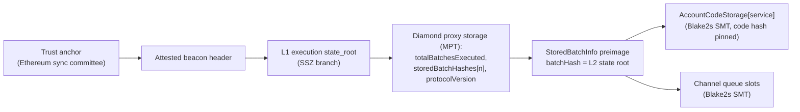

# ZKsync Era verifier

> **Sources**: [ZkSyncEraVerifier.sol](./ZkSyncEraVerifier.sol), [ZkSyncStateTreeVerifier.sol](./ZkSyncStateTreeVerifier.sol), [IZkSyncStateTreeVerifier.sol](./lib/IZkSyncStateTreeVerifier.sol), [EthL1StateVerifier.sol](../ethereum/EthL1StateVerifier.sol), [EthBeaconLightClient.sol](../../../libraries/proof/beacon/EthBeaconLightClient.sol)
> **Interface**: [IClprVerifier.sol](../../../interfaces/IClprVerifier.sol)
> **Generator**: [script/zksync/generateBlake2s.ts](../../../../script/zksync/generateBlake2s.ts) (unrolled Blake2s rounds and the empty-subtree table)

---

## 1. The big picture

`ZkSyncEraVerifier` lets a Hiero CLPR Service accept bundles from a CLPR Service on a **ZK Stack chain that runs EraVM and settles on Ethereum**. It trusts no relayer, sequencer or prover operator. Trust comes from Ethereum: its sync committee signs the L1 state, and in that state the chain's diamond proxy records which batches have been proven and executed.



Every arrow is checked on-chain. If one link fails, the call reverts.

| Step | Where | Notes |
|---|---|---|
| Sync-committee BLS → L1 `state_root`, committee rotation | [EthL1StateVerifier](../ethereum/EthL1StateVerifier.sol), a deployed stateless helper | Shared with the OP Stack verifiers |
| L1 `state_root` → executed batch → L2 root | `ZkSyncEraVerifier._verifyExecutedBatch` | MPT proofs from [ClprEvmStateProof](../../../libraries/proof/evm/ClprEvmStateProof.sol) |
| L2 root → code hash and channel slots | [ZkSyncStateTreeVerifier](./ZkSyncStateTreeVerifier.sol), a deployed helper | Blake2s sparse Merkle tree, no precompile (§5) |
| Slot derivation, queue-metadata decode, bundle content | [ClprEvmBundleVerifier](../common/ClprEvmBundleVerifier.sol) | Same as every EVM verifier: zksolc keeps Solidity's storage layout and keccak mapping slots |

---

## 2. L1: executed batches only

Checked against [era-contracts](https://github.com/matter-labs/era-contracts) `main` (be9a1fe, 2026-09-21) and against live storage of ZKsync Sepolia (protocol 0.29.1) and ZKsync Era mainnet (0.30.1) on 2026-10-01.

**Storage.** `ZKChainStorage` sits at slot 0 of the diamond proxy. The verifier proves three slots, whose numbers are profile data:

| Field | Slot | Value |
|---|---|---|
| `totalBatchesExecuted` | 11 | highest executed batch |
| `storedBatchHashes[n]` | `keccak256(n ‖ 14)` | `keccak256(abi.encode(StoredBatchInfo))` |
| `protocolVersion` | 33 | packed semver `minor << 32 ‖ patch` (0.29.1 = `0x1d00000001`) |

**StoredBatchInfo.** `Executor._commitOneBatch` stores `batchHash = newStateRoot`, the root of the L2 state tree after batch `n`. The same root is the second word of `passThroughData`, which goes into the batch `commitment`; `proveBatches` verifies the validity proof over that commitment. The preimage is `abi.encode` of 9 words (`batchNumber, batchHash, indexRepeatedStorageChanges, numberOfLayer1Txs, priorityOperationsHash, dependencyRootsRollingHash, l2LogsTreeRoot, timestamp, commitment`). Batches committed before v27 hash an 8-word legacy form without `dependencyRootsRollingHash`; the verifier accepts both lengths, since word 0 is the batch number and word 1 the state root in each. The live builder decodes the preimage from the batch's L1 `executeBatchesSharedBridge` calldata and checks its hash against storage. This was confirmed on Sepolia batch 22329 and mainnet batch 518012.

**Acceptance rule.** `n ≤ totalBatchesExecuted` and `keccak256(preimage) == storedBatchHashes[n]`. An executed batch has a verified validity proof, and `Executor.revertBatches` cannot go below `totalBatchesExecuted`, so the root is final. Committed or proven but unexecuted batches are rejected with `BatchNotExecuted`. Older executed batches are still accepted: their state is final too, and the CLPR Service rejects metadata that does not advance.

**Upgrades fail closed.** `protocolVersion` must lie in the profile's `[minProtocolVersion, maxProtocolVersion]`. A chain upgrade beyond that range stalls the verifier with `UnsupportedProtocolVersion` until it is redeployed with a re-checked profile. The live profile accepts 0.29.x–0.30.x.

---

## 3. L2: the state tree

Checked against [zksync-era](https://github.com/matter-labs/zksync-era) `main` (ff5f519, 2026-08-25), `core/lib/merkle_tree` and `core/lib/types/src/storage`, and against live `zks_getProof` on ZKsync Sepolia and mainnet.

| Item | Definition | Source |
|---|---|---|
| Tree | Binary sparse Merkle tree of depth 256 | `TREE_DEPTH = KEY_SIZE * 8` |
| Key | `blake2s(address left-padded to 32 bytes ‖ slot)` read as a **little-endian** U256 | `StorageKey::raw_hashed_key`, `hashed_key_u256` |
| Path | Bit `d` of the key chooses the side at depth `d`, depth 0 being the leaf level; bit set → `hash(sibling ‖ node)` | `HashTree::fold_merkle_path` |
| Leaf | `blake2s(leafIndex as 8 bytes big-endian ‖ value)` | `Blake2Hasher::hash_leaf` |
| Absent key | Empty leaf `blake2s(0^40)` (index 0, value 0); a proof with index 0 must have value 0 | `TreeEntry::empty`, `TreeEntryWithProof::verify` |
| Branch | `blake2s(left ‖ right)`; empty subtree `e_{d+1} = blake2s(e_d ‖ e_d)` | `hash_branch`, `compute_empty_tree_hashes` |
| API path | `zks_getProof` returns siblings **root-to-leaf** and drops the leaf-side run of empty subtrees | `metadata_calculator/src/api_server/mod.rs` reverses the tree's leaf-to-root path |

The Solidity tree verifier reproduces the reference root of zksync-era's `compute_tree_hash_works_correctly` test (`0x7f00a6b2…81e0`), and the live proofs fold to the batch `rootHash` on both networks. There is no per-account storage root: the ClprService's slots are leaves keyed by `(address, slot)`, and its **code hash** is the leaf `AccountCodeStorage (0x8002)[address]`, a versioned bytecode hash (`0x01…` for EraVM, `0x02…` for EVM-emulated code). That value is what the trust anchor pins.

**Proof entries** (`IZkSyncStateTreeVerifier`): `value(32) ‖ leafIndex(8) ‖ pathLen(2) ‖ siblings`, each sibling in "W-form" (every 4-byte group byte-reversed, i.e. the eight little-endian Blake2s message words). The relayer converts; it changes no security property, because the hash fixes the meaning of every byte.

---

## 4. Trust anchor, config and bundle layout

The trust anchor is the same **260-byte Ethereum anchor** as `EthMainnetVerifier` and the OP Stack verifiers. Its `codeHash` field pins the L2 ClprService's versioned bytecode hash, or is zero to skip that check. It rotates with the L1 sync committee.

`verifyConfig` takes `EthMainnetVerifier`'s config RLP `[slot, syncCommittee, gvr, forkVersion, ledgerConfiguration, codeHash]`. An optional endpoint-manifest proof `[lightClientProof, diamondProof, storedBatchInfo, l2ManifestProof, manifestPreimage]` is verified end to end under the genesis anchor; `l2ManifestProof` holds the code-hash entry (if pinned) and the commitment-slot entry.

**Bundle**: a top-level RLP list with 5 items, or 7 with a manifest update:

| # | Item | Contents |
|---|---|---|
| 0 | `lightClientProof` | RLP string wrapping the `EthL1StateVerifier.verifyL1State` proof |
| 1 | `diamondProof` | `[accountProof, [[slot, nodes] × 3]]` at the attested L1 block |
| 2 | `storedBatchInfo` | 288 (or legacy 256) bytes |
| 3 | `l2StorageProof` | packed entries: [code hash if pinned], Channel +1, +2, +4, +5, +16, [last message's running hash] |
| 4 | `bundleContent` | protobuf `ClprBundleContent` |
| 5, 6 | manifest | one packed entry for slot 18, and the manifest preimage |

All keys are derived by the verifier. The last-message key uses the `nextMessageId` that entry 1 claims, and the same call then proves that value.

---

## 5. Blake2s on Hedera

**The BLAKE2F precompile cannot help.** EIP-152 exposes the Blake2**b** compression function: 64-bit words, 12 rounds, rotations 32/24/16/63 and Blake2b's IV. ZKsync's tree uses Blake2**s**: 32-bit words, 10 rounds, rotations 16/12/8/7. Neither the word size nor the rotations can be emulated through F, so Blake2s runs in EVM code.

**Implementation.** Every hash in a proof is one final 64-byte block (40 bytes for leaves). The 4×4 state lives in four 256-bit row words, each 32-bit word in the low half of a 64-bit lane, so one G step updates four columns (then four diagonals) at once. A rotation is `and(shr(n, mul(x, 0x100000001)), M)`: the multiply copies every lane into its own upper half. Message words sit zero-padded in their own memory slots, so `mload(base + 32k + 8i)` delivers word `k` already in lane `i`. Row B's lane rotation for the diagonal step is merged into its last rotation. The rounds and the 256-entry empty-subtree table are generated by `script/zksync/generateBlake2s.ts`; the contract compiles with the legacy pipeline (see `foundry.toml`).

**Cost** (Foundry, Osaka gas schedule as on Hedera):

| | Gas |
|---|---|
| One Blake2s compression (64 bytes) | ~7,700 |
| One tree entry: key hash + leaf + 256 levels | ~2.06M |
| One RECORDED entry (below) | ~5,800 |

A proof costs the same whether it proves inclusion or exclusion, and whatever its path length: the levels the API omits are still hashed, with the table's empty subtrees as siblings.

**Records.** Six or seven tree entries cost about 12–14M gas, which with the L1 half crowds Hedera's 15M limit, and a committee rotation (+4.8M) cannot fit. `ZkSyncStateTreeVerifier.recordStorage` therefore proves entries in a separate transaction and stores `keccak256(value)` under `keccak256(root ‖ account ‖ key)`. A bundle then marks those entries `pathLen = 0xffff` and pays one SLOAD each. Recording is permissionless: a record is a fact about a root, and the bundle still authenticates that root as an executed batch on L1. A relayer can mix recorded and inline entries freely.

---

## 6. Gas and calldata (Hedera: 15M gas, 128 KB)

Live ZKsync Sepolia over Ethereum Sepolia (`eth_estimateGas` on anvil, 487/512 participation, batch 22329, protocol 0.29.1):

| Transaction | Gas | Calldata |
|---|---|---|
| `verifyL2StateRoot` (light client + diamond proof) | 1,901,387 | 22,084 B |
| `verifyBundle`, all 6 tree entries inline | 14,529,485 | 27,492 B |
| Split: tx 1 `recordStorage` (6 entries) | 12,632,320 | 5,892 B |
| Split: tx 2 `verifyBundle` (6 RECORDED entries) | 1,946,164 | 22,468 B |

Synthetic, real `EthL1StateVerifier` with a 512/512 generator committee (Foundry execution gas):

| Bundle | Gas | Proof bytes |
|---|---|---|
| 6 inline entries (ACK-only) | 13.08M | 4,110 |
| 7 inline entries (with messages) | 15.14M ✗ | 4,376 |
| 7 inline entries + committee rotation | 19.50M ✗ | 71,275 |
| 7 RECORDED entries + committee rotation | 5.12M | 69,675 |
| `recordStorage`, 7 entries | 14.57M | — |

So:
- An ACK-only bundle fits in one transaction, with little headroom (14.5M live).
- A message-bearing bundle or one with a rotation does **not** fit inline. The relayer records the tree entries first (one `recordStorage` of up to 7 entries, or two smaller ones), then submits the bundle at ~2M gas, or ~7M with a rotation.
- Calldata never comes near 128 KB: the largest bundle (rotation) is ~70 KB.

---

## 7. Trust and limits

- **Trusted:** Ethereum's sync committee (2/3 of 512) and the ZK Stack's validity proofs (the chain's `Verifier`, set by ZKsync governance through the ChainTypeManager). Governance can upgrade the diamond, the verifier and system contracts, so the chain's upgrade governance is trusted as for any ZK Stack bridge. The verifier pins the diamond address and a protocol-version range, not facet code.
- **Not trusted:** the sequencer, the validator (committer/prover/executor) and the relayer. A batch that was committed but not executed is rejected.
- **Not checked:** `getSettlementLayer()`. A chain that migrates to ZKsync Gateway stops executing batches on its L1 diamond; older L1-executed batches stay valid, so such a channel stalls rather than mis-verifies. A Gateway path (L1 → Gateway batch → Gateway's diamond for the chain → chain root) is a two-hop extension of this verifier.
- **Latency:** an L2 block is deliverable once its batch executes on L1: about 15 minutes on ZKsync Sepolia, and 3 hours plus proving on Era mainnet (`ValidatorTimelock.executionDelay() = 10800`).
- **Data:** relayers need `zks_getProof` at the executed batch. ZKsync's public RPCs serve it; Abstract, Sophon, Lens and Cronos zkEVM answer "Method not implemented" on their public endpoints, so a relayer for them needs its own node with the tree API on. Validium chains (Sophon, Lens, Cronos zkEVM) commit their state root the same way; only the node holds the data.
- **ZKsync OS** chains (a different chain type manager whose verifier is `ZKsyncOSDualVerifier`) use another state tree and commitment format. This verifier does not cover them.

---

## 8. Which chains this serves

Coverage depends on the settlement contracts and the VM, not on the brand. A chain is covered when its L1 diamond uses `ZKChainStorage` (slots 11, 14, 33), it settles on Ethereum, and it runs EraVM with the Blake2s tree. Probed on Ethereum mainnet and Sepolia on 2026-10-01 (`Bridgehub.getAllZKChainChainIDs`, then every diamond's `getSemverProtocolVersion`, `getSettlementLayer`, storage slot 11, and the chain's own RPC).

| Chain | Id | Protocol | Covered | Notes |
|---|---|---|---|---|
| **ZKsync Sepolia** | 300 | 0.29.1 | ✅ **live-verified** (§6) | diamond `0x9A6D…1Ef9` |
| **ZKsync Era** | 324 | 0.30.1 | ✅ | diamond `0x3240…0324`; StoredBatchInfo hash and `zks_getProof` checked on live data |
| **Abstract** | 2741 | 0.30.1 | ✅ (needs own node) | EraVM, settles on L1, rollup |
| **Sophon** | 50104 | 0.30.1 | ✅ (needs own node) | validium |
| **Lens** | 232 | 0.30.1 | ✅ (needs own node) | validium |
| **Cronos zkEVM** | 388 | 0.30.1 | ✅ (needs own node) | validium |
| GRVT 325, ZERO 543210, ZKcandy 320, Treasure 61166, zkXPLA 375, Memento 51888, and other EraVM chains | | 0.26–0.30 | ✅ by L1 profile | EraVM chain type manager; their L2 RPCs were not reachable, so the tree API is unconfirmed |
| Abstract Sepolia | 11124 | 0.29.1 | ✅ (needs own node) | |
| Sophon testnet, Wonder testnets | | 0.28–0.29 | ❌ today | settle on ZKsync Gateway (needs the two-hop path) |
| ZKsync OS chains (e.g. 30715, 30716, 2787, GenLayer testnet 4221) | | | ❌ | different state tree |

Every probed diamond had `storage[11] == getTotalBatchesExecuted()`. Re-check the profile (slots and protocol range) for each chain at deployment.

---

## 9. Tests

- [`test/verifiers/evm/zksync/ZkSyncStateTreeVerifier.t.sol`](../../../../test/verifiers/evm/zksync/ZkSyncStateTreeVerifier.t.sol): Blake2s known answers, zksync-era's reference root, synthetic inclusion and exclusion proofs, records, and every rejection (wrong value, leaf index, sibling, dropped sibling, key, account or root; a value with leaf index 0; a present slot claimed absent; malformed encodings).
- [`test/verifiers/evm/zksync/ZkSyncEraVerifier.t.sol`](../../../../test/verifiers/evm/zksync/ZkSyncEraVerifier.t.sol): synthetic L1 state (anvil `eth_getProof` of a diamond) and a synthetic L2 tree from [`buildZkSyncSyntheticFixture.ts`](../../../../test/e2e/relay/buildZkSyncSyntheticFixture.ts). It covers executed, older and legacy-encoded batches; unexecuted batches; tampered `StoredBatchInfo`; the protocol range; another diamond or L1 root; the code-hash and channel binding; a forged `nextMessageId`; manifests; records; and an end-to-end run with the real `EthL1StateVerifier` and a generator committee (bad signature, below 2/3, wrong committee, wrong fork version, rotation).
- [`test/e2e/tests/verifiers/zksync-live-sepolia.spec.ts`](../../../../test/e2e/tests/verifiers/zksync-live-sepolia.spec.ts) replays the live capture in [`test/e2e/fixtures/zksync-sepolia-live/`](../../../../test/e2e/fixtures/zksync-sepolia-live/) on anvil:

```sh
forge build
npm run test:e2e:zksync-live      # replay the fixture on anvil
npm run zksync-live:refresh       # re-capture from Sepolia + ZKsync Sepolia
npm run zksync:synthetic-fixture  # regenerate the Foundry fixture
npm run zksync:generate-blake2s   # regenerate the Blake2s rounds and table
```

There is no ClprService on ZKsync Sepolia, so the live bundle uses the L2BaseToken system contract (`0x…800a`) with its real code hash pinned. Its channel slots are absent, which gives genuine exclusion proofs and zeroed metadata. Every cryptographic link runs on real data.
