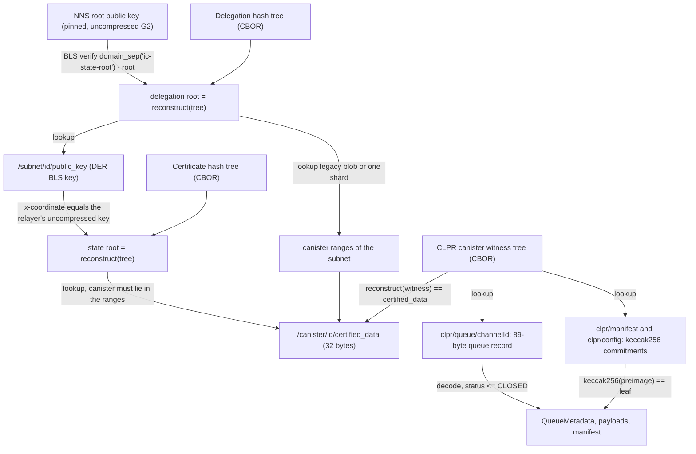
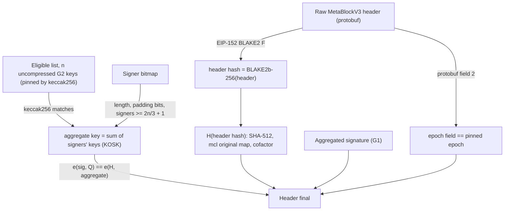
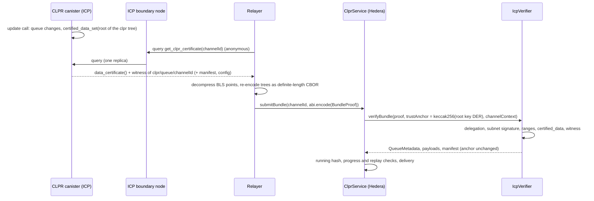

# Internet Computer and MultiversX verifiers

> **Source**: [IcpVerifier.sol](./IcpVerifier.sol) · [MvxMetachainVerifier.sol](./MvxMetachainVerifier.sol) ·
> libraries [IcpHashTree](../../libraries/proof/icp/IcpHashTree.sol), [IcpCertificate](../../libraries/proof/icp/IcpCertificate.sol),
> [IcpBls](../../libraries/proof/icp/IcpBls.sol), [MvxBls](../../libraries/proof/mvx/MvxBls.sol),
> [MvxSha512](../../libraries/proof/mvx/MvxSha512.sol), [MvxBlake2b](../../libraries/proof/mvx/MvxBlake2b.sol)
> **Interface**: [IClprVerifier.sol](../../interfaces/IClprVerifier.sol)
> **Chain pages**: [Internet Computer](../../../docs/chains/internet-computer.md) · [MultiversX](../../../docs/chains/multiversx.md)

Two `<chain> → Hiero` verifiers for chains that sign with BLS12-381 (public keys in G2, signatures in
G1), both checked on Hedera's EVM with the EIP-2537 precompiles.

`IcpVerifier` (Internet Computer → Hiero) is complete. An Internet Computer subnet certifies its
state with a threshold BLS signature over a hash-tree root, and the root (NNS) key certifies each
subnet key through a delegation. A CLPR canister keeps its queue state in its own hash tree and stores
that tree's root as its `certified_data`; the verifier checks the delegation, the subnet signature, the
subnet's canister ranges, the canister's `certified_data`, and the canister witness down to the
channel's queue record. It is an `IClprVerifier`, and it is verified on real mainnet certificates.

`MvxMetachainVerifier` (MultiversX → Hiero) is the consensus half only. It verifies a MultiversX
header and the aggregated BLS signature of more than 2/3 of an eligible validator list, on real
mainnet blocks. MultiversX uses herumi's BLS library in a non-IETF mode (a different hash-to-curve and
a different G2 generator), which this branch reproduces in Solidity. It is not an `IClprVerifier`: the
storage proofs and the validator-list proofs it would need are not served by public MultiversX
endpoints (see [Limits](#limits-and-known-gaps)).

Checked against the IC interface specification (dfinity/portal `docs/references/ic-interface-spec.md`,
"Certification" and "The system state tree"), dfinity/ic master, agent-js (`IC_ROOT_KEY`),
multiversx/mx-chain-go, mx-chain-crypto-go and mx-chain-core-go master, herumi/bls at
`86c167d` (the commit pinned by bls-go-binary v1.37.0) and herumi/mcl, and live on 2026-10-01.

## At a glance

| Item | Internet Computer | MultiversX |
|---|---|---|
| Chains covered | ICP mainnet. No CAIP-2 namespace is registered for ICP (ChainAgnostic/namespaces, 2026-10-01); the chain id is a constructor string (`icp:mainnet` in the tests) | MultiversX mainnet `mvx:1` (chain id `1`); only mainnet was checked |
| Direction | ICP → Hiero | MultiversX → Hiero (consensus half) |
| Finality source | Subnet threshold BLS signature on the certified state root, delegated from the NNS root key | Andromeda equivalent proof: aggregated BLS signature of > 2/3 of the 400 eligible validators on BLAKE2b-256(header) |
| Trust assumptions | The NNS root key; the signing threshold of the canister's subnet; the CLPR canister's controllers | > 2/3 of the epoch's eligible validators; the eligible list pinned at deployment |
| Typical proof (live, full transaction) | ckBTC data certificate + witness: 844,507 gas, 2,980 B | Metachain header: 3,394,220 gas, 104,036 B |
| Typical bundle (synthetic, execution gas) | `verifyBundle`, 10 × 256 B messages: 566,385 gas, 4,804 B; `ClprService.submitBundle`: 1,039,768 gas | none (no `IClprVerifier`) |
| Rotation | None: every certificate carries its subnet delegation | Not implemented (blocked, see Limits) |
| Contract size (runtime) | `IcpVerifier` 15,676 B | `MvxMetachainVerifier` 9,069 B |
| Status | Live-verified on ICP mainnet (2026-10-01): three certificate shapes | Consensus half live-verified on MultiversX mainnet (2026-10-01): metachain and shard-0 header proofs, a single signature; storage and rotation blocked |

## How it works

### Internet Computer



1. `IcpHashTree.sol:reconstruct` rebuilds the root of the delegation tree with the spec's domain
   separators (`ic-hashtree-empty/fork/labeled/leaf`, SHA-256).
2. `IcpCertificate.sol:verify` checks the delegation's BLS signature under the pinned root key on
   `domain_sep("ic-state-root") · root` (`IcpBls.sol:verify`: hash-to-G1 with
   `BLS_SIG_BLS12381G1_XMD:SHA-256_SSWU_RO_NUL_`, one pairing check). A delegation certificate signed
   by any other key fails, so a delegation cannot itself be delegated.
3. `IcpCertificate.sol:verify` looks up `/subnet/<id>/public_key`, strips the DER prefix
   (`derToCompressed`), and binds the relayer's uncompressed subnet key to it
   (`IcpBls.sol:requireMatchesCompressedG2`).
4. `IcpCertificate.sol:inRanges` checks that the canister id lies in the subnet's canister ranges,
   read from `/subnet/<id>/canister_ranges` or from one `/canister_ranges/<id>/<start>` shard of the
   delegation tree. Certificates of the root subnet have no delegation and no range check.
5. With `maxDelegationAgeNanos` set, the delegation's `/time` may be at most that much older than the
   certificate's `/time`.
6. `IcpCertificate.sol:verify` reconstructs the certificate tree and checks the subnet signature.
7. `IcpVerifier.sol:_verifyWitness` reads `/canister/<id>/certified_data` and requires it to equal the
   root of the canister's witness tree.
8. `IcpVerifier.sol:verifyBundle` looks up `clpr/queue/<channelId>` in the witness and decodes it
   (`_decodeQueueRecord`), decodes the payloads from `ClprBundleContent`, and, if the bundle carries a
   manifest, checks `keccak256(manifest) == clpr/manifest`. `verifyConfig` checks
   `keccak256(ControlMessage) == clpr/config` of the canister named in the message.

### MultiversX (consensus half)



1. `MvxMetachainVerifier.sol:_nonceAndEpoch` reads the nonce and epoch (protobuf fields 1 and 2 of
   `MetaBlockV3`) and requires the pinned epoch.
2. `MvxBlake2b.sol:hash256` hashes the raw header (BLAKE2b-256 on the EIP-152 precompile); this is the
   header hash the validators sign.
3. `MvxMetachainVerifier.sol:verifyHeaderHash` checks the key list against the pinned hash, the bitmap
   length and padding bits, counts signers against `GetPBFTThreshold(n) = n·2/3 + 1`
   (mx-chain-core-go `core/common.go`), and sums the signers' keys with G2ADD.
4. `MvxBls.sol:hashToG1` reproduces herumi's `hashAndMapToG1` in `MCL_MAP_TO_MODE_ORIGINAL`:
   `t` = SHA-512(message)[0..48) as a little-endian integer masked to 381 bits (380 if ≥ p)
   (`MvxSha512.sol:hash`, mcl `Fp::setHashOf`), mcl's `MapTo::calcBN` with its constants `c1 = √−3`,
   `c2 = (c1 − 1)/2` (field arithmetic on MODEXP), then multiplication by the G1 cofactor
   `0x396c8c005555e1568c00aaab0000aaab` on G1ADD.
5. `MvxBls.sol:verify` checks `e(sig, Q) = e(H(m), pk)` where `Q` is herumi's G2 generator in this
   mode, `mapToG2(1)` with the same original map (not the IETF generator).

## Bundle lifecycle



The relayer needs only anonymous query calls to a public boundary node. The query response itself is
unauthenticated; the certificate inside it is what the verifier checks. A CLPR canister must expose a
query that returns `ic0.data_certificate()` and the witness for the requested labels (the same pattern
as ICRC-3 `icrc3_get_tip_certificate`). There is no rotation transaction.

MultiversX has no bundle path in this branch. A relayer would read the header (`/internal/<shard>/raw/block/by-nonce`),
the equivalent proof and the ordered eligible list (`api.multiversx.com/blocks/<hash>`), and call
`verifyHeader`.

## Trust model

Internet Computer:

- Trusted: the NNS root public key pinned at deployment (agent-js `IC_ROOT_KEY`), the signing
  threshold of the subnet that hosts the CLPR canister (the subnet's high-threshold NIDKG key, used by
  the certifier, `rs/consensus/certification/src/certifier.rs`), and the canister's controllers, who
  can upgrade its code.
- Root-subnet certificates are trusted as signed by the root key, as in the spec.
- Not trusted: the relayer, the boundary node, the replica that answers the query. The uncompressed
  points the relayer passes are checked: the subnet key's x-coordinate must equal the certified key's,
  and the pairing precompile checks curve and subgroup membership of every key and signature. Both
  curve points with the certified x-coordinate are accepted; −P verifies only the negation of a
  signature made under P on the same root, so it adds no signing power.
- To forge a bundle an attacker must produce a signature with a subnet's threshold key over a forged
  state for a canister inside that subnet's ranges, or with the root key, or control the canister.
- A delegation from an older subnet key is accepted up to `maxDelegationAgeNanos` older than its
  certificate; 0 disables the check.

MultiversX (consensus half):

- Trusted: more than 2/3 of the pinned eligible list, and whoever pins that list. This branch pins the
  list from `api.multiversx.com`; it is not proven from chain data (blocked, see Limits).
- Not trusted: the relayer, the gateway's header bytes (they must hash to the signed header hash).

## Proof format

`IcpVerifier`

| Field | Type | Meaning |
|---|---|---|
| `trustAnchor` | `bytes32` | `ROOT_KEY_ID = keccak256(rootKeyDer)`; never changes |
| `BundleProof.cert.tree` | `bytes` | CBOR hash tree of the certificate (definite lengths; optional tag 55799) |
| `BundleProof.cert.signature` | `bytes` (128) | Subnet signature, uncompressed G1 (EIP-2537) |
| `BundleProof.cert.subnetId` | `bytes` | Delegation subnet id; empty for the root subnet |
| `BundleProof.cert.delegationTree` | `bytes` | CBOR hash tree of the delegation certificate |
| `BundleProof.cert.delegationSignature` | `bytes` (128) | Root-key signature on the delegation, uncompressed G1 |
| `BundleProof.cert.subnetKey` | `bytes` (256) | Subnet key, uncompressed G2 |
| `BundleProof.cert.rangesShard` | `bytes` | Empty: `/subnet/<id>/canister_ranges`; else the `<start>` label under `/canister_ranges/<id>` |
| `BundleProof.witness` | `bytes` | CBOR hash tree of the CLPR canister; root = `certified_data` |
| `BundleProof.bundleContent` | `bytes` | `ClprBundleContent` protobuf (payloads in field 2) |
| `BundleProof.manifestPreimage` | `bytes` | Endpoint-manifest protobuf, or empty |
| `ConfigProof` | `(cert, witness, controlMessage)` | `controlMessage` is the configuration `ClprMessagePayload`; its keccak256 is `clpr/config` |
| `ManifestProof` | `(manifestPreimage)` | Config-time manifest, checked against the config proof's witness |

CLPR canister witness (labels, all leaves):

| Path | Value |
|---|---|
| `clpr/queue/<channelId>` | 89 bytes, big-endian: `status u8 ‖ next_message_id u64 ‖ received_message_id u64 ‖ sent_running_hash [32] ‖ received_running_hash [32] ‖ endpoint_manifest_version u64` |
| `clpr/manifest` | keccak256 of the endpoint-manifest protobuf |
| `clpr/config` | keccak256 of the configuration ControlMessage protobuf |

Deployment parameters: `chainId_`, `rootKeyDer` (133 bytes), `rootKeyUncompressed` (256 bytes, x must
match the DER key), `maxDelegationAgeNanos`. The service address is the canister principal (1–29
bytes).

`MvxMetachainVerifier`: constructor `(epoch, n, keysHash)`; `verifyHeader(rawHeader, bitmap,
signature, keys)` with `signature` an uncompressed G1 point and `keys` the n uncompressed G2 keys in
eligible-list order (`keysHash = keccak256(keys)`); `verifyHeaderHash` for headers that are not
`MetaBlockV3`; `verifySignature(pk, sig, message)` for one validator signature.

## Validator-set / committee rotation

Internet Computer: none on Hedera. Subnet keys are reshared by NIDKG on ICP, and every certificate
carries the delegation that certifies the current subnet key, so the anchor (the root key) stays the
same. In the live fixture the delegations were 206 s and 210 s older than their certificates. A
change of the NNS root key itself would need a new verifier deployment.

MultiversX: the eligible list changes every epoch (144,000 rounds of 600 ms, about 24 hours). The
verifier pins one epoch's list. Proving the next list needs either the peer-accounts trie
(`validatorStatsRootHash`) or the epoch-start validator-info miniblocks, and neither is served by the
public endpoints today. Not implemented.

## Gas and calldata

Measured on anvil (`eth_estimateGas`, a full transaction: intrinsic + calldata + execution) from the
live fixtures recorded on 2026-10-01, against Hedera's 15M gas and 128 KB calldata:

| Call | Gas | Calldata | Fixture |
|---|---|---|---|
| ICP `verifyCertifiedValue`: ckBTC ledger data certificate (delegated, legacy ranges) + witness | 844,507 | 2,980 B | `icp-live/mainnet.json` `dataCertificate` |
| ICP `verifyStateValue`: read_state v3 (delegated, sharded ranges) | 959,333 | 3,364 B | `readStateDelegatedSharded` |
| ICP `verifyStateValue`: read_state of the NNS subnet (no delegation) | 346,169 | 1,604 B | `readStateRootSubnet` |
| MultiversX `verifyHeader`: metachain header 34,295,162, 281 of 400 signers | 3,394,220 | 104,036 B | `mvx-live/mainnet.json` `meta` |
| MultiversX `verifyHeaderHash`: shard-0 header 34,324,116, 277 of 400 signers | 3,348,220 | 102,820 B | `shard0` |
| MultiversX `verifySignature`: one validator signature | 631,675 | 644 B | `meta.leader` |

Synthetic, Foundry execution gas (no intrinsic or calldata gas):

| Call | Gas | Bytes | Test |
|---|---|---|---|
| `IcpVerifier.verifyBundle`, 2 messages, delegated certificate | 539,295 | proof 1,952 B | `IcpVerifier.t.sol:test_bundle_delegated` |
| `IcpVerifier.verifyBundle`, 10 × 256 B messages | 566,385 | calldata 4,804 B | `IcpVerifier.t.sol:test_gas_tenMessages` |
| `ClprService.submitBundle` through `IcpVerifier` (DATA + REPLY) | 1,039,768 | proof 2,112 B | `IntegrationIcp.t.sol:test_fullLifecycle` |

The ICP cost is two BLS verifications (one per certificate) plus SHA-256 tree hashing; it grows with
the tree sizes, not with the subnet size. The MultiversX header proof carries all 400 keys
(102,400 B) and stays under 128 KB only because the list is 400 keys; about 1.35M of its gas is
calldata (77,745 non-zero and 26,009 zero bytes of arguments).

## Limits and known gaps

Internet Computer:

- No CLPR canister exists on ICP. The witness layout above is this verifier's specification; a canister
  must keep `clpr/...` in a certified hash tree (for example `ic-certified-map`), call
  `certified_data_set` after every queue change, and serve the certificate and witness from a query.
  The live fixtures prove real certified data of other canisters (the ckBTC ledger's ICRC-3 tip, two
  `module_hash` values) through the same code.
- The verifier is stateless: an older certificate proves an older queue state. `ClprService` rejects it
  (`NoProgress` or `ClprReplayDetected`), as `IntegrationIcp.t.sol` shows.
- Only definite-length CBOR is accepted; the relayer re-encodes (the encoding does not change the
  root).
- Hiero → ICP is not part of this branch.

MultiversX (blocked for CLPR):

- **Storage proofs: blocked on public endpoints.** The node API has `/proof/root-hash/:roothash/address/:address/key/:key`,
  but mx-chain-proxy-go ships it closed (`Open = false` in `cmd/proxy/config/apiConfig/v1_0.toml`) and
  `gateway.multiversx.com`, `devnet-gateway` and `testnet-gateway` answer 404. A CLPR contract's
  storage (account trie → data trie, BLAKE2b Patricia Merkle trie) needs an own observing node.
- **Eligible list: not proven.** The ordered list comes from `api.multiversx.com/blocks/<hash>`
  (`validators`). The list is sorted by (`IndexInList`, key) in the nodes coordinator and is committed
  only through the peer-accounts trie or the epoch-start validator-info miniblocks. The gateway's
  `/internal/json/startofepoch/validators/by-epoch/:epoch` returned an empty list for epoch 2249: the
  node reads the epoch-start header's `miniBlockHeaders`, which is empty in `MetaBlockV3`, while the
  peer miniblocks (type 60) are listed in its `executionResults`. The miniblocks themselves are served
  (`/internal/<shard>/json/miniblock/by-hash/...`) but hold only validator-info hashes, and
  `/transaction/<hash>` does not return validator-info objects. Rotation therefore needs an own node,
  or a weaker owner-attested list.
- **State root:** with asynchronous execution (`MetaBlockV3`), state roots arrive in the execution
  results of later headers; a storage proof must use a root from a signed `executionResults` entry.
  Not implemented.
- Calldata: 400 keys per proof are 102,400 B. A stored aggregate key with non-signer subtraction or a
  key Merkle root would cut this; not implemented.
- The BLAKE2 F precompile (0x09) is used; the replay runs on anvil, and Hedera support for 0x09 was
  not checked in this work.

## Upgrades and forks

Changes classified as in ADR `ADR/2026-10-01-fork-aware-verifiers.md` (spec fork, draft PR
LFDT-CLPR/clpr-spec#1, §3.1):

| Source-chain change | Class | Today |
|---|---|---|
| ICP subnet key resharing (NIDKG) | A | Handled: carried by each certificate's delegation |
| ICP canister moves subnets, or ranges are split into shards | A | Handled: the delegation's ranges (legacy blob or shard) are read per certificate |
| ICP certificate or hash-tree encoding change, new domain separators, new BLS ciphersuite | C | Tree or signature checks fail; new verifier and Channel succession |
| NNS root key change | C | New deployment with the new key |
| CLPR canister upgrade that changes the witness layout | B | `PathNotFound` or `InvalidQueueRecord`; new verifier |
| MultiversX epoch change (new eligible list) | A, but no proof path today | Needs a new deployment per epoch (blocked) |
| MultiversX header format change (new protobuf version) | B | `MalformedHeader` or `WrongEpoch`; `verifyHeaderHash` still works on the hash |
| MultiversX signature scheme or herumi map-to mode change | C | `BadSignature`; new library |

## Running it

```sh
# Unit, synthetic and live-fixture suites (Foundry)
forge test --match-path 'test/verifiers/icpmvx/*' -vv
# Shared compliance suite and the ClprService lifecycle
forge test --match-path test/verifiers/compliance/IcpComplianceTest.t.sol
forge test --match-path test/integration/IntegrationIcp.t.sol -vv
# Live fixture replay on anvil, gas and calldata per transaction (needs a prior forge build)
forge build && npm run test:e2e:icp-live && npm run test:e2e:mvx-live
# Re-record from public endpoints (checks every signature off-chain first)
npm run icp-live:refresh
npm run mvx-live:refresh
```

## Files

| File | Purpose |
|---|---|
| `src/verifiers/icpmvx/IcpVerifier.sol` | ICP → Hiero `IClprVerifier`, plus `verifyCertifiedValue` / `verifyStateValue` |
| `src/libraries/proof/icp/IcpHashTree.sol` | CBOR hash trees: `reconstruct`, `lookup`, LEB128 |
| `src/libraries/proof/icp/IcpCertificate.sol` | Certificates, delegations, DER keys, canister ranges |
| `src/libraries/proof/icp/IcpBls.sol` | BLS G1 signatures, IETF `..._RO_NUL_` hash-to-G1, compressed-key binding |
| `src/verifiers/icpmvx/MvxMetachainVerifier.sol` | MultiversX header proofs against a pinned eligible list |
| `src/libraries/proof/mvx/MvxBls.sol` | herumi/mcl original hash-to-G1, herumi G2 generator, verification |
| `src/libraries/proof/mvx/MvxSha512.sol` | SHA-512 in Solidity |
| `src/libraries/proof/mvx/MvxBlake2b.sol` | BLAKE2b-256 on EIP-152 |
| `test/verifiers/icpmvx/IcpTestKit.sol` | Synthetic IC: keys, signatures, trees, ranges, CLPR witness |
| `test/verifiers/icpmvx/IcpVerifier.t.sol` | ICP unit and negative tests, spec and RFC 9380 vectors |
| `test/verifiers/icpmvx/IcpLive.t.sol` | ICP mainnet certificates |
| `test/verifiers/compliance/IcpComplianceTest.t.sol` | Shared compliance suite for `IcpVerifier` |
| `test/integration/IntegrationIcp.t.sol` | Full lifecycle on an unmodified `ClprService` |
| `test/verifiers/icpmvx/MvxBls.t.sol` | Synthetic MultiversX validator sets |
| `test/verifiers/icpmvx/MvxLive.t.sol` | MultiversX mainnet headers and signatures; SHA-512 and BLAKE2b vectors |
| `test/e2e/relay/icp.ts` | CBOR, principals, hash trees, anonymous query / read_state, Candid for ICRC-3 |
| `test/e2e/relay/buildIcpLiveFixture.ts` | Records `test/e2e/fixtures/icp-live/mainnet.json` |
| `test/e2e/relay/mvx.ts` | herumi/mcl BLS off-chain (map, generator, mcl point format) |
| `test/e2e/relay/buildMvxLiveFixture.ts` | Records `test/e2e/fixtures/mvx-live/mainnet.json` |
| `test/e2e/tests/verifiers/icp-live.spec.ts`, `mvx-live.spec.ts` | anvil replay with gas and calldata |

## References

- IC interface specification, "Certification", "The system state tree", "Canister ranges", "Certified
  data": https://github.com/dfinity/portal/blob/master/docs/references/ic-interface-spec.md
- Certificate CDDL: https://github.com/dfinity/portal/blob/master/docs/references/_attachments/certificates.cddl
- IC root key (`IC_ROOT_KEY`): https://github.com/dfinity/agent-js/blob/main/packages/core/src/agent/agent/http/index.ts
- Certifier and NIDKG thresholds: https://github.com/dfinity/ic/blob/master/rs/consensus/certification/src/certifier.rs,
  https://github.com/dfinity/ic/blob/master/rs/consensus/dkg/src/payload_builder.rs
- RFC 9380 (hash to curve), RFC 7693 (BLAKE2), FIPS 180-4 (SHA-512), EIP-2537, EIP-152
- MultiversX header signature checks: https://github.com/multiversx/mx-chain-go/blob/master/process/headerCheck/headerSignatureVerify.go
- Nodes coordinator (consensus group, eligible-list order): https://github.com/multiversx/mx-chain-go/blob/master/sharding/nodesCoordinator/indexHashedNodesCoordinator.go
- Proof API routes: https://github.com/multiversx/mx-chain-go/blob/master/api/groups/proofGroup.go,
  https://github.com/multiversx/mx-chain-proxy-go/blob/master/cmd/proxy/config/apiConfig/v1_0.toml
- BLS signers: https://github.com/multiversx/mx-chain-crypto-go/tree/main/signing/mcl
- `MetaBlockV3`: https://github.com/multiversx/mx-chain-core-go/blob/main/data/block/metaBlockV3.proto
- PBFT threshold: https://github.com/multiversx/mx-chain-core-go/blob/main/core/common.go
- herumi BLS init (non-ETH): https://github.com/herumi/bls/blob/86c167db926f293f30d6d7f45aea1785622e1462/src/bls_c_impl.hpp
- mcl original map and square roots: https://github.com/herumi/mcl/blob/master/src/map_impl.hpp,
  https://github.com/herumi/mcl/blob/master/include/mcl/gmp_util.hpp
- MultiversX CAIP-2: https://github.com/ChainAgnostic/namespaces/blob/main/mvx/caip2.md
