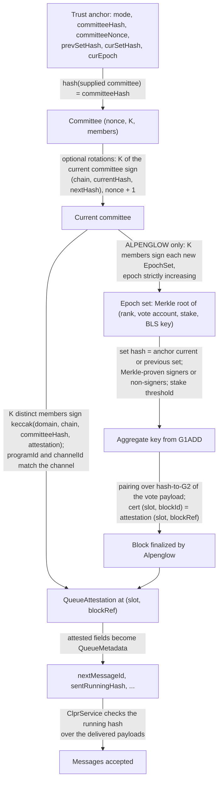
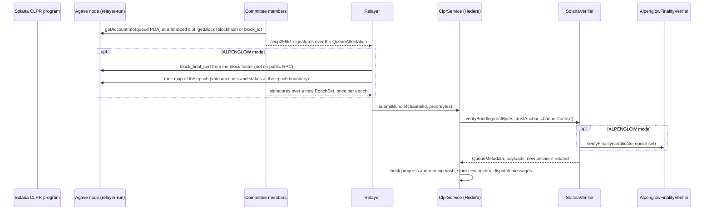

# SolanaVerifier: Solana → Hiero (attested and Alpenglow modes)

`SolanaVerifier` is an `IClprVerifier` that runs on Hedera's EVM and verifies CLPR bundles from Solana (direction
`Solana → Hiero`). **Solana consensus cannot prove that a transaction succeeded or what an account holds**: there is
no receipt or status root, and the accounts lattice hash cannot open a single account. So the queue state of the
Solana CLPR program is signed by a **K-of-N attestor committee**, and that committee is trusted. The verifier has two
modes:

- **ATTESTED** (shippable today): the committee signs the queue state at a rooted slot. Safety rests entirely on the
  committee.
- **ALPENGLOW** (the switch target once Alpenglow reaches mainnet): the same attestation, plus an Alpenglow BLS
  finality certificate from at least 60% or 80% of stake for the attested block. The committee can then only lie
  about state inside a block that Solana finalized; it still signs the state and each epoch's validator set.

## At a glance

| Item | Value |
|---|---|
| Chains covered | Solana mainnet (`solana:5eykt4UsFv8P8NJdTREpY1vzqKqZKvdp`), testnet (`solana:4uhcVJyU9pJkvQyS88uRDiswHXSCkY3z`), devnet (`solana:EtWTRABZaYq6iMfeYKouRu166VU2xqa1`). Per-chain page: [`docs/chains/solana.md`](../../../docs/chains/solana.md) |
| Finality source | ATTESTED: the committee signs only rooted (`finalized`) slots. ALPENGLOW: a FinalizeFast (80%) or Notarize + Finalize (60%) BLS certificate |
| Trust (one line) | **K-of-N committee (strict majority) for the queue state in both modes, and for the epoch validator set in ALPENGLOW mode**; genesis committee pinned at deployment |
| Typical bundle | ATTESTED, 13-of-19: 88,107 execution gas, 4,160 B proof (synthetic). ALPENGLOW on the live devnet certificate: 429,023 gas (`eth_estimateGas`), 7,812 B calldata |
| Rotation | Committee rotation 5 → 7 members with a 3-of-5 bundle: 74,285 execution gas, 3,296 B proof. Epoch-set update: one committee quorum per epoch |
| Contract size | `SolanaVerifier` runtime 14,551 B; `AlpenglowFinalityVerifier` 11,455 B (split to stay under EIP-170) |
| Status | In progress. The Alpenglow certificate path is verified on devnet's live genesis certificate (captured 2026-10-01). ATTESTED mode is tested with synthetic committees; the Solana-side CLPR program is designed, not built |

## How it works

### Why a committee is needed

Every rule below was checked against Agave `master` at `6638e56` (1 Oct 2026), `solana-sdk` `master`, the SIMD
repository and live mainnet, testnet and devnet RPC (Agave 4.3.0), all on 1 Oct 2026.

| Question | Finding | Evidence |
|---|---|---|
| What is the bank hash? | `sha256(sha256(parent_bank_hash ‖ signature_count u64 LE ‖ last_blockhash) ‖ accounts_lt_hash[2048 B])`, plus hard-fork data if any | `runtime/src/bank.rs` `hash_internal_state` |
| Can one account be proven? | **No.** The accounts lattice hash is a sum of per-account BLAKE3 vectors (SIMD-0215); opening one account needs every other account. The accounts delta hash was removed (SIMD-0223), and snapshots also use the lattice hash (SIMD-0220) | SIMDs 0215, 0220, 0223 |
| Can transaction success be proven? | **No.** There is no receipt or status root (SIMD-0064 "Transaction Receipts" is Stagnant). Failed transactions are included and charged fees | SIMD-0064 |
| What do TowerBFT votes sign? | Vote transactions (ed25519) whose `TowerSync.hash` is the voted bank hash | `vote-interface/src/state/vote_instruction_data.rs` |
| How are transactions committed? | PoH entries mix in a SHA-256 Merkle root of the transactions' signatures; reaching the slot end from a transaction means replaying every later PoH hash in the slot (64 ticks per slot), millions of SHA-256 calls | `entry/src/entry.rs`, `merkle-tree/src/merkle_tree.rs` |
| Mainnet stake concentration (683 staked vote accounts) | 1/3 of stake: 18 validators; 60%: 61; 2/3: 80; 80%: 146 | `getVoteAccounts` |
| Alpenglow status | Feature `A1pengvuM6JEcyNuTnMqepBKhwHE3N6PmUrdATGawhJS` is active on testnet (slot 444,620,256) and devnet (slot 504,144,000), absent on mainnet | feature accounts via `getMultipleAccounts` |

Consensus can prove at most that a block is final and, at high cost, that a transaction is in it. It cannot prove that
the transaction succeeded. Counting any included CLPR transaction regardless of its result is unsafe: an attacker could
submit a `send` built to fail, which is included while its Solana-side effects are rolled back. So no design, whether
it uses TowerBFT signatures, ZK proofs or Alpenglow certificates, can prove "the CLPR program's queue account holds X"
from Solana consensus alone. A committee that reads the program's state is the floor until Solana commits to account
or receipt data.

### Options considered

| # | Design | Trust | Hedera cost | Verdict |
|---|---|---|---|---|
| A | ATTESTED: K-of-N committee signs the queue state at a rooted slot | Committee | 44,830 gas (3-of-5), 88,107 gas (13-of-19) | Release now |
| B | ALPENGLOW: A plus a BLS finality certificate for the attested block | Committee for state and epoch set; Solana for finality | 0.36M gas live devnet (verifier only); about 1.16M gas, 42 KB at 700 validators (synthetic) | Switch target |
| C | TowerBFT light client (ed25519 votes plus PoH inclusion) | Consensus for inclusion only | At least 80 ed25519 checks with no precompile, plus a PoH replay | Rejected: infeasible on the EVM, success still unproven |
| D | ZK proof of the vote supermajority plus inclusion | Same gap as C; the stake set is also unprovable | Groth16 on BN254 | Rejected as a full answer; possible add-on to B |
| E | Count included, well-formed `send` transactions regardless of execution | Consensus for inclusion | As C or D | Unsafe (see above) |
| E′ | Block-validity trick (a follow-up transaction includable only after success) | Consensus | As C or D | Rejected: SIMD-0191 (Activated), SIMD-0290 and SIMD-0083 (Accepted) remove exactly these constraints |

### Proof chain



1. `SolanaVerifier.sol:verifyBundle` decodes the anchor and checks `SolanaCommittee.sol:hash` of the supplied
   committee against `committeeHash`. `SolanaCommittee.sol:applyRotations` applies signed rotations.
2. In ALPENGLOW mode, each `EpochSet` update is checked with `AlpenglowCert.sol:requireWellFormed` and a committee
   quorum over `SolanaVerifier.sol:epochSetDigest`.
3. `verifyBundle` checks that `programId` equals the channel's `remoteServiceAddress` and `channelId` the channel id,
   and `SolanaCommittee.sol:requireQuorum` checks K distinct members over `SolanaVerifier.sol:queueDigest`
   (secp256k1, high-s rejected, member indices strictly increasing).
4. In ALPENGLOW mode, `verifyBundle` requires the certificate's set to be the anchor's current or previous set and its
   `(slot, blockId)` to equal the attestation's `(slot, blockRef)`, then calls
   `AlpenglowFinalityVerifier.sol:verifyFinality`, which runs `AlpenglowCert.sol:verifyFinality` and
   `verifyAggregate`: bitmap decode, Merkle-proven entries (`_verifyMerkle`), the stake threshold, key aggregation with
   `BLS12_G1ADD`, and `ClprBeaconBls.sol:verifyAggregate` (hash-to-G2 of the payload and one pairing).
5. The attested fields become `QueueMetadata`; `_decodeBundleContent` returns the payloads and `_bindManifest` checks
   an optional manifest preimage against `manifestCommitment`. A new anchor is returned after a rotation or set update.

## Bundle lifecycle



## Trust model

Trusted:
- **K-of-N committee honesty (strict majority, `2K > N`).** In ATTESTED mode, K colluding members can attest to any
  queue state and forge messages into Hiero. In ALPENGLOW mode they can still lie about the program's state, but only
  at a slot and block that Solana finalized, and they also sign each epoch's validator set (rank map), which the
  chain cannot prove either. This is the same class of trust as Wormhole guardians (13-of-19).
- **The genesis committee**, pinned at deployment (`GENESIS_COMMITTEE_HASH`, a constructor argument). Nothing on
  Solana can authenticate it (weak subjectivity).
- **ALPENGLOW mode: fewer than the certificate threshold of stake is malicious** (60% or 80% per certificate type).
- **Liveness** needs K members online; rotation needs K of the old committee.

Planned on Solana (designed, not built): members bond SOL in the CLPR program, and anyone can submit a signed
`QueueAttestation` that contradicts the program's own records (a different running hash for a message id, a message
id never enqueued by that slot, or a slot before the message was enqueued); proven fraud slashes the bond. This makes
lying costly, not impossible, so the trust stays labelled. Optionally, members can be required to be staked validators
(`sol_get_epoch_stake`, SIMD-0133).

Not trusted: the relayer.

To forge a bundle an attacker must control K committee members (both modes); in ALPENGLOW mode the forged state must
also sit at a slot and block that a real Alpenglow certificate finalized.

## Proof format

Trust anchor, `abi.encode(Anchor)`:

| Field | Type | Meaning |
|---|---|---|
| `mode` | `uint8` | 1 ATTESTED, 2 ALPENGLOW |
| `committeeHash` | `bytes32` | `keccak256(abi.encode(nonce, K, members))` |
| `committeeNonce` | `uint64` | Increases by 1 per rotation |
| `prevSetHash`, `curSetHash` | `bytes32` | Previous and current epoch sets (ALPENGLOW) |
| `curEpoch` | `uint64` | Epoch of the current set |

Trust anchor id: `committeeNonce ‖ curEpoch` (16 bytes); it changes on a rotation or a set update.

Bundle `proof_bytes`, `abi.encode(BundleProof)`:

| Field | Type | Meaning |
|---|---|---|
| `committee` | `Committee` | The anchored committee |
| `rotations` | `Rotation[]` | Committee rotations, each signed by the current committee |
| `setUpdates` | `EpochSetUpdate[]` | ALPENGLOW only: committee-signed epoch sets |
| `attestation` | `QueueAttestation` | `(programId, channelId, slot, blockRef, status, nextMessageId, sentRunningHash, receivedMessageId, receivedRunningHash, endpointManifestVersion, manifestCommitment)` |
| `sigs` | `Signatures` | Member indices and 65-byte secp256k1 signatures |
| `finality` | bytes | ALPENGLOW: `abi.encode(FinalityProof, EpochSet)`; otherwise empty |
| `bundleContent` | bytes | Protobuf `ClprBundleContent` |
| `manifestPreimage` | bytes | Empty, or a manifest whose keccak equals `manifestCommitment` |

Attestation digest: `keccak256(abi.encode(keccak256("CLPR_SOLANA_QUEUE_ATTESTATION_V1"), keccak256(chainId),
committeeHash, attestation))`. `blockRef` is the slot's `blockhash` under TowerBFT and its `block_id` under Alpenglow.

`EpochSet = (epoch, firstSlot, lastSlot, shredVersion, size, depth, totalStake, root, aggregatePubkey)`, where `root`
is a power-of-two keccak tree over `keccak256(rank u16 ‖ voteAccount ‖ stake u64 ‖ pubkey_EIP2537[128])`.

Configuration: `ConfigProof = (Committee, ConfigAttestation, Signatures, mode, EpochSet[] initialSet, Signatures
setSigs)`. Constructor: `chainId` (CAIP-2), `genesisCommitteeHash`, and the `AlpenglowFinalityVerifier` address.

### Alpenglow certificate rules

| Item | Rule | Source |
|---|---|---|
| Vote payload | wincode `tag:u8 ‖ slot:u64 LE ‖ [block_id:32] ‖ shred_version:u16 LE`; tags Notar 1, Finalize 2, Skip 3, NotarFallback 4, SkipFallback 5, Genesis 6 | `votor-messages/src/wire.rs` |
| Thresholds | Notarize, Finalize, Skip, NotarizeFallback 60%; FinalizeFast 80%; Genesis 82%; `signed x den ≥ pct x total` | `certificate.rs`, `fraction.rs`, `migration.rs` |
| Finality | A FinalizeFast certificate, or Notarize(block) plus Finalize(slot) | SIMD-0326; `finalized_slot.rs` |
| Signatures | Min-pubkey BLS12-381 (keys G1, signatures G2), DST `BLS_SIG_BLS12381G2_XMD:SHA-256_SSWU_RO_POP_` | `solana-sdk/bls-signatures` |
| Bitmap | `0x00 ‖ nbits u16 LE ‖ bits LSB-first`, truncated after the last signer; base3 bitmaps (Skip, NotarizeFallback) are rejected because they never prove finality | `signer-store`; `votor/src/aggregate_accumulator.rs` |
| Rank map | Staked vote accounts with a BLS key, duplicates dropped, sorted by stake descending then key ascending; at most 2,000 | `runtime/src/epoch_stakes.rs`; SIMD-0326, SIMD-0357 |
| Where certificates live | Block footers (`BlockFooterV1.block_final_cert`, which also carries `bank_hash`, SIMD-0298); public RPC exposes only `getAgGenesisCert` | `entry/src/block_component.rs`, `rpc/src/rpc.rs` |

The verifier proves either the signers or, when shorter, the non-signers (complement) against the set root. Their
count must equal the bitmap's popcount (or `size − popcount`), which makes the list complete.

## Validator-set / committee rotation

- **Committee.** The current committee signs `keccak256(abi.encode("CLPR_SOLANA_COMMITTEE_ROTATION_V1", chainHash,
  currentHash, nextHash))` and `next.nonce` must be `current.nonce + 1`. Several rotations can ride in one bundle; the
  old committee is locked out afterwards. Rotations happen when operators change, not on a schedule.
- **Epoch set (ALPENGLOW).** Once per Solana epoch (432,000 slots), K members sign the new rank map; the epoch must
  increase. The anchor keeps the current and previous set so certificates near an epoch boundary still verify. The
  CLPR program can recompute the set on Solana for fraud proofs, but on Hedera it is committee trust.
- **Cost.** A 5 → 7 rotation in a 3-of-5 bundle costs 74,285 execution gas and 3,296 B of proof, against 44,830 gas
  and 1,792 B without it.

## Gas and calldata

Hedera limits: 15M gas and 128 KB calldata. Execution gas and proof bytes are from Foundry (`SolanaVerifier.t.sol`,
`AlpenglowCert.t.sol`); `eth_estimateGas` and calldata are from anvil (`solana-live.spec.ts`). The devnet fixture was
captured on 2026-10-01; committee signatures and the large validator sets are synthetic.

| Case | Execution gas | `eth_estimateGas` | Size |
|---|---|---|---|
| ATTESTED, 3-of-5 (synthetic) | 44,830 | – | 1,792 B proof |
| ATTESTED, 13-of-19 (synthetic) | 88,107 | – | 4,160 B proof |
| ATTESTED, 3-of-5 + rotation 5 → 7 (synthetic) | 74,285 | – | 3,296 B proof |
| `verifyFinality`, live devnet genesis certificate (19-entry set, 8 non-signers) | 290,886 | 352,196 | 5,572 B calldata |
| ALPENGLOW `verifyBundle` on the live devnet certificate | 355,448 | 429,023 | 7,360 B proof, 7,812 B calldata |
| FinalizeFast, 700 validators, about 8% offline (synthetic) | 1,161,881 | – | 58 entries, 42,112 B ABI |
| FinalizeFast, 2,000 validators, about 8% offline (synthetic) | 4,403,134 | – | 166 entries, 123,616 B ABI |
| Worst case: only the top 80% sign, 700 validators (synthetic) | 5,139,807 | – | 291 entries, 206,112 B ABI: **exceeds 128 KB** |

## Limits and known gaps

- **Committee trust is the floor** in both modes until Solana commits to account or receipt data (track SIMD-0064 and
  any account-proof SIMD). Then the attestation can be replaced by a proof against `bank_hash`, which the Alpenglow
  footer already carries (SIMD-0298).
- **The Solana CLPR program is not built** (queue PDAs, bonds and fraud proofs are designed only). ATTESTED mode has
  no live data yet.
- **Alpenglow is not on mainnet.** It is active on testnet and devnet only.
- **Certificates are not on public RPC.** Only `getAgGenesisCert` is exposed, and `block_id` is missing from
  `getBlock`. A relayer needs its own Agave node that exports `block_final_cert` from replayed block footers (a Geyser
  plugin or a small RPC patch), or a votor listener.
- **Historical rank maps.** RPC serves only current stakes, so the relayer must snapshot each epoch's rank map at the
  boundary. The devnet fixture rebuilds the map from epoch 1171 stakes for an epoch-1167 certificate: the BLS check is
  exact, but the stake weights are those of the capture epoch. The testnet genesis certificate (485 ranks) can no
  longer be rebuilt from public RPC.
- **Mainnet-scale proof size.** A worst-case certificate at 700 validators needs about 206 KB. Fixes: a Merkle
  multiproof, or a per-epoch BN254 SNARK of the aggregate key and stake for a bitmap.
- No `IClprVerifier` compliance suite runs against this verifier yet.

## Upgrades and forks

- The TowerBFT → Alpenglow migration does not stop ATTESTED channels: the committee signs the program's state, not a
  consensus artifact, so it is consensus-agnostic.
- Moving a channel to ALPENGLOW mode follows the fork-aware verifier ADR
  ([`ADR/2026-10-01-fork-aware-verifiers.md`](https://github.com/shayansal/clpr-spec/blob/adr/fork-handling/ADR/2026-10-01-fork-aware-verifiers.md),
  draft PR [LFDT-CLPR/clpr-spec#1](https://github.com/LFDT-CLPR/clpr-spec/pull/1)), either as a profile or as Class C
  channel succession:
  - `fork_id` = the Alpenglow feature-gate pubkey (`A1pengvu…`);
  - fork evidence = the cluster's Alpenglow genesis certificate (82% of stake, Genesis payload), checked by
    `AlpenglowFinalityVerifier.verifyFinality` with the GENESIS kind; it is signed by Solana consensus, as ADR §3.2
    requires;
  - arming follows ADR §3.4: the Solana CLPR program announces the profile (proven by a committee attestation) and the
    Hedera admin registers it with at least a 7-day timelock;
  - the armed profile switches `mode` from 1 to 2 and installs the first `EpochSet`; equivalently, a successor channel
    uses `mode = 2` in `verifyConfig`. Both paths exist in code; `verifyForkProfile` is not on this branch.
- Testnet evidence first (ADR §3.10): devnet's genesis certificate is in `test/e2e/fixtures/solana-live/` and verifies.
- A later change to the vote payload, the certificate thresholds or the BLS scheme is Class B or C for ALPENGLOW mode.

## Running it

```sh
# ATTESTED and ALPENGLOW paths, live devnet certificate, synthetic validator sets and gas
forge test --match-path 'test/verifiers/solana/*' -vv

# Live certificate replay on anvil (AlpenglowFinalityVerifier and an ALPENGLOW-mode verifyBundle)
npm run test:e2e:solana-live

# Refresh the devnet fixture (refuses to write a fixture that does not verify)
npm run solana-live:refresh
```

Test counts on this branch: 22 `SolanaVerifier` and 17 `AlpenglowCert` tests (Foundry), 6 anvil tests.

## Files

| File | Purpose |
|---|---|
| `src/verifiers/solana/SolanaVerifier.sol` | `IClprVerifier`: ATTESTED and ALPENGLOW modes, anchor, digests |
| `src/verifiers/solana/SolanaCommittee.sol` | K-of-N secp256k1 committee: well-formedness, quorum, signed rotation |
| `src/verifiers/solana/AlpenglowCert.sol` | Alpenglow certificates with EIP-2537: payloads, bitmaps, Merkle-proven rank sets, thresholds, pairing |
| `src/verifiers/solana/AlpenglowFinalityVerifier.sol` | Stand-alone deployment of `AlpenglowCert`, kept separate for EIP-170 |
| `src/libraries/proof/beacon/ClprBeaconBls.sol` | Gains `hashBytesToG2` and `verifyAggregate` for raw messages |
| `test/verifiers/solana/SolanaVerifier.t.sol` | Both modes, negative cases, gas |
| `test/verifiers/solana/AlpenglowCert.t.sol` | Live devnet certificate, synthetic 64, 700 and 2,000-validator sets, negative cases |
| `test/verifiers/solana/SolanaTestKit.sol` | Synthetic committees, BLS keys and certificates |
| `test/e2e/fixtures/solana-live/devnet-genesis.json`, `.proof.hex` | Live devnet genesis certificate and rank map |
| `test/e2e/relay/buildSolanaAlpenglowProof.ts` | Capture and proof builder |
| `test/e2e/tests/verifiers/solana-live.spec.ts` | Anvil replay |

## References

- Agave (`runtime/src/bank.rs`, `entry`, `votor`, `runtime/src/epoch_stakes.rs`, `rpc/src/rpc.rs`): https://github.com/anza-xyz/agave (commit `6638e56`)
- Solana SDK (`bls-signatures`, `vote-interface`): https://github.com/anza-xyz/solana-sdk
- SIMDs 0064, 0083, 0133, 0191, 0215, 0220, 0223, 0290, 0298, 0326, 0357: https://github.com/solana-foundation/solana-improvement-documents
- EIP-2537 BLS12-381 precompiles: https://eips.ethereum.org/EIPS/eip-2537
- Fork-aware verifier ADR: https://github.com/shayansal/clpr-spec/blob/adr/fork-handling/ADR/2026-10-01-fork-aware-verifiers.md
