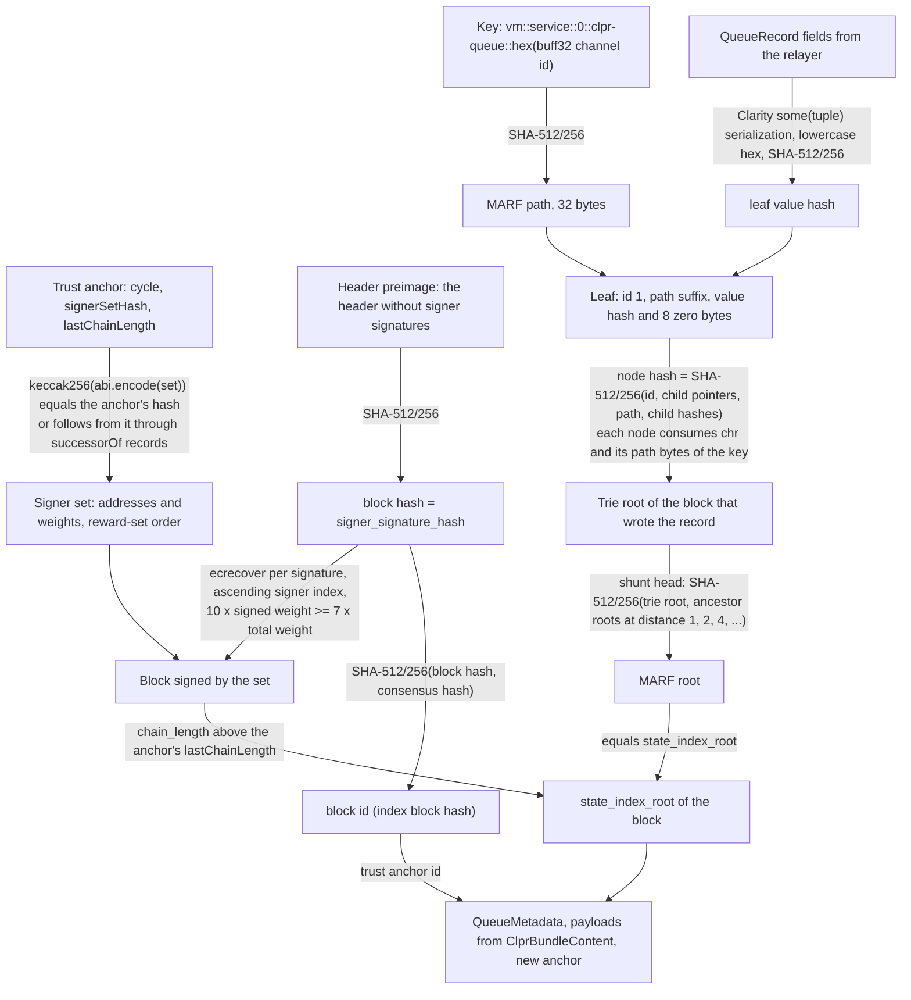
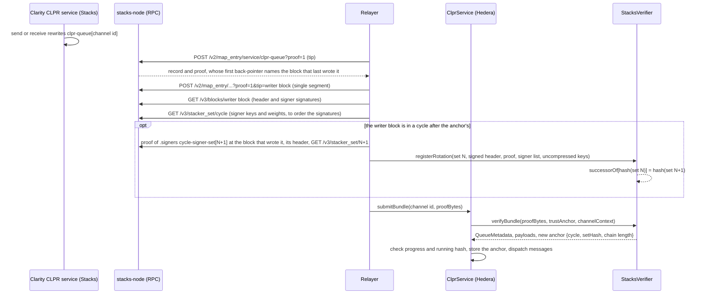

# StacksVerifier: Stacks → Hiero

`StacksVerifier` is an `IClprVerifier` for Hedera's EVM that verifies the CLPR queue state of a Clarity CLPR service
contract on Stacks (direction `Stacks → Hiero`). It is a light client for Stacks' Nakamoto consensus: a block counts
when signers holding at least 70% of the reward cycle's signing weight have signed it. The queue record is then
proven through the block's MARF state root (Stacks' Merklized Adaptive Radix Forest). Signer sets change every
reward cycle; `registerRotation` proves the next set from the `.signers` boot contract in a block signed by the
current set.

**Trust rests on the Stacks signer set, not on Bitcoin proof-of-work.** Stacks miners are chosen through Bitcoin
(Proof of Transfer), and tenures are anchored to Bitcoin blocks, but this verifier reads no Bitcoin data at all.
It accepts whatever 70% of the signer weight signs.

## At a glance

| Item | Value |
|---|---|
| Chains covered | Stacks mainnet (`stacks:1`), Stacks testnet (`stacks:2147483648`, profile only). Page: [`docs/chains/stacks.md`](../../../docs/chains/stacks.md) |
| Direction | Stacks → Hiero |
| Finality source | Nakamoto signer signatures: at least 70% of the reward cycle's signer weight over the block hash |
| Trust (one line) | The cycle's signer set (Stacking, PoX) is honest at 70% of weight; the deployment set is correct. Not Bitcoin PoW |
| Typical bundle | One block + one single-segment MARF proof: 12,084,553 gas (`eth_estimateGas`), 56,868 B calldata (live mainnet entry, 2026-10-01) |
| Rotation | `registerRotation` 143 → 144 (31 signers): 13,136,304 gas used, 59,844 B calldata (live mainnet, real transaction on anvil) |
| Contract size | `StacksVerifier` runtime 17,844 B; `ClprSha512t256Hasher` runtime 13,456 B (deployed once per network) |
| Status | Live-verified on Stacks mainnet (2026-10-01): signer signatures, rotation, MARF proofs with 1, 2 and 3 segments. The CLPR queue record and manifest paths run on synthetic data (no Clarity CLPR service exists yet), including the shared IClprVerifier compliance suite |

## How it works



1. `StacksVerifier.sol:_resolveSet` hashes the signer set from the proof and requires it to be the anchor's set or a
   recorded successor (`successorOf`, at most `MAX_HOPS` = 64 links).
2. `NakamotoHeader.sol:parse` hashes the header preimage with SHA-512/256 (the block hash, which is also what signers
   sign) and computes the block id `SHA-512/256(block_hash ‖ consensus_hash)`. It reads `chain_length` and
   `state_index_root` at fixed offsets and accepts header versions 0 and 1 only.
3. `NakamotoHeader.sol:verifySigners` recovers each signature with `ecrecover` (recovery id 0 or 1), requires it to
   match the signer at the given index, requires strictly ascending indices (no duplicates) and requires
   `10 × signed ≥ 7 × total`, which is stacks-core's `⌈7·total/10⌉` rule.
4. `StacksVerifier.sol:verifyBundle` requires the block's chain length to be above the anchor's `lastChainLength`.
5. `ClarityCodec.sol:mapEntryPath` builds the MARF key of the queue record and hashes it; `queueRecordValue` and
   `ClarityCodec.sol:valueHash` serialize the six record fields the way Clarity stores them and hash the hex string.
6. `StacksMarf.sol:verify` walks the proof from the leaf to the MARF root (next section) and compares the result
   with `state_index_root`.
7. `verifyBundle` returns the proven record as `QueueMetadata`, the payloads from `ClprBundleContent`, the absent
   endpoint manifest (version 0) and the new anchor `{cycle, signerSetHash, lastChainLength = this block}`.
8. At channel setup, `StacksVerifier.sol:_verifyStacksManifest` proves the service's `clpr-manifest-commitment`
   data-var (a `(buff 32)` holding keccak256 of the manifest protobuf) at the config block and decodes the manifest.

### MARF proofs

The MARF keeps one trie per block. A write copies the path from the root to the changed leaf into the new block's
trie. Unchanged children are back-pointers that name the block whose trie holds them (by block id). Each trie root is
mixed with the roots of the tries 1, 2, 4, 8, … blocks back; that mixed hash is `state_index_root`.

A proof (`TrieMerkleProof`, served by `/v2/map_entry/...?proof=1`) is a list of segments, oldest trie first.
Segment 0 runs from the leaf to the root of the trie that holds the leaf. Every later segment runs from a
back-pointer to the root of a newer trie, and shunt proofs walk the skip list between them. `StacksMarf.sol` follows
stacks-core `TrieMerkleProof::verify_proof` and is stricter in four places:

- Every older trie's root must be bound to its block. The relayer passes that block's header preimage; its
  `state_index_root` must equal the computed root, and its block id is the hash the next segment's back-pointer must
  name. stacks-core uses its local `root_to_block` table instead. Without this check a proof could substitute an
  older trie from the skip list and prove a stale value.
- The pointer a segment passes through must be a back-pointer naming exactly that block id at the first node of a
  later segment, and an in-trie pointer everywhere else.
- Node id bytes must match the proof item type, and every byte of the proof must be used (stacks-core stops at the
  first root match).
- The key path is checked for every segment.

A CLPR service rewrites its queue record whenever it sends or receives, so the relayer proves the record at the
block that last wrote it. That proof has one segment (the copied path lives in that block's trie). Proofs through
back-pointers are verified too, but cost more than one Hedera transaction allows (see Gas and calldata).

### The Clarity CLPR service (proposed layout)

No CLPR service is deployed on Stacks. The verifier fixes this record layout:

```clarity
(define-map clpr-queue (buff 32)
  { next-message-id: uint, sent-running-hash: (buff 32),
    received-message-id: uint, received-running-hash: (buff 32),
    status: uint, endpoint-manifest-version: uint })
(define-data-var clpr-manifest-commitment (buff 32) 0x…) ;; keccak256 of the ClprEndpointManifest protobuf
```

`status` uses the `ClprTypes.ChannelStatus` numbering (0 PENDING … 5 CLOSED). The service principal (for example
`SP….clpr-service`) is the channel's `remoteServiceAddress` and is part of the MARF key, so a record of another
contract or another channel cannot be substituted.

## Bundle lifecycle



Channel setup: `verifyConfig` checks a header signed by the deployment set (or a recorded successor of it) and returns
the anchor with `lastChainLength = 0`, so a record written before that header can still be proven. With manifest
proof bytes it also proves the service's manifest commitment at that header.

## Trust model

Trusted:
- **The signer set of the cycle that signs the block.** Signers holding at least 70% of the cycle's weight (weights
  are PoX reward slots, 4,000 per cycle on mainnet in cycles 143 and 144) sign only valid blocks. This is a committee
  assumption over Stacked STX, not Bitcoin proof-of-work.
- **The deployment signer set** (constructor `genesis`), read by the deployer from `/v3/stacker_set/{cycle}`. Every
  later set is proven from it.
- **Old signer sets until the channel's anchor moves on.** A set stays acceptable for a channel until a bundle moves
  that channel's anchor to a later set. Signers who held 70% of an old cycle's weight can still sign blocks the
  verifier accepts for channels whose anchor names that cycle (a long-range attack). Relayers should move each
  channel's anchor after every rotation.
- **The Clarity CLPR service code**: the record is only as good as the contract that writes it.

Not trusted:
- The relayer: every value is proven. A relayer can delay, or prove an older state, which `ClprService` rejects
  (`lastChainLength` and its own message-id checks).
- The `registerRotation` caller: a record only links two set hashes, proven by the first set's signatures.
- Stacks miners: a miner's block counts only once the signers sign it. The miner signature is hashed but not checked.

Not checked:
- Bitcoin: block-commits, sortition, tenure changes, Bitcoin reorganisations. A signed block is final for this
  verifier whatever happens on Bitcoin.
- Block contents other than the queue record (transactions, the miner, the PoX treatment bit vector).

To forge a bundle an attacker needs signatures from signers holding 70% of the weight of a set the channel accepts:
the current cycle's, or a recorded later one, or an old one the channel's anchor still names. If two different
next-cycle sets are proven for one set (which needs at least 40% of the weight to sign two conflicting blocks), the
first recorded one stays and the second reverts `ConflictingRotation`.

## Proof format

Trust anchor, `abi.encode(Anchor)`:

| Field | Type | Meaning |
|---|---|---|
| `cycle` | `uint64` | Reward cycle of the anchored signer set |
| `signerSetHash` | `bytes32` | `keccak256(abi.encode(SignerSet))` |
| `lastChainLength` | `uint64` | Chain length of the last proven block; the next must be higher (0 after `verifyConfig`) |

Trust anchor id: the proven block's id (index block hash, 32 bytes).

`SignerSet`: `{uint64 cycle, address[] signers, uint64[] weights}` in reward-set order, where each address is
`keccak256(x ‖ y)[12:]` of the uncompressed signing key (what `ecrecover` returns).

Bundle `proof_bytes`, `abi.encode(BundleProof)`:

| Field | Type | Meaning |
|---|---|---|
| `signerSet` | `SignerSet` | The set that signed the block |
| `block.header` | `bytes` | Nakamoto header without the signer-signature vector (block-hash preimage, 217 B for version 1 on mainnet) |
| `block.signatures` | `bytes` | `index (u16) ‖ recovery id ‖ r ‖ s` per signature (67 B), strictly ascending index |
| `marfProof` | `bytes` | `TrieMerkleProof` of the queue record, exactly as the node serves it |
| `bindings` | `bytes[]` | Header preimages of the older tries the proof passes through, oldest first (none for a single segment) |
| `record` | `QueueRecord` | `nextMessageId`, `sentRunningHash`, `receivedMessageId`, `receivedRunningHash`, `status`, `endpointManifestVersion` |
| `bundleContent` | `bytes` | `ClprBundleContent` protobuf (payloads; the service checks them against the running hash) |

Config `configProofBytes`, `abi.encode(ConfigProof)`: `signerSet`, `block` (as above), `servicePrincipal` (ASCII
`<address>.<contract>`), `peerConfigNanos`, `throttles`. `endpointManifestProofBytes` is empty (bring-up, manifest
version 0) or `abi.encode(ConfigManifestProof)`: `manifestPreimage` (protobuf), `marfProof` and `bindings` of the
data-var `vm::<service>::1::clpr-manifest-commitment`, whose stored value is `serialize((buff 32))` of
keccak256(preimage). The manifest must have version ≥ 1 and the channel's service principal.

Rotation input, `RotationProof`: `current` (set N), `block`, `marfProof` and `bindings` for `.signers`
`cycle-signer-set[N+1]`, `signerList` (the stored value, `some(list {signer: principal, weight: uint})`), `nextKeys`
(uncompressed key of each listed signer). Each key must be on secp256k1, and the hash160 of its compressed form must
equal the listed p2pkh principal.

Constructor profile:

| Parameter | Mainnet | Testnet |
|---|---|---|
| `hasher` | Address of a deployed `ClprSha512t256Hasher` | same |
| `chainId` | `stacks:1` | `stacks:2147483648` |
| `signersContract` | `SP000000000000000000002Q6VF78.signers` | `ST000000000000000000002AMW42H.signers` |
| `principalVersion` | 22 (`SP` single-sig) | 26 (`ST` single-sig) |
| `genesis` | `/v3/stacker_set/{cycle}`: keys converted to addresses, weights | same |

## Validator-set / committee rotation

The signer set changes every reward cycle (2,100 Bitcoin blocks, about two weeks). In the prepare phase of cycle N
(the last 100 Bitcoin blocks), the node writes the cycle N+1 set into `.signers` `cycle-signer-set[N+1]` as a list of
`{signer: p2pkh principal, weight}` (stacks-core `NakamotoSigners::update_signers`). That block is signed by the
cycle N set.

`registerRotation` checks that block's signatures against set N, proves the map entry through the MARF (single
segment at the block that wrote it), parses the list, turns each hash160 into an address using the relayer's
uncompressed key, and records `successorOf[hash(N)] = hash(N+1)`. It is permissionless and idempotent.

- Cost: 13,136,304 gas and 59,844 B calldata for 31 signers (live 143 → 144). The MARF proof dominates (three Node256
  nodes); each extra signer adds one hash160 check and 64 B of keys.
- Cadence: one transaction per cycle per network (shared by all channels on that verifier).
- Catch-up: missed cycles are registered one by one, from historical blocks (the node must serve proofs at old
  tips; the public Hiro node did on 2026-10-01). A proof may follow up to 64 records ahead of its anchor.
- The rotation block is in cycle N; blocks of cycle N+1 start when cycle N+1 begins. A channel's anchor moves only
  when a bundle signed by the new set is verified.

## Gas and calldata

Measured on anvil (`eth_estimateGas` / receipt `gasUsed`) with the live mainnet fixture
`test/e2e/fixtures/stacks-live/mainnet.json` (captured 2026-10-01 from stacks-node 4.0.4):

| Operation | Gas | Calldata | Fits 15M gas / 128 KB |
|---|---|---|---|
| `registerRotation` 143 → 144, 31 signers (receipt) | 13,136,304 | 59,844 B | yes |
| `verifyEntry`, 1 segment (live map entry at the block that wrote it, 51,727 B proof) | 12,084,553 | 56,868 B | yes |
| `verifyEntry`, 2 segments (69,351 B proof, 1 binding header) | 16,122,898 | 74,724 B | no (gas) |
| `verifyEntry`, 3 segments (104,631 B proof, 2 binding headers) | 24,167,281 | 110,404 B | no (gas) |
| `verifyBundle`, synthetic queue record, 1 segment of the same shape (forge, call only) | 11,333,996 | 53,376 B proof | yes |
| `verifyConfig` with a manifest proof, synthetic, same shape (forge, call only) | 11,304,144 | 53,664 B | yes |

The cost is SHA-512/256. Ethereum and Hedera have no precompile for it; `ClprSha512t256Hasher` does one 128-byte
block in about 26,100 gas. A Node256 node is hashed over 16,898 bytes (256 child pointers of 34 B and 256 child
hashes), 133 blocks or about 3.5M gas. A fresh write in mainnet's state trie has three Node256 levels, about 10.4M of
the 12.1M. `verifyEntry` runs the same signer and MARF checks as `verifyBundle`; the live entry (Node16 + leaf) and a
CLPR record (Node4 or Node16 + leaf) have the same shape.

## Limits and known gaps

- **No Clarity CLPR service exists.** The queue-record path (`verifyConfig`, `verifyBundle`) is verified on
  synthetic data built with stacks-core's wire formats; the signer, rotation and MARF paths are verified on live
  mainnet data with another contract's map entry.
- **One segment per bundle in practice.** A proof through back-pointers costs 16M gas or more. The relayer must prove
  the record at the block that last wrote it, which a CLPR service guarantees by rewriting the record on every
  change. A record not rewritten since an older block can still be proven at that block (any block signed by an
  acceptable set), not at the tip.
- **Manifests only at channel setup.** `verifyConfig` proves the manifest commitment; `verifyBundle` always returns
  the absent manifest (version 0), because a second MARF proof next to the queue record (about 11M gas each) does not
  fit in one transaction. A manifest change on Stacks needs a new channel config until the commitment is moved into
  the queue record or proven in a separate transaction.
- **Long-range exposure of old sets** as described in the trust model; the verifier does not know cycle boundaries
  from a header.
- **The service principal is not proven to exist.** It is taken from the config proof. Clarity contract ids cannot be
  redeployed; a wrong id gives a channel whose record can never be proven.
- **Bitcoin anchoring is ignored** (see Trust model).
- **Archive needs:** rotations for missed cycles and proofs at the writer block need a node that serves MARF proofs at
  historical tips; the public Hiro API did for blocks two weeks old on 2026-10-01.
- **Testnet not live-verified.** The profile is known; no fixture was captured.
- **Header versions:** only 0 and 1 are accepted.

## Upgrades and forks

| Stacks change | Effect here | Handling |
|---|---|---|
| New header version (layout of the 206-byte prefix or the hashed tail) | `HeaderVersionUnsupported` | New verifier or a fork profile under the fork-aware verifier ADR |
| Signature scheme, threshold (now 70%), recovery rules | Signatures fail or a wrong threshold is applied | New verifier |
| MARF node format, hashing, skip-list rule | `MarfRootMismatch` / `MarfMalformed` | New verifier |
| Clarity storage keys or value serialization (`vm::…::0::…`, hex of `some(v)`) | `MarfPathMismatch` / `MarfValueMismatch` | New verifier |
| `.signers` layout (`cycle-signer-set`, tuple fields) | Rotation fails, channels stall at the next cycle | New verifier |
| Signer-set size above 4,000 | Not possible today (`SIGNERS_MAX_LIST_SIZE`) | — |

Every failure mode is fail-closed: a revert, never a wrong acceptance. The fork-aware verifier ADR
(`ADR/2026-10-01-fork-aware-verifiers.md` in the spec fork, draft PR LFDT-CLPR/clpr-spec#1) proposes fork profiles armed
by a proven announcement plus a timelocked registration, and `ClprChannelSuccession` to move a channel to a new
verifier without losing queue position. This verifier has no fork profile mechanism yet; header versions are the
natural first profile parameter. Because the signer set rotates, a channel stalled for more than about two weeks
needs its missed rotations registered before it can continue (they stay provable from historical blocks).

## Running it

```bash
# unit and live-fixture tests, and the IClprVerifier compliance suite (forge)
forge test --match-path 'test/verifiers/stacks/*'
forge test --match-path 'test/verifiers/compliance/StacksComplianceTest.t.sol'

# anvil replay of the live mainnet fixture (registerRotation as a transaction, verifyEntry 1/2/3 segments)
forge build && npm run test:e2e:stacks-live

# re-capture the fixture from a public node (needs the current cycle's rotation block to be at least one block old)
npm run stacks-live:refresh                 # = npx tsx test/e2e/relay/buildStacksProof.ts --refresh [--rpc URL]
npx tsx test/e2e/relay/buildStacksProof.ts --check   # re-verify the saved fixture offline

# regenerate the SHA-512/256 hasher bytecode
python3 script/gen/gen_sha512_evm.py 26,100 1.9
```

## Files

| File | Purpose |
|---|---|
| `src/verifiers/stacks/StacksVerifier.sol` | The verifier: bundles, config, rotations, generic `verifyEntry` |
| `src/libraries/proof/stacks/StacksMarf.sol` | MARF proof verification (segments, back-pointers, shunts, header bindings) |
| `src/libraries/proof/stacks/NakamotoHeader.sol` | Header hashing, block id, signer-signature threshold |
| `src/libraries/proof/stacks/ClarityCodec.sol` | Clarity keys, value hashing, `.signers` list parsing |
| `src/libraries/crypto/ClprSha512t256Hasher.sol` | SHA-512/256 as a contract (generated bytecode) and its call helper |
| `script/gen/gen_sha512_evm.py` | Generator of the hasher bytecode |
| `src/libraries/crypto/Sha512t256.sol` | Yul SHA-512/256 library (reference for the hasher tests) |
| `test/verifiers/stacks/StacksVerifier.t.sol` | 37 tests: live mainnet rotation and entries, synthetic queue records and manifest, negative cases |
| `test/verifiers/compliance/StacksComplianceTest.t.sol` | The shared IClprVerifier compliance suite (21 cases) on synthetic data |
| `test/verifiers/stacks/StacksTestBuilder.sol` | Synthetic headers, signatures and MARF proofs in stacks-core's wire formats |
| `test/verifiers/stacks/Sha512t256.t.sol` | Hasher and library vectors (every tail length 0..259, 16,900-byte input) |
| `test/e2e/fixtures/stacks-live/mainnet.json` | Live mainnet capture (cycles 143 and 144) |
| `test/e2e/relay/buildStacksProof.ts` | Relayer reference: capture, header parsing, signature ordering, off-chain MARF check, ABI helpers |
| `test/e2e/tests/verifiers/stacks-live.spec.ts` | Anvil replay with gas and calldata checks |

## References

- stacks-core `a327c946` (main, 2026-09-30), the code read for this verifier:
  - `stackslib/src/chainstate/nakamoto/mod.rs`: `NakamotoBlockHeader` codec, `signer_signature_hash`, `block_id`,
    `verify_signer_signatures`, `compute_voting_weight_threshold`, header versions 0 and 1.
  - `stackslib/src/chainstate/stacks/index/proofs.rs`: `TrieMerkleProof` codec and `verify_proof`, shunt proofs.
  - `stackslib/src/chainstate/stacks/index/node.rs`, `bits.rs`, `trie.rs`, `storage.rs`: node consensus bytes, leaf
    hash, back-pointer child hashes, the root skip list.
  - `stackslib/src/chainstate/stacks/index/mod.rs`: `MARFValue::from_value`.
  - `stacks-common/src/types/chainstate.rs`: `TrieHash::from_key`, `StacksBlockId::new`.
  - `clarity/src/vm/database/clarity_db.rs`: `make_key_for_quad`, `StoreType`, `put_value_with_size`.
  - `clarity-types/src/types/serialization.rs`: Clarity value serialization and type prefixes.
  - `stackslib/src/chainstate/stacks/boot/signers.clar`, `stackslib/src/chainstate/nakamoto/signer_set.rs`,
    `stackslib/src/chainstate/stacks/boot/mod.rs` (`make_signer_set`): the signer list and weights.
  - `stacks-common/src/bitvec.rs`: `BitVec` codec.
- Live data: `https://api.hiro.so` (`/v2/info`, `/v2/pox`, `/v3/blocks`, `/v3/stacker_set`, `/v2/map_entry`,
  `/extended/v2/blocks`), stacks-node 4.0.4, 2026-10-01.
